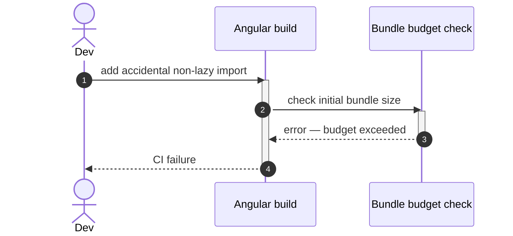

# Goal

- Reduce the visible network delay on first navigation into a feature or embeddable module, for the subset of sections common enough to justify it, without unconditionally preloading everything
- Give features a rule for splitting rarely-used or heavy sub-pages out of their own lazy chunk
- Catch bundle-size regressions in CI via enforced budgets, rather than noticing them informally after the fact

# Capabilities

- A small, deliberately reviewed set of top-level sections feel instant on first navigation, without wasting bandwidth preloading rarely-used features or federated remote chunks
- Heavy, rarely-used sub-pages (e.g. PDF export, charting) do not inflate the chunk paid for by every visitor of a feature's main path
- A non-lazy import that accidentally grows the initial bundle fails CI immediately instead of shipping unnoticed

# Core Principles

- Every route lazily loaded via `loadChildren` (per `solution-app-routing`) is on-demand by default; preloading is opt-in, never the default
- The decision to preload a segment is made by whoever mounts it (the shell for top-level segments, a module for the features it contains) — never by the feature/module itself, consistent with the hierarchical route-ownership principle from `solution-app-routing`
- `loadComponent` is a second, finer-grained level of code-splitting *inside* an already-lazy feature chunk — it does not replace the feature-level `loadChildren` split
- Bundle budgets are enforced (`error`, not just `warning`) on both the initial bundle and every lazy chunk

# Adr

- [[skills/angular/architecture/v3.1/solutions/solution-performance-tuned-routing.skill/adr/preloading-strategy.md|Custom selective preloading instead of PreloadAllModules or NoPreloading]]
  - Selected variant: custom selective preloading via a `data.preload` route flag — chosen to avoid unconditionally prefetching federated embeddable-module chunks while still warming up genuinely high-traffic sections

# Boundaries
- `monolith` catalog, `PerformanceTunedRouting` (VP1). Assumes `solution-app-routing` (extends its per-feature routes and the shell's mount points). Uses only standard `@angular/router` APIs.
- The baseline already lazy-loads every feature via `loadChildren`; this adds *selective preloading* (opt-in at the mount point), *`loadComponent` sub-splitting* (a per-sub-route decision), and *enforced bundle budgets*.
- The preload decision is always made by whoever mounts a segment (the shell for top-level, a module for its features), never by the feature itself.

# Requirements

SOLUTION:
- [[skills/angular/architecture/v3.1/solutions/solution-app-routing.skill/solution-app-routing.skill.md|solution-app-routing]]
  - [[skills/angular/architecture/v3.1/solutions/solution-app-routing.skill/Implementation/PlatformHost/platform-shell.project.extend|apps/platform-shell (app.routes.ts)]] - top-level segments gain the `data.preload` flag at their mounting point
  - [[skills/angular/architecture/v3.1/solutions/solution-app-routing.skill/Implementation/FeatureRoutes/{Feature}.project.extend/{feature}.routes.ts.create|{Feature}/feature routes]] - feature's own sub-routes gain `loadComponent` splitting where justified

NPM:
- @angular/router
  - `withPreloading`, `PreloadingStrategy`, `loadComponent` — all standard Angular Router APIs, no additional library

# Template Skill Mutations

REPOSITORY:
- [[skills/angular/architecture/v3.1/solutions/solution-performance-tuned-routing.skill/Implementation/Repository.extend|Repository]] - extend - add enforced bundle budgets and the `data.preload` mounting-point convention
PROJECT:
- [[skills/angular/architecture/v3.1/solutions/solution-performance-tuned-routing.skill/Implementation/PlatformHost/platform-shell.project.extend|apps/platform-shell]] - extend - register a custom `SelectivePreloadingStrategy`, mark selected top-level segments `preload: true`
- [[skills/angular/architecture/v3.1/solutions/solution-performance-tuned-routing.skill/Implementation/FeatureRoutes/{Feature}.project.extend/{feature}.routes.ts.extend|{Feature}/feature routes (generic pattern)]] - extend - rule for splitting heavy/rare sub-routes via `loadComponent`, plus the feature's own chunk budget

# Workflow

## Mark a high-traffic feature for background preloading (happy path)

1. The shell owns the decision: a feature is visited by most users in most sessions, so its chunk is worth warming up.
2. The shell adds `data: { preload: true }` to that feature's entry in `app.routes.ts`.
3. After the initial route settles, `SelectivePreloadingStrategy` fetches that feature's chunk in the background; navigating into it later is instant.
4. Everything else — including any federated embeddable module's remote chunk — stays purely on-demand.

## Split a heavy sub-page out of a feature's own chunk (happy path)

1. A feature has a rarely-visited sub-page that pulls in a heavy dependency (e.g. PDF export).
2. Inside the feature's own `{feature}.routes.ts`, that sub-route is switched from `component:` to `loadComponent:`, giving it its own chunk.
3. The feature's main chunk shrinks by the weight of that dependency; the sub-page's chunk is only fetched when a user actually navigates to it.

## Bundle regression caught in CI (failure path)

1. A developer adds a non-lazy, top-level import that accidentally pulls a feature's code into the initial bundle.
2. The `type:app` project's initial-bundle budget (declared per [[skills/angular/architecture/v3.1/solutions/solution-performance-tuned-routing.skill/Implementation/Repository.extend#MUST]]) is exceeded.
3. CI fails the build with an error rather than a warning, before the regression reaches production.

# Rules

## MUST
- [[skills/angular/architecture/v3.1/solutions/solution-performance-tuned-routing.skill/Implementation/Repository.extend#MUST|Repository]]
- [[skills/angular/architecture/v3.1/solutions/solution-performance-tuned-routing.skill/Implementation/PlatformHost/platform-shell.project.extend#MUST|PlatformHost/platform-shell.project.extend]]
- [[skills/angular/architecture/v3.1/solutions/solution-performance-tuned-routing.skill/Implementation/FeatureRoutes/{Feature}.project.extend/{feature}.routes.ts.extend#MUST|{feature}.routes.ts]]

## SHOULD
- [[skills/angular/architecture/v3.1/solutions/solution-performance-tuned-routing.skill/Implementation/Repository.extend#SHOULD|Repository]]
- [[skills/angular/architecture/v3.1/solutions/solution-performance-tuned-routing.skill/Implementation/FeatureRoutes/{Feature}.project.extend/{feature}.routes.ts.extend#SHOULD|{feature}.routes.ts]]

- Avoid — [[skills/angular/architecture/v3.1/solutions/solution-performance-tuned-routing.skill/Implementation/Repository.extend|See Repository.extend.md]] — silencing a bundle budget failure by raising the threshold; a feature setting its own `preload` flag.
- Avoid — [[skills/angular/architecture/v3.1/solutions/solution-performance-tuned-routing.skill/Implementation/PlatformHost/platform-shell.project.extend|See platform-shell.project.extend.md]] — marking every top-level segment `preload: true`, degenerating into `PreloadAllModules`.
- Avoid — [[skills/angular/architecture/v3.1/solutions/solution-performance-tuned-routing.skill/Implementation/FeatureRoutes/{Feature}.project.extend/{feature}.routes.ts.extend|See {feature}.routes.ts.extend.md]] — splitting every sub-route via `loadComponent` regardless of actual size/usage, or leaving a genuinely heavy sub-page unsplit in the main chunk.
# Check list

- [ ] The router is configured with `withPreloading(SelectivePreloadingStrategy)`
- [ ] `data: { preload: true }` appears only at mounting points, never inside a feature's/module's own routes
- [ ] Every `type:app` and routable `type:feature` project has an enforced (`error`-level) bundle budget
- [ ] Heavy or rarely-visited sub-routes inside features are split via `loadComponent`; small/common ones are not split unnecessarily
