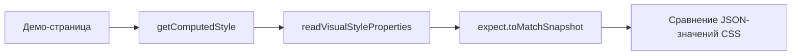

# Style-snapshot testing

**Style-snapshot testing** (тестирование стилевых снапшотов) — это проверка, при которой вместо пиксельного скриншота фиксируется набор вычисленных CSS-свойств компонента (`getComputedStyle`), чтобы превратить необъяснимый визуальный дифф в читаемый список изменений: `color: rgb(0,0,0) → rgb(51,51,51)`.

## Why it exists

Пиксельный дифф говорит, что картинка изменилась, но не объясняет почему. Разработчик или агент, видя упавший `.visual.spec.ts`, может либо долго разбирать изображения, либо бездумно запустить `--update-snapshots`, рискуя замазать реальную регрессию. Style-snapshot добавляет структурированный сигнал: если изменился `color`, `padding` или `box-shadow`, дифф текста покажет это прямо; если свойства не изменились, значит, пиксельная разница — это рендерный шум (сглаживание, хинтинг шрифтов), который безопасно принять.

## How it works

1. Каждому `spec/{component-name}.visual.spec.ts` соответствует параллельный `spec/{component-name}.style-snapshot.spec.ts`.
2. Тест открывает ту же демо-страницу и эмулирует ту же цветовую схему.
3. Через единый хелпер `readVisualStyleProperties` считывается зафиксированный список визуально значимых свойств (`color`, `backgroundColor`, `padding`, `border*`, `fontSize`, `lineHeight`, `opacity`, `transform`, `boxShadow`, `display`).
4. Значения сериализуются в JSON и сравниваются с коммитнутым снапшотом через `toMatchSnapshot`.
5. Перед обновлением baseline скриншота сначала проверяется style-snapshot дифф: пустой дифф — шум; непустой дифф — указание на конкретное изменение, которое нужно осознанно подтвердить.



### Что делает `readVisualStyleProperties`

```typescript
import type { Locator } from '@playwright/test';

export const VISUAL_STYLE_PROPERTIES = [
  'color', 'backgroundColor', 'borderColor', 'borderWidth', 'borderRadius',
  'boxShadow', 'padding', 'margin', 'fontSize', 'fontWeight', 'lineHeight',
  'opacity', 'display', 'transform',
] as const;

export type VisualStyleSnapshot = Record<(typeof VISUAL_STYLE_PROPERTIES)[number], string>;

export async function readVisualStyleProperties(locator: Locator): Promise<VisualStyleSnapshot> {
  return locator.evaluate((el, properties) => {
    const computed = getComputedStyle(el);
    return Object.fromEntries(
      properties.map((property) => [property, computed[property as keyof CSSStyleDeclaration] as string]),
    ) as Record<string, string>;
  }, VISUAL_STYLE_PROPERTIES) as Promise<VisualStyleSnapshot>;
}
```

Функция выполняется в контексте браузера (`locator.evaluate(...)`). Она принимает `VISUAL_STYLE_PROPERTIES` — единый, централизованный список имён свойств — и для каждого свойства берёт **вычисленное** значение через `getComputedStyle(el)`. Это не имя CSS-класса, не Tailwind-строка и не содержимое атрибута `style`: это финальное значение, полученное после всех каскадов, наследований, CSS-переменных и `light-dark()`. Именно поэтому снапшот ловит изменение токена, даже если класс остался прежним.

### Что такое `.styles.txt`

```typescript
expect(JSON.stringify(styles, null, 2)).toMatchSnapshot(`ds-button-default-${scheme}.styles.txt`);
```

`toMatchSnapshot` — это стандартный assertion Playwright для текстовых снапшотов. Он работает так:

- При первом прогоне (или с `--update-snapshots`) Playwright сериализует переданное значение и сохраняет в файл снапшота. В этом решении `snapshotPathTemplate` в `playwright.config.ts` настроен так, что файлы попадают в `spec/snapshot/` рядом с тестом.
- При последующих прогонах Playwright считывает сохранённый снапшот из `spec/snapshot/` и сравнивает с текущим значением.
- Если значения отличаются, тест падает, и в выводе/диффе видно, какое именно свойство изменилось: `color: rgb(0, 0, 0) → rgb(51, 51, 51)`.

`JSON.stringify(styles, null, 2)` нужен, чтобы файл снапшота был многострочным, читаемым JSON, а не одной строкой. В качестве имени передаётся `ds-button-default-light.styles.txt`, чтобы по имени было понятно, что это стилевой снапшот конкретного состояния и цветовой схемы.

### Про `--update-snapshots` в style-snapshot

`--update-snapshots` — это **общий** флаг Playwright для всех снапшотов в спеке: и для `toHaveScreenshot` (PNG), и для `toMatchSnapshot` (текст). Когда вы осознанно меняете внешний вид, вы запускаете визуальный спек с `--update-snapshots`, и он обновляет **и** PNG-базелайн, **и** текстовый style-snapshot. Поэтому в правиле и сказано: сначала смотри style-snapshot дифф, чтобы понять, что именно изменилось, и только потом обновляй оба снапшота одной командой.

## How it is structured

- **Shared helper** — `read-visual-style-properties.ts` с единым списком `VISUAL_STYLE_PROPERTIES`; живёт в project-level test-support, не дублируется на компонент.
- **Style-snapshot spec** — `spec/{component-name}.style-snapshot.spec.ts`, по одному рядом с `spec/{component-name}.visual.spec.ts`.
- **Computed-style snapshot** — текстовый снапшот с JSON-значениями свойств, коммитится в `spec/snapshot/`.
- **Paired visual spec** — изменения сравниваются с изменениями в `spec/{component-name}.visual.spec.ts` перед обновлением baseline.
- **Curated property list** — список свойств расширяется централизованно, а не заводится отдельный набор под каждый компонент.

## Example

```typescript
// File: projects/design-system/src/lib/ds-button/spec/ds-button.style-snapshot.spec.ts
import { test, expect } from '@playwright/test';
// The helper is a single shared file in the project's test-support directory
import { readVisualStyleProperties } from '@test/read-visual-style-properties';

test.describe('DsButtonComponent — style snapshot', () => {
  for (const scheme of ['light', 'dark'] as const) {
    test(`computed style matches baseline (${scheme})`, async ({ page }) => {
      await page.emulateMedia({ colorScheme: scheme });
      await page.goto('/ds-button/default');
      const styles = await readVisualStyleProperties(page.getByTestId('ds-button'));
      expect(JSON.stringify(styles, null, 2)).toMatchSnapshot(`ds-button-default-${scheme}.styles.txt`);
    });
  }
});
```

## Related concepts

- [Visual regression testing](skills/angular/architecture/v3.1/solutions/testing/solution-ui-testing.skill/glossary/visual-regression-testing.md) — фиксирует пиксельную картинку, с которой работает style-snapshot.
- [Behavioral component testing](skills/angular/architecture/v3.1/solutions/testing/solution-ui-testing.skill/glossary/behavioral-component-testing.md) — DOM-тест, не затрагивающий стили.
- [Accessibility testing](skills/angular/architecture/v3.1/solutions/testing/solution-ui-testing.skill/glossary/accessibility-testing.md) — проверяет доступность, а не стилевые значения.

## Sources

- [MDN — getComputedStyle](https://developer.mozilla.org/en-US/docs/Web/API/Window/getComputedStyle)
- [Playwright — Test Snapshots](https://playwright.dev/docs/test-snapshots)
- [ADR: style-snapshot-approach](skills/angular/architecture/v3.1/solutions/testing/solution-ui-testing.skill/adr/style-snapshot-approach.md)
- [Generic pattern для style-snapshot спеков](skills/angular/architecture/v3.1/solutions/testing/solution-ui-testing.skill/Implementation/Testing/{component-name}.style-snapshot.spec.ts.create.md)
- [Хелпер readVisualStyleProperties](skills/angular/architecture/v3.1/solutions/testing/solution-ui-testing.skill/Implementation/Testing/read-visual-style-properties.ts.create.md)
- [solution-ui-testing.skill.md — раздел про style-snapshot](skills/angular/architecture/v3.1/solutions/testing/solution-ui-testing.skill/solution-ui-testing.skill.md)
