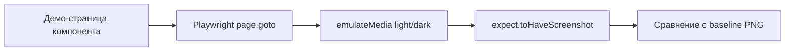

# Visual regression testing

**Visual regression testing** (визуальное регрессионное тестирование) — это автоматическая проверка, что UI-компонент выглядит так же, как раньше, путём сравнения текущего скриншота его демо-страницы с сохранённым базовым изображением.

## Why it exists

DOM-тесты умеют проверять текст, роли и события, но не видят фактическую картинку: jsdom/happy-dom не имеет движка рендеринга и не может сказать, что сломалась вёрстка, неправильно применилась тёмная тема, упал контраст или возник конфликт CSS-специфичности. Визуальное регрессионное тестирование закрывает этот пробел, фиксируя внешний вид компонента и фейля CI при любом заметном отклонении.

## How it works

1. Для каждого значимого состояния компонента создаётся стабильная демо-страница (`/ds-button/default`, `/ds-button/disabled` и т. п.).
2. Playwright открывает страницу напрямую по этому URL.
3. При необходимости эмулируется цветовая схема (`light`/`dark`).
4. Тест вызывает `expect(page).toHaveScreenshot(...)`, который сравнивает текущий скриншот с сохранённым baseline.
5. Если пиксельная разница превышает порог, CI падает; baseline обновляется только осознанно через `--update-snapshots` и ревью PR.



### Что делает `expect(page).toHaveScreenshot(...)`

`toHaveScreenshot` — это assertion Playwright, который делает три вещи:

1. Делает скриншот видимой области страницы, к которой применён `page`.
2. Сравнивает его с файлом-базелайном (`ds-button-default-light.png`). При первом запуске, если baseline ещё не существует, Playwright либо создаёт его (если разрешено), либо просит запустить с `--update-snapshots`.
3. Вычисляет пиксельный дифф. Если количество различающихся пикселей превышает настроенный порог, тест падает и генерирует вспомогательные файлы: `actual.png` (что получилось), `expected.png` (старый baseline) и `diff.png` (красная маска различий).

Playwright перед скриншотом пытается стабилизировать страницу: останавливает CSS-анимации, ожидает окончания переходов, сбрасывает фокус. Но если на демо-странице есть динамический контент (часы, случайный порядок, UUID), скриншот будет «мигать» — такой контент нужно убирать в самом preview-приложении.

### Про `--update-snapshots`

`--update-snapshots` — общий флаг Playwright. Когда вы осознанно меняете внешний вид, он обновляет **все** снапшоты в спеке: и PNG-скриншоты, и текстовые снапшоты (`.styles.txt`). Поэтому перед его запуском смотрят на парный style-snapshot дифф: он объясняет, какие CSS-свойства изменились и стоит ли обновлять baseline.

## How it is structured

- **Demo/preview page** — минимальное приложение, которое рендерит компонент в одном состоянии с фиксированными данными: `apps/component-preview` (платформа) или `projects/demo` (design system).
- **Visual spec** — `.visual.spec.ts`, по одному на компонент, со скриншотами каждого состояния и цветовой схемы.
- **Baseline image** — коммитится в репозиторий под `spec/snapshot/` рядом со спеком как эталон. Playwright `snapshotPathTemplate` в `playwright.config.ts` должен быть настроен на эту папку.
- **Diff threshold** — настраивается в Playwright; отсеивает незначительный шум, но остаётся чувствительным к реальным регрессиям.
- **Update workflow** — baseline меняется только как часть намеренного визуального изменения, после просмотра диффа.

## Example

```typescript
// File: projects/design-system/src/lib/ds-button/spec/ds-button.visual.spec.ts
import { test, expect } from '@playwright/test';

test.describe('DsButtonComponent — visual', () => {
  for (const scheme of ['light', 'dark'] as const) {
    test(`matches baseline (${scheme})`, async ({ page }) => {
      await page.emulateMedia({ colorScheme: scheme });
      await page.goto('/ds-button/default');
      await expect(page).toHaveScreenshot(`ds-button-default-${scheme}.png`);
    });
  }
});
```

## Related concepts

- [Behavioral component testing](skills/angular/architecture/v3.1/solutions/testing/solution-ui-testing.skill/glossary/behavioral-component-testing.md) — проверяет поведение, но не видит картинку.
- [Style-snapshot testing](skills/angular/architecture/v3.1/solutions/testing/solution-ui-testing.skill/glossary/style-snapshot-testing.md) — объясняет, какие именно CSS-свойства изменились, когда визуальный тест падает.
- [Accessibility testing](skills/angular/architecture/v3.1/solutions/testing/solution-ui-testing.skill/glossary/accessibility-testing.md) — ловит WCAG-нарушения, которые скриншот не проверяет.

## Sources

- [Playwright — Test Snapshots](https://playwright.dev/docs/test-snapshots)
- [Playwright — Screenshot Assertions](https://playwright.dev/docs/api/class-page#page-screenshot)
- [ADR: visual-regression-approach](skills/angular/architecture/v3.1/solutions/testing/solution-ui-testing.skill/adr/visual-regression-approach.md)
- [Generic pattern для визуальных спеков в решении](skills/angular/architecture/v3.1/solutions/testing/solution-ui-testing.skill/Implementation/Testing/{component-name}.visual.spec.ts.create.md)
- [solution-ui-testing.skill.md — описание визуального слоя](skills/angular/architecture/v3.1/solutions/testing/solution-ui-testing.skill/solution-ui-testing.skill.md)
