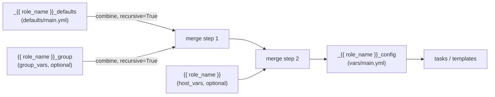

# Goal
- Give every role a single, unique variable namespace so no two roles can collide on the same variable name in inventory.
- Let a variable be set at the right altitude — role default, whole group, or a single host — without ever editing the role itself.
- Make changing one role's variable structure a one-role change, not a multi-file hunt across the inventory.

# Capabilities
- A role's variables can never be shadowed by another role's variables, because every tier is prefixed with the role's own name.
- Consumers (playbooks/inventory) can override just the group or just the host, or both, or neither, and always get a fully-defined effective configuration.
- Tasks and templates read one variable (`_{{ role_name }}_config`) regardless of which tier actually supplied a given key.

# Core Principles
- Each role owns its own variable structure — every tier is prefixed with the role's own `{{ role_name }}`, so renaming or restructuring one role's variables cannot silently affect another role.
- Precedence is fixed and always defaults → group → host; it is never reordered per role.
- The merge is computed once, in the role's `vars/main.yml`, never duplicated in tasks.

# Adr
- [[adr/three-tier-variable-precedence.md|Three-tier variable precedence]]
  - Selected variant: [[adr/three-tier-variable-precedence.md#Three-tier prefixed combine (selected)|Three-tier prefixed combine]]

# Requirements
SOLUTION:
- Related, narrower guidance already in the repo: [ansible-role-requirements.skill.md §6](../../../../ansible-role-requirements/SKILL.md) documents a two-tier `_defaults` + `_override` combine pattern for a single override input. This solution generalizes that pattern to three fixed tiers (defaults, group, host) when a role needs group-level and host-level overrides to be independent, ordered inputs rather than one shared `_override` variable.

ANSIBLE-CORE:
- `combine` filter (built-in, no collection required) — see [[glossary/ansible-combine-filter.md|Ansible combine filter]] for merge semantics, `recursive=True`, and `default({})`.

# Template Skill Mutations
FILES:
- [[./Implementation/defaults/main.yml.create.md|defaults/main.yml]] - create - defines `_{{ role_name }}_defaults`, the full safe key set
- [[./Implementation/vars/main.yml.create.md|vars/main.yml]] - create - combines defaults → group → host into `_{{ role_name }}_config`
- [[./Implementation/inventory/group_vars/{group}.yml.create.md|inventory/group_vars/{{ group }}.yml]] - create - consumer-side example of the group override tier
- [[./Implementation/inventory/host_vars/{host}.yml.create.md|inventory/host_vars/{{ host }}.yml]] - create - consumer-side example of the host override tier

# Workflow

## Define a role's variables (happy path)
1. Author adds `_{{ role_name }}_defaults` to `roles/{{ role_name }}/defaults/main.yml` with every key the role will consume, each given a safe value.
2. Author adds the combine expression to `roles/{{ role_name }}/vars/main.yml`, producing `_{{ role_name }}_config` from `_{{ role_name }}_defaults`, `{{ role_name }}_group`, and `{{ role_name }}`.
3. Role tasks/templates read exclusively from `_{{ role_name }}_config.*`.
4. A consumer optionally sets `{{ role_name }}_group` in `group_vars/{{ group }}.yml` to override keys for a whole group.
5. A consumer optionally sets `{{ role_name }}` in `host_vars/{{ host }}.yml` to override keys for one host.
6. At play time, Ansible resolves `_{{ role_name }}_config` by evaluating the combine chain against whichever of the three tiers are actually defined.

## No group or host override defined
1. `{{ role_name }}_group` and `{{ role_name }}` are both undefined for the host being played.
2. `| default({})` in both `combine()` calls substitutes an empty mapping for each, so the merge does not fail.
3. `_{{ role_name }}_config` equals `_{{ role_name }}_defaults` unchanged.

## Overriding a nested key
1. `_{{ role_name }}_defaults` defines a nested mapping, e.g. `paths: {install: ..., data: ...}`.
2. `{{ role_name }}_group` sets only `paths: {data: /custom}`.
3. Because both `combine()` calls use `recursive=True`, the merge keeps `paths.install` from the defaults and only overwrites `paths.data` — see [[glossary/ansible-combine-filter.md|combine filter]].
4. Without `recursive=True`, step 3 would instead replace the whole `paths` mapping, silently losing `paths.install`.

# Rules

## MUST
- [[./Implementation/defaults/main.yml.create.md#MUST|defaults/main.yml]]
- [[./Implementation/vars/main.yml.create.md#MUST|vars/main.yml]]
- [[./Implementation/inventory/group_vars/{group}.yml.create.md#MUST|group_vars/{{ group }}.yml]]
- [[./Implementation/inventory/host_vars/{host}.yml.create.md#MUST|host_vars/{{ host }}.yml]]

## SHOULD
- [[./Implementation/defaults/main.yml.create.md#SHOULD|defaults/main.yml]]

## MUST NOT
- [[./Implementation/defaults/main.yml.create.md#MUST NOT|defaults/main.yml]]
- [[./Implementation/vars/main.yml.create.md#MUST NOT|vars/main.yml]]
- [[./Implementation/inventory/group_vars/{group}.yml.create.md#MUST NOT|group_vars/{{ group }}.yml]]
- [[./Implementation/inventory/host_vars/{host}.yml.create.md#MUST NOT|host_vars/{{ host }}.yml]]

# Anti-patterns
- **Reusing a generic, unprefixed variable name across roles (e.g. `port`, `config`, `enabled`)**
  - Consequence: two roles collide the moment they are used together in the same inventory scope; overriding one role's `port` in `group_vars` can accidentally feed the wrong value into another role.
  - Instead: prefix every tier with the role's own unique name, as in [[./Implementation/defaults/main.yml.create.md|defaults/main.yml]].
- **Reading `{{ role_name }}_group` or `{{ role_name }}` directly inside tasks instead of `_{{ role_name }}_config`**
  - Consequence: the task breaks with an undefined-variable error the moment a host or group has no override defined, even though the role has perfectly good defaults.
  - Instead: always read from `_{{ role_name }}_config`, per [[./Implementation/vars/main.yml.create.md|vars/main.yml]].
- **Naming the merged config the same as one of its own input tiers**
  - Consequence: Ansible's `vars/main.yml` precedence over `host_vars` means the role's own file wins over the host tier it was supposed to merge in, silently discarding host-level overrides.
  - Instead: keep four distinct names — `_{{ role_name }}_defaults`, `{{ role_name }}_group`, `{{ role_name }}`, `_{{ role_name }}_config` — see [[./Implementation/vars/main.yml.create.md|vars/main.yml]].
- **Omitting `recursive=True` when a tier's value is a nested mapping**
  - Consequence: a group or host override that sets a single nested key wholesale replaces the entire nested mapping, silently dropping untouched sibling keys — see [[glossary/ansible-combine-filter.md|combine filter]].
  - Instead: always pass `recursive=True` when any tier value is a mapping.
- **Adding a new key only at the group or host tier, never in `_{{ role_name }}_defaults`**
  - Consequence: the role has no safe fallback; running it against a host/group that forgot to set the key fails deep inside a task instead of surfacing a clear, documented default.
  - Instead: add every new key to `_{{ role_name }}_defaults` first, per [[./Implementation/defaults/main.yml.create.md|defaults/main.yml]].
- **Recomputing the merge again in a task via `set_fact`**
  - Consequence: a second, independent merge computation can drift out of sync with the one in `vars/main.yml`, and the actual effective precedence becomes unclear.
  - Instead: compute `_{{ role_name }}_config` once, in `vars/main.yml`.

# Check list
- [ ] `roles/{{ role_name }}/defaults/main.yml` defines `_{{ role_name }}_defaults` with every key the role consumes.
- [ ] `roles/{{ role_name }}/vars/main.yml` defines `_{{ role_name }}_config`, combining defaults → group → host with `recursive=True` on both combines.
- [ ] No task or template in the role reads `{{ role_name }}_group` or `{{ role_name }}` directly — only `_{{ role_name }}_config`.
- [ ] Any `group_vars`/`host_vars` overrides in the role's `example/` folder use `{{ role_name }}_group` / `{{ role_name }}` and list only the keys they actually override.
- [ ] No other role in the project reuses this role's `{{ role_name }}` prefix.
