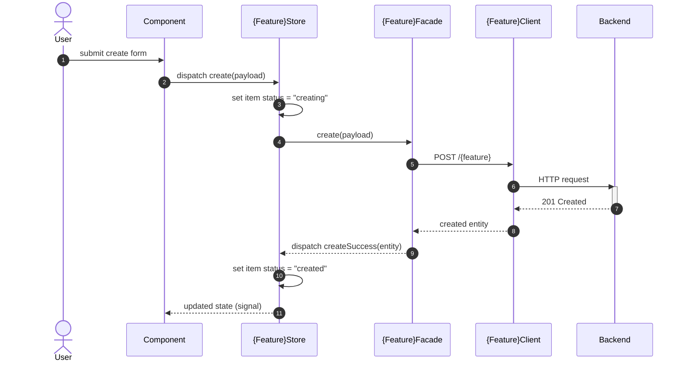

# How Apply this template
- Fill `whenToUse` with the concrete situations that should make the agent read the plateau before writing code (starting a new app/lib/feature under `{plateau-name}`, or checking whether a change already made follows it). See [skill-design](skills/common-workflow/skill-design.skill/skill-design.skill.md) for the baseline rules.
- add to header properties `tags` tag `plateau/{plateau-name}`
- Fill `parent_plateaus` as a list (empty when built from scratch) and `standalone` (`true`/`false`) per [[skills/common-workflow/architecture/design/solution-plateau-hierarchy.skill.md|solution-plateau-hierarchy]]. When `parent_plateaus` is non-empty, merge every parent's content by union; stop and ask the user, then record a plateau-level ADR, on any conflict between parents or between a parent and `created_by`.

# Core Principles
```hint
Summarise core principles from applied solutions.

MUST:
- If Core Principles conflicted to each other as user to solve the problem
- Don't just copy principles, make brief summary

RECOMENDATION:
- Prefer bullet list
```
```example
- Every business feature is split into at least a `feature` lib and a `data-access` lib from the start
```
# Capabilities
```hint
What capabilities does this plateau has

MUST:
- If Capabilities conflicted to each other as user to solve the problem
- Summaraize all capabilities from all used solutions and logicaly group them

RECOMENDATION:
- Prefer bullet list
```
```example
- state management
	- component-local state lives in Signals, feature state in a Signal Store, cross-cutting state in classical NgRx
- routing
	- every routable feature exports its `Routes` from `index.ts`, relative to its own root only
```

# Usecases
```hint
fill usecases for plateau
- example of interactions
- example of async workflows (optimistic update, offline retry, etc.)
```
## {Case name}
```hint
write short description and mermaid workflow
```
````example
Create an entity with optimistic UI update

````
