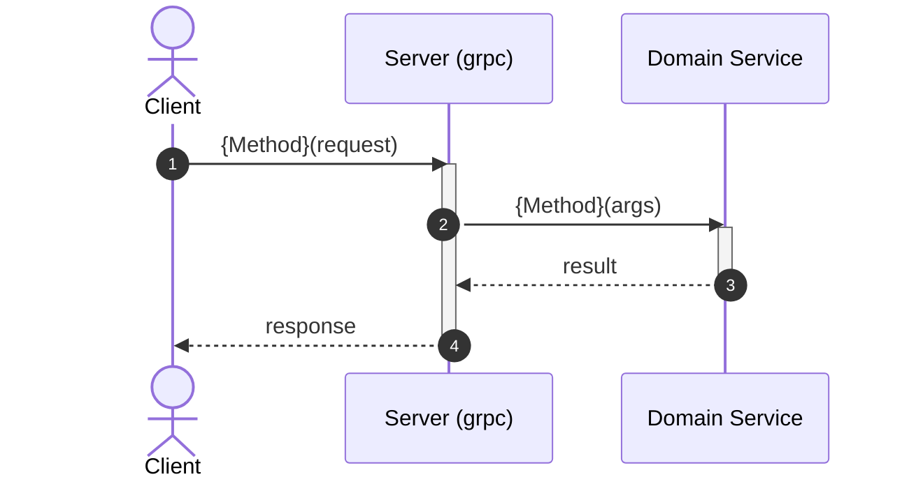

# How Apply this template
- Fill `whenToUse` with the concrete situations that should make the agent read the plateau before writing code (starting a new service/package under `{plateau-name}`, or checking whether a change already made follows it). See [[skills/design/skill-design.skill/skill-design.skill.md|skill-design]] for the baseline rules.
- add to header properties `tags` tag `plateau/{plateau-name}`
- Fill `parent_plateaus` as a list (empty when built from scratch) and `standalone` (`true`/`false`) per [[skills/common-workflow/architecture/design/solution-plateau-hierarchy.skill.md|solution-plateau-hierarchy]]. When `parent_plateaus` is non-empty, merge every parent's content by union; stop and ask the user, then record a plateau-level ADR, on any conflict between parents or between a parent and `created_by`.

# Goal
```hint
Describe the purpose of this plateau.

MUST:
- If `parent_plateaus` is non-empty, explain what problem the solutions in `created_by` solve or what behavior they introduce on top of the union of those parent plateaus.
- If `parent_plateaus` is empty, explain the overall purpose of the plateau.

RECOMENDATION:
- Keep it to one or two sentences.
```
```example
Add a second inbound entry point over gRPC on top of the base HTTP web-service, sharing the same domain service instance.
```

# Core Principles
```hint
Summarise core principles introduced or changed by the solutions in `created_by`.

MUST:
- If `parent_plateaus` is non-empty, describe the union of every parent's content plus the delta `created_by`'s solutions add on top — not just one parent's delta.
- If Core Principles conflict with each other, ask the user to resolve the problem.
- Don't just copy principles; make a brief summary.

RECOMENDATION:
- Prefer bullet list.
```
```example
- Every inbound adapter (HTTP, gRPC, ...) is a thin translation layer over one shared domain-service instance constructed once in `main.go`.
```

# Capabilities
```hint
What capabilities does this plateau add or change.

MUST:
- If `parent_plateaus` is non-empty, describe the union of every parent's content plus the delta `created_by`'s solutions add on top — not just one parent's delta.
- If Capabilities conflict with each other, ask the user to resolve the problem.
- Summarize capabilities from the solutions in `created_by` and group them logically.

RECOMENDATION:
- Prefer bullet list.
```
```example
- api
	- The service answers gRPC calls in addition to HTTP, translating domain sentinel errors into `codes.*` statuses.
```

# Usecases
```hint
Fill use cases that demonstrate new or changed interactions introduced by this plateau.

MUST:
- If `parent_plateaus` is non-empty, cover scenarios from every parent plus any new or changed scenario `created_by`'s solutions add.

RECOMMENDATION:
- Include examples of interactions if applicable.
```
## {Case name}
```hint
write short description and mermaid workflow
```
````example
Handle a gRPC call

````
