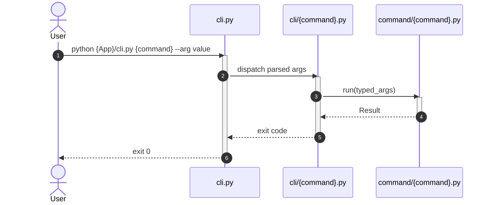

# How Apply this template
- add to header properties `tags` tag `plateau/{plateau-name}`

# Core Principles
```hint
Summarise core principles from applied solutions.

MUST:
- If Core Principles conflicted to each other as user to solve the problem
- Don't just copy principles, make brief summary

RECOMENDATION:
- Prefer bullet list
```
```example
- Every CLI entry point configures logging and exposes `--debug`
```
# Capabilities
```hint
What capabilities does this plateau has

MUST:
- If Capabilities conflicted to each other as user to solve the problem
- Summaraize all capabilities from all used solutions and logicaly group them

RECOMENDATION:
- Prefer bullet list
```
```example
- workflow
	- CLI parses arguments and dispatches to typed Commands
- validation
	- Commands validate typed parameters before orchestrating Functions and Services
```

# Usecases
```hint
fill usecases for plateau
- example of interactions
- example of cron jobs
```
## {Case name}
```hint
write short description and mermaid workflow
```
````example
Run CLI command

````
