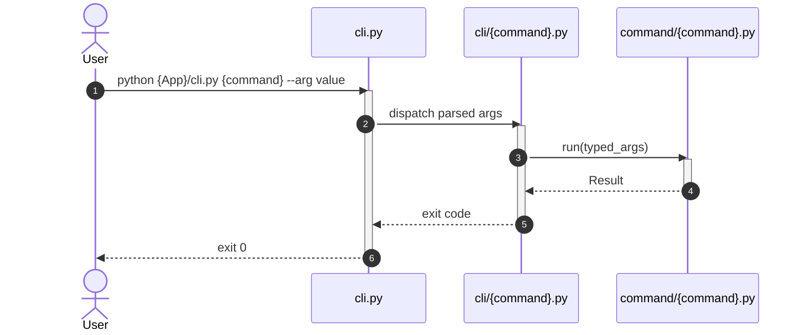

# How Apply this template
- Fill `whenToUse` with the concrete situations that should make the agent read the plateau before writing code (starting a new repository/package/command under `{plateau-name}`, or checking whether a change already made follows it). See [skill-design](skills/common-workflow/skill-design.skill/skill-design.skill.md) for the baseline rules.
- add to header properties `tags` tag `plateau/{plateau-name}`

# Goal
```hint
Describe the purpose of this plateau.

MUST:
- If `parent_plateau` is set, explain what problem the solutions in `created_by` solve or what behavior they introduce on top of the parent plateau.
- If `parent_plateau` is empty, explain the overall purpose of the plateau.

RECOMENDATION:
- Keep it to one or two sentences.
```
```example
Add a typed CLI framework with command dispatch and validation on top of the default Python package structure.
```

# Core Principles
```hint
Summarise core principles introduced or changed by the solutions in `created_by`.

MUST:
- If `parent_plateau` is set, describe only the delta relative to the parent plateau.
- If Core Principles conflict with each other, ask the user to resolve the problem.
- Don't just copy principles; make a brief summary.

RECOMENDATION:
- Prefer bullet list.
```
```example
- Logging: every CLI entry point configures logging and exposes `--debug`.
```

# Capabilities
```hint
What capabilities does this plateau add or change.

MUST:
- If `parent_plateau` is set, describe only the delta relative to the parent plateau.
- If Capabilities conflict with each other, ask the user to resolve the problem.
- Summarize capabilities from the solutions in `created_by` and group them logically.

RECOMENDATION:
- Prefer bullet list.
```
```example
- workflow
	- CLI parses arguments and dispatches to typed Commands.
- validation
	- Commands validate typed parameters before orchestrating Functions and Services.
```

# Usecases
```hint
Fill use cases that demonstrate new or changed interactions introduced by this plateau.

MUST:
- If `parent_plateau` is set, focus on scenarios that are added or changed relative to the parent plateau.

RECOMENDATION:
- Include examples of interactions and cron jobs if applicable.
```
## {Case name}
```hint
write short description and mermaid workflow
```
````example
Run CLI command

````
