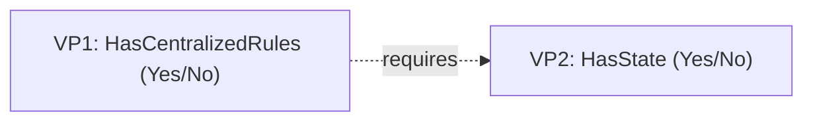

# Orthogonal Variability Model (OVM)

The **Orthogonal Variability Model** is a way of documenting variability as its own model — Variation Points, Variants, Constraints — kept separate ("orthogonal") from the model of the actual artifacts (code, solutions, plateaus), and connected to it only through explicit [[skills/common-workflow/architecture/design/plateau-map/variability-map-create.skill/glossary/realized-by|Realized by]] links. Introduced by Pohl, Böckle, and van der Linden (2005).

## Why it exists
A [[skills/common-workflow/architecture/design/plateau-map/variability-map-create.skill/glossary/feature-model|Feature Model]] draws the questions as a tree, but leaves open where the answers live in code — writing that connection directly into the tree makes it bloat with implementation detail as the catalog grows. OVM's fix is to never embed code references in the tree at all: keep a separate table (a Variability Map) and link outward.

## How it works
Three terms, always used together: a [[skills/common-workflow/architecture/design/plateau-map/variability-map-create.skill/glossary/variation-point|Variation Point]] (the question), a [[skills/common-workflow/architecture/design/plateau-map/variability-map-create.skill/glossary/variant|Variant]] (one legal answer), and [[skills/common-workflow/architecture/design/plateau-map/variability-map-create.skill/glossary/realized-by|Realized by]] (the link from that answer to the code realizing it). Adding a new axis of variability is one new table row, not a new tree node crossed with every existing node.

## How it is structured

The dotted edge is a Constraint between VPs, not a "build order" — the model records legality of combinations, not assembly sequence (assembly is [[skills/common-workflow/architecture/design/plateau-map/delta-conflict-detection.skill/glossary/delta-oriented-programming|Delta-Oriented Programming]]'s job).

## Example
`skills/dotnet/architecture/v3/variability-map.md` is the OVM table for that catalog: each row is a VP, each cell under `Realized by` is the orthogonal link out to a real solution skill.

## Related concepts
- [[skills/common-workflow/architecture/design/plateau-map/variability-map-create.skill/glossary/variation-point|Variation Point]]
- [[skills/common-workflow/architecture/design/plateau-map/variability-map-create.skill/glossary/variant|Variant]]
- [[skills/common-workflow/architecture/design/plateau-map/variability-map-create.skill/glossary/realized-by|Realized by]]
- [[skills/common-workflow/architecture/design/plateau-map/delta-conflict-detection.skill/glossary/delta-oriented-programming|Delta-Oriented Programming]]

## Sources
- Pohl, K., Böckle, G., van der Linden, F. (2005). *Software Product Line Engineering: Foundations, Principles, and Techniques*.
