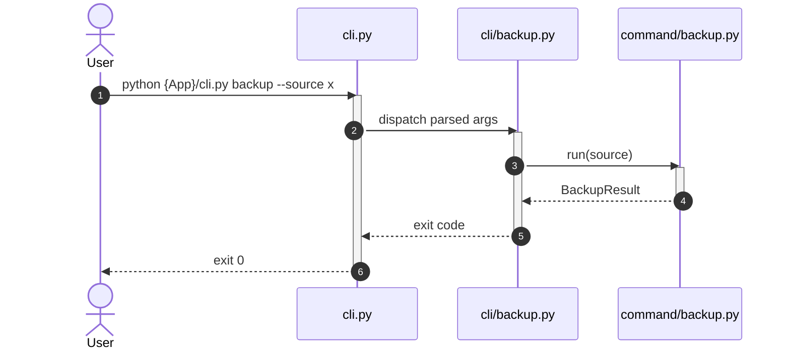

# How Apply this template
- Create a folder named `solution-{SolutionName}.skill` and put this template into it as `solution-{SolutionName}.skill.md`.
- Fill `whenToUse` first: one concrete sentence naming the task types/situations that must make an agent apply this solution. See the front matter comment above and [skill-design](skills/common-workflow/skill-design.skill/skill-design.skill.md) for the baseline rules.
- Fill the template using:
  - `hint` blocks — instructions on how the section should be filled;
  - `example` blocks — examples of filled sections;
  - `code example` blocks — code examples.
- When the section does not apply to the solution, remove the whole section or add a note that no changes are introduced.
- Clearing template hints before finalizing the skill:
  - Remove all `hint`, `example` and `code example` blocks.
  - Remove this `# How Apply this template` block.

# Goal
```hint
List of goals that are pursued by the creation of this solution.
RECOMMENDATION:
- Prefer bullet list
```
```example
- Define the base structure for Python CLI applications with clear separation between CLI, commands, and reusable services/functions
```

# Capabilities
```hint
What are the benefits of using this solution?
RECOMMENDATION:
- Prefer bullet list
```
```example
- Low coupling between application modules
```

# Core Principles
```hint
Core principles that a solution should follow.
RECOMMENDATION:
- Prefer bullet list
- Group principles by logical sense
```
```example
- CLI layer is thin and only translates terminal input to typed Python values
- Commands contain business logic and receive typed parameters
```

# Boundaries
```hint
List what this solution's Rules assume exists elsewhere but that this solution does not itself implement and does not require via a named `depends_on` solution.
Use this section only when such an assumption exists — skip it entirely when the solution is fully self-contained.
RECOMMENDATION:
- Prefer bullet list
- State the gap itself, not who is responsible for it. Name a specific solution only informationally, when one reliably closes the gap in the current catalog today — never as a `depends_on` requirement, since the gap must remain true even if that solution is absent.
- Do not use this section for a dependency that has a concrete Implementation-file link — that is a real dependency and belongs in `# Requirements` instead.
```
```example
- An unhandled exception raised while validating a value is not caught here — some global exception-handling middleware is expected to catch it. This solution does not require a specific middleware package to be installed.
```

# Adr
```hint
Use this section only if an architecture decision was made while building or editing the solution.
Record every such decision as an ADR following [[skills/common-workflow/architecture/design/adr-create.skill/adr-create.skill.md|adr-create]]: create ADR files from its template in an `adr/` folder inside the solution skill folder, list them in the `adr:` property of the YAML header, and briefly summarize each decision in the skill body with a link to its ADR.
RECOMMENDATION:
- Prefer bullet list
```
```example
- [[adr/dto-validators-only-for-request-dtos.md|DTO validators only for RequestDto]]
  - Selected variant: Create validators only for RequestDto by default
```

# Requirements
```hint
List of requirements for solution applying and packages. Define what solution uses from dependencies.
RECOMMENDATION:
- Prefer bullet list
- Use <Link|Property Name> format in link

TEMPLATE:
SOLUTION:
- {link to requirements solution}
  - {link to requirements file in solution}
    - {link to requirements module/class in solution} - description how does it used in solution
PYPI / STANDARD LIBRARY:
- {package name} {version}
  - {Class or function} - description how does it used in solution
```
```example
SOLUTION:
- [[solution-repository-structure.skill.md|Repository structure solution]]
  - [[app-host.create.md|App.Host]]
    - [[command.py.create.md|Command]] - add extension `IRequest` to `Command` class
PYPI:
- pydantic
  - BaseModel - used for request/response DTO validation
```

# Template Skill Mutations
```hint
1. Create an `Implementation/` folder inside the skill folder.
2. All changes which must be made to implement this solution must be written into the `Implementation/` folder using templates from [[./Implementation Templates/|Implementation Templates]].
3. Implementation file naming rules:
   1. For class.template — `{ClassName}.py.{change_kind}.md`
   2. For functions.template — `{ModuleName}.py.{change_kind}.md`
   3. For init.template — `{PackagePath}/__init__.py.{change_kind}.md`
4. Implementation files must be placed into the `Implementation/` folder following this structure:
   - Implementation/
     - {ClassName}.py.{change_kind}.md
     - {ModuleName}.py.{change_kind}.md
     - {PackagePath}/__init__.py.{change_kind}.md
   ATTENTION: for dynamic names like package path, module name or class name prefer using `{Package}`, `{Module}` or `{Class}` notation. It shows that the name is not constant.
5. Every solution skill must provide concrete implementation files, including classification, decision, policy, or taxonomy skills. If the skill selects between variants, provide an implementation file for each variant that shows the resulting code or configuration.
6. When this skill depends on other solutions, each implementation variant or section must explicitly state which dependency solution(s) are applied and which are intentionally not applied.

Add links to created files as shown below:
FILES:
- {link to class template} - {change_kind} - {description}
- {link to functions template} - {change_kind} - {description}
- {link to init template} - {change_kind} - {description}
```
```example
FILES:
- [[./Implementation/backup_service.py.create.md|backup_service.py]] - create - encapsulates backup behavior
- [[./Implementation/helpers.py.create.md|helpers.py]] - create - reusable helper functions
- [[./Implementation/cli/__init__.py.create.md|cli/__init__.py]] - create - make cli a package
```

# Workflow
```hint
Describe all major workflows that the solution covers. Do not limit the description to a single happy-path scenario.
For each workflow:
- Name the scenario (e.g., happy path, validation failure, cross-module call, retry).
- List the participants and the sequence of steps.
- Mention the outcome and any side effects.

When a workflow is best explained visually, use a Mermaid diagram.
Apply the [[skills/common-workflow/mermaid-diagram.skill.md|mermaid-diagram]] skill:
- If a sequence diagram has more than 3 lifelines, or any other diagram has more than 5 elements, place it in a separate `*.mmd` file inside a `diagrams/` subfolder next to this skill file and reference it with markdown link.
- For sequence diagrams, use step numeration and show activation/deactivation of lifelines.
- Keep diagrams focused: one diagram per workflow or per scenario.

RECOMMENDATION:
- Prefer a bullet list of workflows, each optionally followed by its diagram.
- Cover at least: success path, main failure path, and any cross-cutting path (cross-module, async, retry, etc.).
```
```example
## Run CLI command (happy path)

1. User runs `python {App}/cli.py {command} --arg value`.
2. `cli.py` builds the argument parser and configures logging.
3. The matched `cli/{command}.py` subparser converts raw arguments into typed Python values.
4. `cli/{command}.py` calls the corresponding `command/{command}.py` function.
5. The Command validates parameters and orchestrates Functions and Services.
6. The Command returns a result object.
7. `cli/{command}.py` prints the result to the terminal.
8. `cli.py` exits with code `0`.
```
````example

```example
## Validation failure

1. User provides invalid or missing arguments.
2. `argparse` prints usage and exits with code `2`.
3. If the Command detects a business validation failure, it logs an error and returns a non-zero exit code.
```
````

# Rules
```hint
Define MUST, SHOULD, MAY rules. Follow the Rule-section baseline in [[skills/common-workflow/skill-design.skill/skill-design.skill.md|skill-design]]:
- Use only ## MUST, ## SHOULD, ## MAY subblocks — never ## MUST NOT/## SHOULD NOT headings.
- Express a prohibition as a negatively-phrased bullet ("Never ...", "Do not ...") inside ## MUST or ## SHOULD, at whichever strength it actually carries.
- Never keep a separate # Anti-patterns section: convert each would-be anti-pattern into a negative bullet with nested `Risk:` (the consequence) and `Fix:` (the correct alternative).
- Every ## MUST bullet that states a rule carries a nested `Risk:` and `Fix:` (`Violation:` is optional); pure link bullets that aggregate implementation-file rules carry none.
- ## SHOULD bullets carry the elaboration only when the rule is non-obvious; ## MAY bullets never carry it.
- Show links to the same subblock in implementation files.
- Only add a subblock for categories that contain at least one implementation-file link or rule.
- If a category has no links and no rules, skip it — do not write an empty subblock.

MUST:
- Contain link to same subblock in implementation template
- Rules that describe a specific implementation file (class, functions module, package init) should be written in that implementation file.

SHOULD:
- Keep rules in implementation file. You can keep rules here only when moving them to an implementation file would reduce clarity or cause irrational duplication (e.g., cross-cutting concerns that span multiple files).
```

## MUST
```example
- [[./Implementation/backup_service.py.create.md#MUST|backup_service.py]]
  - [[./Implementation/helpers.py.create.md#MUST|helpers.py]]
- Never mix CLI and Commands.
  - Risk: code becomes hard to test, responsibilities blur.
  - Fix: keep CLI modules dedicated to argument parsing; delegate work to Commands.
```

## SHOULD
```example
- [[./Implementation/backup_service.py.create.md#SHOULD|backup_service.py]]
```

## MAY
```example
- [[./Implementation/backup_service.py.create.md#MAY|backup_service.py]]
```

# Check list
```hint
What must be true before this solution is considered correctly applied?
RECOMMENDATION:
- Prefer checkbox list
```
```example
- [ ] `cli.py` exists at the project root and configures logging
- [ ] `--debug` flag is available and disabled by default
```
