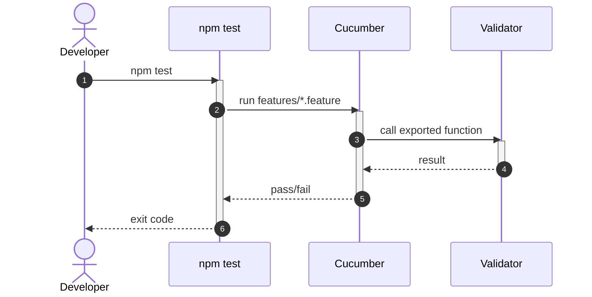

# How Apply this template
- Create a folder named `solution-{SolutionName}.skill` and put this template into it as `solution-{SolutionName}.skill.md`.
- Fill the template using:
  - `hint` blocks — instructions on how the section should be filled;
  - `example` blocks — examples of filled sections;
  - `code example` blocks — code examples.
- When the section does not apply to the solution, remove the whole section or add a note that no changes are introduced.
- Clearing template hints before finalizing the skill:
  - Remove all `hint`, `example` and `code example` blocks.
  - Remove this `# How Apply this template` block.

# Goal
```hint
List of goals that are pursued by the creation of this solution.
RECOMMENDATION:
- Prefer bullet list
```
```example
- Define the base structure for a TypeScript library with clear separation between public API and internal modules
```

# Capabilities
```hint
What are the benefits of using this solution?
RECOMMENDATION:
- Prefer bullet list
```
```example
- Low coupling between application modules
```

# Core Principles
```hint
Core principles that a solution should follow.
RECOMMENDATION:
- Prefer bullet list
- Group principles by logical sense
```
```example
- Public API is exported only through the package's root `index.ts`
- Internal modules are never imported by their full path from outside the package
```

# Adr
```hint
Use this section only if an architecture decision was made while building or editing the solution.
1. Create an `adr/` folder inside the solution skill folder.
2. Add an ADR record using [[./adr/adr.template.md|adr.template.md]].
3. List created ADRs in the `adr:` property of the YAML header.
4. In the skill body, briefly summarize the decision and link to the ADR.
5. The ADR itself must contain `# Selected variant` and `# Searched variants` sections. The selected variant must be clearly marked and linked from `# Searched variants`.

See also a complete example: [[./adr/example.adr.md|example.adr.md]].
RECOMMENDATION:
- Prefer bullet list
```
```example
- [[adr/mutation-tool-choice.md|Mutation testing tool choice]]
  - Selected variant: Stryker (`@stryker-mutator/core`)
```

# Requirements
```hint
List of requirements for solution applying and npm packages. Define what solution uses from dependencies.
RECOMMENDATION:
- Prefer bullet list
- Use <Link|Property Name> format in link

TEMPLATE:
SOLUTION:
- {link to requirements solution}
  - {link to requirements package in solution}
    - {link to requirements class/module in solution} - description how does it used in solution
NPM:
- {package name} {version}
  - {Class or function} - description how does it used in solution
```
```example
SOLUTION:
- [[solution-repository-structure.skill.md|Repository structure solution]]
  - [[{Package}.package.extend.md|{Package}]]
    - [[index.ts.extend.md|index.ts]] - re-export the new public API surface
NPM:
- vitest
  - describe/it - used to run unit tests
```

# Template Skill Mutations
```hint
1. Create an `Implementation/` folder inside the skill folder.
2. All changes which must be made to implement this solution must be written into the `Implementation/` folder using templates from [[./Implementation Templates/|Implementation Templates]].
3. Implementation file naming rules:
   1. For Repository.template — `Repository.{change_kind}.md`
   2. For Project.template — `{Package}.package.{change_kind}.md`
   3. For Class.template — `{ClassName}.ts.{change_kind}.md`
   4. For Module.template — `{ModuleName}.ts.{change_kind}.md`
   5. For Index.template — `{path}/index.ts.{change_kind}.md`
4. Implementation files must be placed into the `Implementation/` folder following this structure:
   - Implementation/
     - Repository.{change_kind}.md
     - {Package}.package.{change_kind}.md
     - {Package}.package.{change_kind}/
       - {ClassName}.ts.{change_kind}.md
       - {ModuleName}.ts.{change_kind}.md
       - {path}/index.ts.{change_kind}.md
   ATTENTION: for dynamic names like package name, module name or class name prefer using `{Package}`, `{Module}` or `{Class}` notation. It shows that the name is not constant.
5. Every solution skill must provide concrete implementation files, including classification, decision, policy, or taxonomy skills. If the skill selects between variants, provide an implementation file for each variant that shows the resulting code or configuration.
6. When this skill depends on other solutions, each implementation variant or section must explicitly state which dependency solution(s) are applied and which are intentionally not applied.

Add links to created files as shown below:
REPOSITORY:
- {link to repository template} - {change_kind} - {description}
PACKAGE:
- {link to package template} - {change_kind} - {description}
  - {link to class/module/index template} - {change_kind} - {description}
```
```example
REPOSITORY:
- [[./Implementation/Repository.extend.md|Repository]] - extend - enforce Cucumber/coverage/mutation CI gates workspace-wide
PACKAGE:
- [[./Implementation/{Package}.package.extend.md|{Package}]] - extend - add step-definition binding for the shared spec
  - [[./Implementation/{Package}.package.extend/index.ts.extend.md|index.ts]] - extend - re-export the validator under test
```

# Workflow
```hint
Describe all major workflows that the solution covers. Do not limit the description to a single happy-path scenario.
For each workflow:
- Name the scenario (e.g., happy path, validation failure, cross-module call, retry).
- List the participants and the sequence of steps.
- Mention the outcome and any side effects.

When a workflow is best explained visually, use a Mermaid diagram.
Apply the [[skills/common-workflow/mermaid-diagram.skill.md|mermaid-diagram]] skill:
- If a sequence diagram has more than 3 lifelines, or any other diagram has more than 5 elements, place it in a separate `*.mmd` file inside a `diagrams/` subfolder next to this skill file and reference it with markdown link.
- For sequence diagrams, use step numeration and show activation/deactivation of lifelines.
- Keep diagrams focused: one diagram per workflow or per scenario.

RECOMMENDATION:
- Prefer a bullet list of workflows, each optionally followed by its diagram.
- Cover at least: success path, main failure path, and any cross-cutting path (cross-module, async, retry, etc.).
```
```example
## Run the package's test suite (happy path)

1. Developer runs `npm test`.
2. Vitest executes unit tests and the Cucumber step definitions.
3. Step definitions call the exported validator function directly.
4. Vitest coverage reporter writes a coverage report.
5. Command exits `0`.
```
````example

````

# Rules
```hint
Define MUST, SHOULD, MAY, SHOULD NOT, MUST NOT rules.
Show links to same subblock in implementation files.
Only add a subblock for categories that contain at least one implementation-file link or rule.
If a category has no links and no rules, skip it — do not write an empty subblock.

MUST:
- Contain link to same subblock in implementation template
- Rules that describe a specific implementation file (class, module, index, package, repository) should be written in that implementation file.

SHOULD:
- Keep rules in implementation file. You can keep rules here only when moving them to an implementation file would reduce clarity or cause irrational duplication (e.g., cross-cutting concerns that span multiple files).
```

## MUST
```example
- [[./Implementation/{Package}.package.extend.md#MUST|{Package}.package.extend]]
  - [[./Implementation/{Package}.package.extend/index.ts.extend.md#MUST|index.ts.extend]]
```

## SHOULD
```example
- [[./Implementation/{Package}.package.extend.md#SHOULD|{Package}.package.extend]]
```

## MAY
```example
- [[./Implementation/{Package}.package.extend.md#MAY|{Package}.package.extend]]
```

## SHOULD NOT
```example
- [[./Implementation/{Package}.package.extend.md#SHOULD NOT|{Package}.package.extend]]
```

## MUST NOT
```example
- [[./Implementation/{Package}.package.extend.md#MUST NOT|{Package}.package.extend]]
```

# Anti-patterns
```hint
Describe concrete wrong ways to apply the solution and their consequences.
Each item must tell the agent what NOT to do, why it is harmful, and what to do instead.

Format:
- **{What NOT to do}**
  - Consequence: {negative consequence}
  - Instead: {correct alternative}

RECOMMENDATION:
- Prefer bullet list
- Be specific to the solution context
```
```example
- **Import a module by its internal path instead of the package's `index.ts`**
  - Consequence: internal restructuring becomes a breaking change for consumers
  - Instead: always import through the package's public `index.ts`
```

# Check list
```hint
What must be true before this solution is considered correctly applied?
RECOMMENDATION:
- Prefer checkbox list
```
```example
- [ ] `package.json` declares the test/coverage/mutation scripts
- [ ] `index.ts` re-exports only the intended public API
```
