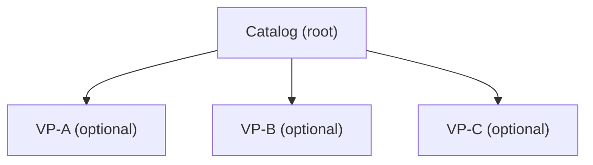

# Feature Model

A **Feature Model** is a way of drawing variability as a tree of yes/no or one-of-many questions ("features") instead of drawing every possible combination of answers as its own node. It comes from FODA (Feature-Oriented Domain Analysis, Kang et al., 1990), the first methodology to formalize Parnas's [[skills/common-workflow/architecture/design/variability-map-create.skill/glossary/program-families.md|Program Families]] split into a concrete notation.

## Why it exists
A tree that draws every combination of independent choices grows exponentially: 3 independent yes/no choices already produce up to 8 combination-nodes, 5 choices produce up to 32. A Feature Model instead draws one node per *question*, plus separate rules for how questions relate — so the tree grows linearly with the number of questions, not exponentially with the number of combinations.

## How it works
Each parent-child edge in the tree carries one of four relations:
- **Mandatory** — the child is always present if the parent is.
- **Optional** — the child may or may not be present, independent of siblings.
- **Alternative** — exactly one child from the group must be chosen.
- **Or** — one or more children from the group may be chosen together.

A rule that relates two features **not** connected by a direct parent-child edge is a **cross-tree constraint**, written separately (e.g. `FeatureA requires FeatureB`) — the tree itself cannot express it.

## How it is structured

A cross-tree constraint like "VP-C requires VP-A" is written as a separate line, not as another edge in this diagram.

## Example
`skills/dotnet/architecture/v3`'s HttpApi and GrpcApi solutions are both **Optional**, siblings, freely combinable — an "Or" relationship, not "Alternative". `HasCentralizedRules requires (HasInteractionValidation OR HasState)` is a cross-tree constraint: the two features it names are not parent/child of each other.

## Related concepts
- [[skills/common-workflow/architecture/design/variability-map-create.skill/glossary/variation-point.md|Variation Point]]
- [[skills/common-workflow/architecture/design/variability-map-create.skill/glossary/orthogonal-variability-model.md|Orthogonal Variability Model]]

## Sources
- Kang, K. C. et al. (1990). "Feature-Oriented Domain Analysis (FODA) Feasibility Study." CMU/SEI-90-TR-21.
