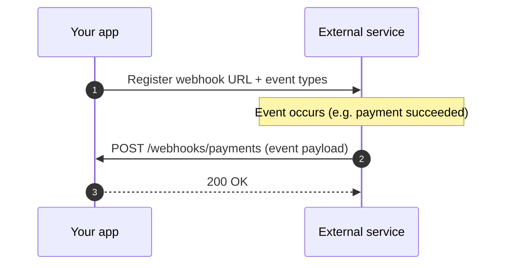

# Webhook

A **webhook** is an HTTP callback: instead of your app repeatedly asking a service "did anything happen yet?", the service sends an HTTP POST to a URL you register the moment something happens.

## Why it exists

Without webhooks, checking for updates means polling — either you hammer the API on a timer and waste requests, or you poll too slowly and miss events. Webhooks let the service push the event to you the instant it happens, so you get near-real-time updates without polling, and without keeping a connection open.

## How it works

1. Your app registers a URL with the service (a "subscription"), usually scoped to specific event types.
2. Something happens on the service's side (a payment succeeds, a file is uploaded, a build finishes).
3. The service builds an event payload and sends an HTTP POST to your registered URL.
4. Your endpoint verifies the request (see [Sources](#sources) for signature verification), processes the event, and responds `2xx`.
5. If your endpoint does not respond `2xx`, most services retry with backoff.



## How it is structured

- **Subscription** — the registration linking an event type to your URL, usually created via an API call or a dashboard.
- **Event payload** — the JSON body describing what happened; shape is defined by the service, not by you.
- **Delivery** — the actual HTTP POST attempt; services usually log delivery attempts and let you inspect failures.
- **Signature/secret** — most services sign the payload (e.g. an `X-Signature` header) so your endpoint can verify the request really came from them, not from an attacker who guessed the URL.
- **Retry policy** — what the service does when your endpoint is down or errors; usually exponential backoff for a bounded number of attempts.

## Example

```python
# Minimal Flask endpoint receiving a webhook
@app.post("/webhooks/payments")
def handle_payment_webhook():
    verify_signature(request.headers["X-Signature"], request.data)
    event = request.get_json()
    if event["type"] == "payment.succeeded":
        mark_order_paid(event["data"]["order_id"])
    return "", 200
```

## Related concepts

- None yet in this glossary.

## Sources

- The payment provider's own "Webhooks" documentation page — subscription setup, payload shape, signature verification, retry behavior. (Cite the exact URL of the provider actually used in the project.)
