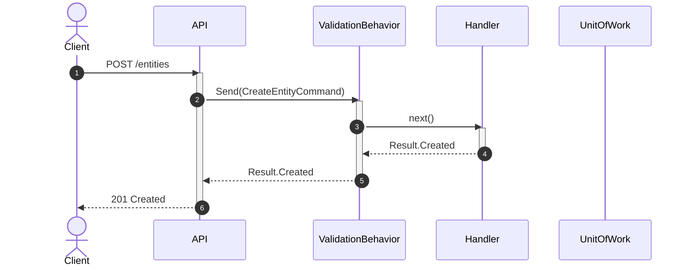
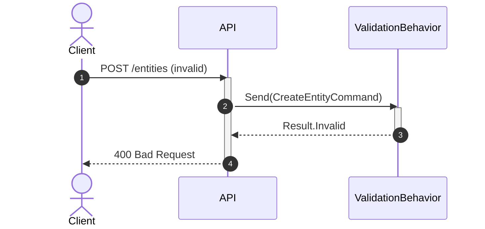

# How Apply this template
- Create a folder named `solution-{SolutionName}.skill` and put this template into it as `solution-{SolutionName}.skill.md`.
- Fill the template using:
  - `hint` blocks — instructions on how the section should be filled;
  - `example` blocks — examples of filled sections;
  - `code example` blocks — code examples.
- When the section does not apply to the solution, remove the whole section or add a note that no changes are introduced.
- Clearing template hints before finalizing the skill:
  - Remove all `hint`, `example` and `code example` blocks.
  - Remove this `# How Apply this template` block.

# Goal
```hint
List of goals that are pursued by the creation of this solution.
RECOMMENDATION:
- Prefer bullet list
```
```example
- Define the system-level architecture for domain events — how events are raised, persisted, and dispatched across the application
```

# Capabilities
```hint
What are the benefits of using this solution?
RECOMMENDATION:
- Prefer bullet list
```
```example
- Low coupling between application modules
```

# Core Principles
```hint
Core principles that a solution should follow.
RECOMMENDATION:
- Prefer bullet list
- Group principles by logical sense
```
```example
- Rules define business predicates
- Entities define consistency.
```

# Adr
```hint
Use this section only if an architecture decision was made while building or editing the solution.
1. Create an `adr/` folder inside the solution skill folder.
2. Add an ADR record using [[./adr/adr.template.md|adr.template.md]].
3. List created ADRs in the `adr:` property of the YAML header.
4. In the skill body, briefly summarize the decision and link to the ADR.
5. The ADR itself must contain `# Selected variant` and `# Searched variants` sections. The selected variant must be clearly marked and linked from `# Searched variants`.

See also a complete example: [[./adr/example.adr.md|example.adr.md]].
RECOMMENDATION:
- Prefer bullet list
```
```example
- [[adr/dto-validators-only-for-request-dtos.md|DTO validators only for RequestDto]]
  - Selected variant: Create validators only for RequestDto by default
```

# Requirements
```hint
List of requirements for solution applying and NuGet packages. Define what solution uses from dependencies.
RECOMMENDATION:
- Prefer bullet list
- Use <Link|Property Name> format in link

TEMPLATE:
SOLUTION:
- [[solution-DependencySolution.skill.md|{name}]]
  - [[LinkToProject.csproj.{change_kind}.md|{name}]]
    - [[ProjectClass.class.{change_kind}.md|{name}]] - description how does it used in solution
NUGET:
- {Nuget package name} {version}
  - {Class} - description how does it used in solution
```
```example
SOLUTION:
- [[solution-repository-structure.skill.md|Repository structure solution]]
  - [[app-host.csproj.extended.md|App.Host]]
    - [[command.class.created.md|Command]] - add extension `IRequest` to `Command` class
NUGET:
- MediatR
  - IRequest - added to `Command` class
```

# Template Skill Mutations
```hint
1. Create an `Implementation/` folder inside the skill folder.
2. All changes which must be made to implement this solution must be written into the `Implementation/` folder using templates from [[./Implementation Templates/|Implementation Templates]].
3. Implementation file naming rules:
   1. For Repository.template — `Repository.{change_kind}.md`
   2. For Project.template — `{ProjectName}.csproj.{change_kind}.md`
   3. For Class.template — `{ClassName}.cs.{change_kind}.md`
4. Implementation files must be placed into the `Implementation/` folder following this structure:
   - Implementation/
     - Repository.{change_kind}.md
     - {ProjectName}.csproj.{change_kind}.md
     - {ProjectName}.csproj.{change_kind}/
       - {ClassName}.cs.{change_kind}.md
   ATTENTION: for dynamic names like Module name or Entity name prefer using `{Module}` or `{Entity}` notation. It shows that the name is not constant.
5. Every solution skill must provide concrete implementation files, including classification, decision, policy, or taxonomy skills. If the skill selects between variants, provide an implementation file for each variant that shows the resulting code or configuration.
6. When this skill depends on other solutions, each implementation variant or section must explicitly state which dependency solution(s) are applied and which are intentionally not applied.

Add links to created files as shown below:
REPOSITORY:
- [[./Implementation/Repository.{change_kind}.md|Repository]] - {change_kind} - {description}
PROJECT:
- [[./Implementation/{ProjectName}.csproj.{change_kind}.md|{ProjectName}.csproj]] - {change_kind} - {description}
  - [[./Implementation/{ProjectName}.csproj.{change_kind}/{ClassName}.cs.{change_kind}.md|{ClassName}.cs]] - {change_kind} - {description}
```
```example
REPOSITORY:
- [[./Implementation/Repository.extend.md|Repository]] - extend - add app host
PROJECT:
- [[./Implementation/App.Host.csproj.create.md|App.Host.csproj]] - create - be root of app composition
  - [[./Implementation/App.Host.csproj.create/DIConfiguration.cs.create.md|DIConfiguration.cs]] - create - be single point of registration into Service collection
- [[./Implementation/{Module}.Domain.csproj.extend.md|{Module}.Domain.csproj]] - extend - core project of domain logic
  - [[./Implementation/{Module}.Domain.csproj.extend/{Entity}.cs.extend.md|{Entity}.cs]] - extend - add invariant validation by rules
  - [[./Implementation/{Module}.Domain.csproj.extend/Rule.cs.create.md|Rule.cs]] - create - add invariant rules
```

# Workflow
```hint
Describe all major workflows that the solution covers. Do not limit the description to a single happy-path scenario.
For each workflow:
- Name the scenario (e.g., happy path, validation failure, cross-module call, retry).
- List the participants and the sequence of steps.
- Mention the outcome and any side effects.

When a workflow is best explained visually, use a Mermaid diagram.
Apply the [[skills/common-workflow/mermaid-diagram.skill.md|mermaid-diagram]] skill:
- If a sequence diagram has more than 3 lifelines, or any other diagram has more than 5 elements, place it in a separate `*.mmd` file inside a `diagrams/` subfolder next to this skill file and reference it with ``.
- For sequence diagrams, use step numeration and show activation/deactivation of lifelines.
- Keep diagrams focused: one diagram per workflow or per scenario.

RECOMMENDATION:
- Prefer a bullet list of workflows, each optionally followed by its diagram.
- Cover at least: success path, main failure path, and any cross-cutting path (cross-module, async, retry, etc.).
```
````example
## Create entity (happy path)

1. Client sends a POST request to the API.
2. API maps the request to a command and sends it through MediatR.
3. Validation behavior validates the command.
4. Handler loads the aggregate, invokes domain logic, and stages changes.
5. Unit of Work commits the transaction.
6. API returns `201 Created`.



## Validation failure

1. Client sends an invalid request.
2. Validation behavior catches the failure before the handler runs.
3. API returns `400 Bad Request` with validation details.


````

# Rules
```hint
Define MUST, SHOULD, MAY, SHOULD NOT, MUST NOT rules.
Show links to same subblock in implementation files.
Only add a subblock for categories that contain at least one implementation-file link or rule.
If a category has no links and no rules, skip it — do not write an empty subblock.

MUST:
- Contain link to same subblock in implementation template
- Rules that describe a specific implementation file (class, project, repository) should be written in that implementation file.

SHOULD:
- Keep rules in implementation file. You can keep rules here only when moving them to an implementation file would reduce clarity or cause irrational duplication (e.g., cross-cutting concerns that span multiple files).
```

## MUST
```example
- [[./Implementation/Shared.csproj.extend.md#MUST|Shared.csproj.extend]]
  - [[./Implementation/Shared.csproj.extend/IQuery.cs.create.md#MUST|IQuery.cs.create]]
- Interfaces.csproj.extend
  - [[./Implementation/Interfaces.csproj.extend/{Dto}.cs.create.md#MUST|{Dto}.cs.create]]
- [[./Implementation/App.Host.csproj.extend.md#MUST|App.Host.csproj.extend]]
```

## SHOULD
```example
- [[./Implementation/Shared.csproj.extend.md#SHOULD|Shared.csproj.extend]]
  - [[./Implementation/Shared.csproj.extend/IQuery.cs.create.md#SHOULD|IQuery.cs.create]]
- Interfaces.csproj.extend
  - [[./Implementation/Interfaces.csproj.extend/{Dto}.cs.create.md#SHOULD|{Dto}.cs.create]]
- [[./Implementation/App.Host.csproj.extend.md#SHOULD|App.Host.csproj.extend]]
```

## MAY
```example
- [[./Implementation/Shared.csproj.extend.md#MAY|Shared.csproj.extend]]
  - [[./Implementation/Shared.csproj.extend/IQuery.cs.create.md#MAY|IQuery.cs.create]]
- Interfaces.csproj.extend
  - [[./Implementation/Interfaces.csproj.extend/{Dto}.cs.create.md#MAY|{Dto}.cs.create]]
- [[./Implementation/App.Host.csproj.extend.md#MAY|App.Host.csproj.extend]]
```

## SHOULD NOT
```example
- [[./Implementation/Shared.csproj.extend.md#SHOULD NOT|Shared.csproj.extend]]
  - [[./Implementation/Shared.csproj.extend/IQuery.cs.create.md#SHOULD NOT|IQuery.cs.create]]
- Interfaces.csproj.extend
  - [[./Implementation/Interfaces.csproj.extend/{Dto}.cs.create.md#SHOULD NOT|{Dto}.cs.create]]
- [[./Implementation/App.Host.csproj.extend.md#SHOULD NOT|App.Host.csproj.extend]]
```

## MUST NOT
```example
- [[./Implementation/Shared.csproj.extend.md#MUST NOT|Shared.csproj.extend]]
  - [[./Implementation/Shared.csproj.extend/IQuery.cs.create.md#MUST NOT|IQuery.cs.create]]
- Interfaces.csproj.extend
  - [[./Implementation/Interfaces.csproj.extend/{Dto}.cs.create.md#MUST NOT|{Dto}.cs.create]]
- [[./Implementation/App.Host.csproj.extend.md#MUST NOT|App.Host.csproj.extend]]
```

# Anti-patterns
```hint
Describe concrete wrong ways to apply the solution and their consequences.
Each item must tell the agent what NOT to do, why it is harmful, and what to do instead.

Format:
- **{What NOT to do}**
  - Consequence: {negative consequence}
  - Instead: {correct alternative}

RECOMMENDATION:
- Prefer bullet list
- Be specific to the solution context
```
```example
- **Skip validation**
  - Consequence: service may fail during request execution or save invalid data
  - Instead: validate input at the transport boundary before the handler runs

- **Business rule in handler**
  - Consequence: logic leaks out of the domain, making the system hard to test and evolve
  - Instead: delegate all business decisions to entities and domain services
```

# Check list
```hint
What must be true before this solution is considered correctly applied?
RECOMMENDATION:
- Prefer checkbox list
```
```example
- [ ] `int Id` with `internal set` present in Entity
```
