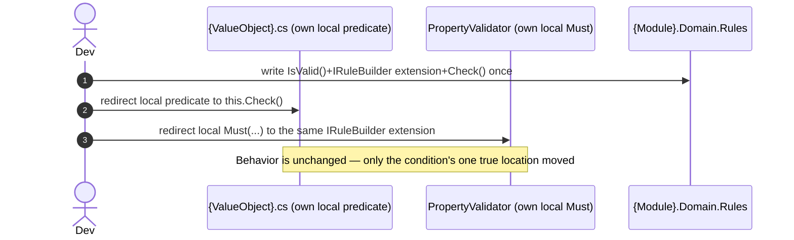
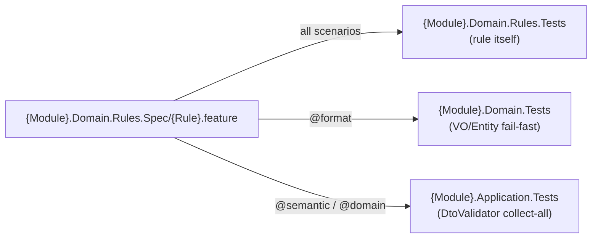

# Goal
- Give a condition that turns out to be duplicated across a VO constructor, an Entity method, a PropertyValidator, and a DTO/Command validator exactly one place where it is declared, once each of those already exists independently
- Let a rule already proven for a Value Object be reused, unmodified, by a DTO validator, an async Command validator, or an external .NET service — never re-declared
- Give `Domain.Rules` a standalone, FluentValidation-dependent project shape so it is reusable by other .NET services without adopting this service's exception or pipeline conventions

# Capabilities
- One rule shape (`IsValid()` + `IRuleBuilder` extension + `Check()`) that VO constructors, Entity methods, `PropertyValidator`s, and DTO/Command validators all call the same way, regardless of whether the rule is Format, Semantic, or Domain
- Decentralized rejection codes (`{ModuleName}.{Class}.{Reason}`) declared next to the rule that produces them, instead of a hand-maintained central registry
- A default, parameterized error message for every rule, with structured `State` still available to a frontend that wants its own text
- A documented boundary for when a Domain rule can stay synchronous (same aggregate) versus when it must become a Try/Confirm process (different aggregate or different service)
- A single point of change: fixing or improving a condition here fixes it everywhere that condition is used, instead of requiring the same fix to be ported to three separately-owned local copies
- One shared Gherkin source per rule (`{Module}.Domain.Rules.Spec/{Rule}.feature`) proven from every layer that redirects to it — the rule's own logic in `{Module}.Domain.Rules.Tests`, its fail-fast VO/Entity adapter in `{Module}.Domain.Tests`, its collect-all DTO adapter in `{Module}.Application.Tests` — without writing the same scenario text three times
- Mutation testing scoped tightly to `{Module}.Domain.Rules` alone, via `{Module}.Domain.Rules.Tests`'s own dedicated project, isolated from the broader Entity/VO mutation surface of `{Module}.Domain.Tests`

# Core Principles
- This solution never introduces a *new* condition — it centralizes one that `solution-value-objects`, `solution-dto-property-validators`, or `solution-domain-behaviour` already wrote locally and independently. Applying it to a module is a refactor of existing, already-working code, not a prerequisite for that code to exist
- A Rule is a static predicate over a **wrapper** of the values it needs — never over a pre-computed verdict the caller already decided
- The wrapper is either an existing `Soft{ValueObject}` property of the container (Format), a `Soft{ValueObject}`/tuple assembled on the spot from the container's own fields (Semantic), or the same assembled from data loaded elsewhere (Domain) — the rule itself never knows which; classifying a rule as Format/Semantic/Domain is part of this solution, not a separate concern
- Name the wrapper (`Soft{ValueObject}`) only when the combination of fields is a reusable domain concept on its own; leave it an anonymous tuple when it exists only for this one comparison
- `Domain.Rules` never performs I/O — loading is always the caller's job (the Handler, a DI-injected async wrapper class, or FluentValidation's `CustomAsync`/`MustAsync`), never the rule
- `ErrorCode`, default `Message`, and `State` are declared exactly once, inside the `IRuleBuilder` extension method; every other adapter calls it or forwards its `ValidationResult`, never re-declares `Must`/`WithErrorCode`/`WithMessage`
- A blocking check reads `result.Errors.Any(e => e.Severity == Severity.Error)` (or `FirstOrDefault` for the exception to throw), never bare `ValidationResult.IsValid`
- A Domain rule that needs data from another aggregate or another service is not "just read it" — same-aggregate Domain rules stay synchronous; cross-aggregate/cross-service Domain rules become Try/Confirm (see Workflow)
- `{Module}.Domain.Rules.Spec` holds `.feature` files only, never a `.cs` file — it is a shared Gherkin source, not a project, and is not itself compiled or referenced by anything; every test project that proves a scenario from it links the physical `.feature` file in via its own `.csproj` and generates its own Reqnroll fixture bound to its own step definitions (see [[skills/dotnet/architecture/draft/solutions/solution-domain-rules.skill/Implementation/{Module}.Domain.Rules.Spec.create|{Module}.Domain.Rules.Spec]])
- `{Module}.Domain.Rules.Tests` proves the rule's own `IsValid()`/`Check()`/`IRuleBuilder` extension directly — it takes scenarios both from its own project (`{Module}.Domain.Rules.Tests/Rules/*.feature`, for rule-only edge cases no other layer needs) and, linked in, from `{Module}.Domain.Rules.Spec` (the scenarios shared with `{Module}.Domain.Tests`/`{Module}.Application.Tests`)

# Boundaries
- Applying this solution to a module is optional. `solution-value-objects`, `solution-dto-property-validators`, and `solution-domain-behaviour` each already work standalone with their own locally-owned condition — nothing about them requires this solution to exist
- This solution does not decide *which* duplicated condition is worth centralizing, or *when* — that judgment call is made by whoever is applying it, based on real, observed duplication or drift, not on speculation
- `Domain.Rules` defines the predicate and its wiring — it does not decide which Entity method or validator must call it; that redirection is what this solution's own `.extend` files do, one consumer at a time
- The Try/Confirm saga's orchestration (Handler, Consumer, Outbox publish/subscribe, `Pending`/`Confirmed`/`Rejected` Entity state machine) is not created by this solution — it is illustrated here only to show why/when a Domain rule needs it; the actual Handler/Consumer wiring follows the existing `solution-command-integration` pattern
- Structural/wiring guarantees over the rule mechanism as a whole — "is every `Check()` actually called," "is `DomainException` thrown only from the right layer," "are rejection codes unique" — are not proven by any `.feature` scenario here; that is [[skills/dotnet/architecture/draft/solutions/solution-cecil-architecture-tests.skill/solution-cecil-architecture-tests.skill.md|solution-cecil-architecture-tests]]'s job, a sibling solution composed alongside this one
- This solution's `built_on_plateau` (`plateau-service-with-validated-module-interaction`) has no repository or other data-loading abstraction. The Domain-classified worked example (`AccountWithdrawalRule` + `TransactionWithdrawalCheck`, injecting `IReadRepository<Transaction>`) is illustrative for the same reason `solution-dto-property-validators`' own `{Feature}Check` example is — see that solution's own Boundaries. Format- and Semantic-classified rules need no persistence and are fully usable at this plateau; a Domain-classified rule's `Load` step becomes real only once a persistence-introducing plateau (`solution-repository-integration`, part of `plateau-statefull-service`) is layered on top

# Adr
- [[skills/dotnet/architecture/draft/solutions/solution-domain-rules.skill/adr/rule-as-irulebuilder-extension|Rule as bool primitive + IRuleBuilder extension]]
  - Selected variant: static class with `IsValid()` + `IRuleBuilder<T,TValue>` extension + `Check()`, `Domain.Rules` depending on FluentValidation directly
- [[skills/dotnet/architecture/draft/solutions/solution-domain-rules.skill/adr/format-semantic-domain-unification|Format/Semantic/Domain are one mechanism]]
  - Selected variant: one mechanism, classified only by where the wrapper's values come from

# Requirements
SOLUTION:
- [[skills/dotnet/architecture/draft/solutions/solution-sln-structure.skill/solution-sln-structure.skill|solution-sln-structure]]
  - Registers `{Module}.Domain.Rules.csproj` as an additional project for the module, per the base-set-plus-extension rule established there
- [[skills/dotnet/architecture/draft/solutions/solution-value-objects.skill/solution-value-objects.skill|solution-value-objects]]
  - [[skills/dotnet/architecture/draft/solutions/solution-value-objects.skill/Implementation/{Module}.Domain.csproj.extend/{ValueObject}.cs.create|{ValueObject}.cs]] - already validates via a local predicate; this solution redirects it to `Check()`
- [[skills/dotnet/architecture/draft/solutions/solution-dto-property-validators.skill/solution-dto-property-validators.skill|solution-dto-property-validators]]
  - [[skills/dotnet/architecture/draft/solutions/solution-dto-property-validators.skill/Implementation/{Module}.Application.csproj.extend/{ValueObject}PropertyValidator.cs.create|{ValueObject}PropertyValidator.cs]] - already validates via a local `Must(...)`; this solution redirects it to the same `IRuleBuilder` extension `{ValueObject}.cs` calls
  - [[skills/dotnet/architecture/draft/solutions/solution-dto-property-validators.skill/Implementation/{Module}.Application.csproj.extend/{Dto}.Validator.cs.create|{Dto}.Validator.cs]] - already checks a cross-field condition locally; this solution redirects it to a Semantic-classified extension
  - [[skills/dotnet/architecture/draft/solutions/solution-dto-property-validators.skill/Implementation/{Module}.Application.csproj.extend/{Feature}Check.cs.create|{Feature}Check.cs]] - already loads data and checks it locally; this solution redirects the check to a Domain-classified `Check()`
- [[skills/dotnet/architecture/draft/solutions/solution-domain-behaviour.skill/solution-domain-behaviour.skill|solution-domain-behaviour]]
  - [[skills/dotnet/architecture/draft/solutions/solution-domain-behaviour.skill/Implementation/{Module}.Domain.csproj.extend/{EntityName}.cs.extend|{EntityName}.cs]] - already validates via a local condition inside behavior methods; this solution redirects it to `Check()`
- [[skills/dotnet/architecture/draft/solutions/solution-dotnet-conformance-testing.skill/solution-dotnet-conformance-testing.skill.md|solution-dotnet-conformance-testing]]
  - [[skills/dotnet/architecture/draft/solutions/solution-dotnet-conformance-testing.skill/Implementation/{Module}.Domain.Tests.csproj.create.md|{Module}.Domain.Tests.csproj]] - gains a rule-focused step-definition class bound to `{Module}.Domain.Rules.Spec` scenarios, proving the VO/Entity fail-fast adapter
  - [[skills/dotnet/architecture/draft/solutions/solution-dotnet-conformance-testing.skill/Implementation/{Module}.Application.Tests.csproj.create.md|{Module}.Application.Tests.csproj]] - gains a rule-focused step-definition class bound to the same scenarios, proving the DtoValidator collect-all adapter
  - `{Module}.Domain.Rules.Tests.csproj` (new here) mirrors the same one-test-project-per-production-project pattern for `{Module}.Domain.Rules` itself

NUGET:
- FluentValidation {existing solution version}
  - `IRuleBuilder<T,TProperty>`, `AbstractValidator<T>`, `InlineValidator<T>`, `ValidationResult`/`ValidationFailure` — the entire mechanism this solution is built on
- Reqnroll.xUnit, coverlet.collector, Microsoft.NET.Test.Sdk — same as every other test project in `solution-dotnet-conformance-testing`, needed by `{Module}.Domain.Rules.Tests`

# Template Skill Mutations

PROJECT:
- [[skills/dotnet/architecture/draft/solutions/solution-domain-rules.skill/Implementation/{Module}.Domain.Rules.csproj.create|{Module}.Domain.Rules.csproj]] - create - Dedicated project holding every centralized business predicate for the module
  - [[skills/dotnet/architecture/draft/solutions/solution-domain-rules.skill/Implementation/{Module}.Domain.Rules.csproj.create/Common.ModuleInfo.cs.create|Common/ModuleInfo.cs]] - create - Module name constant, source of every rejection code's prefix
  - [[skills/dotnet/architecture/draft/solutions/solution-domain-rules.skill/Implementation/{Module}.Domain.Rules.csproj.create/{Rule}.cs.create|{Rule}.cs]] - create - `IsValid()` + `IRuleBuilder` extension + `Check()`, for a Format, Semantic, or Domain-classified condition
- [[skills/dotnet/architecture/draft/solutions/solution-domain-rules.skill/Implementation/Shared.csproj.extend|Shared.csproj]] - extend - Add `EntityNotLoadedException`
  - [[skills/dotnet/architecture/draft/solutions/solution-domain-rules.skill/Implementation/Shared.csproj.extend/EntityNotLoadedException.cs.create|EntityNotLoadedException.cs]] - create - Thrown when an Entity method needs a navigation the Handler did not load
- [[skills/dotnet/architecture/draft/solutions/solution-domain-rules.skill/Implementation/{Module}.Domain.csproj.extend|{Module}.Domain.csproj]] - extend - Redirect already-existing local conditions to the centralized `Check()`
  - [[skills/dotnet/architecture/draft/solutions/solution-domain-rules.skill/Implementation/{Module}.Domain.csproj.extend/{ValueObject}.cs.extend|{ValueObject}.cs]] - extend - Replace `solution-value-objects`'s local predicate with `this.Check()`
  - [[skills/dotnet/architecture/draft/solutions/solution-domain-rules.skill/Implementation/{Module}.Domain.csproj.extend/{EntityName}.cs.extend|{EntityName}.cs]] - extend - Replace `solution-domain-behaviour`'s local condition with `Check()`
- [[skills/dotnet/architecture/draft/solutions/solution-domain-rules.skill/Implementation/{Module}.Application.csproj.extend|{Module}.Application.csproj]] - extend - Redirect already-existing local conditions to the centralized `IRuleBuilder` extension
  - [[skills/dotnet/architecture/draft/solutions/solution-domain-rules.skill/Implementation/{Module}.Application.csproj.extend/{ValueObject}PropertyValidator.cs.extend|{ValueObject}PropertyValidator.cs]] - extend - Replace the local `Must(...)` with the shared `IRuleBuilder` extension
  - [[skills/dotnet/architecture/draft/solutions/solution-domain-rules.skill/Implementation/{Module}.Application.csproj.extend/{Dto}.Validator.cs.extend|{Dto}.Validator.cs]] - extend - Replace the local cross-field `Must(...)` with a Semantic-classified extension
  - [[skills/dotnet/architecture/draft/solutions/solution-domain-rules.skill/Implementation/{Module}.Application.csproj.extend/{Feature}Check.cs.extend|{Feature}Check.cs]] - extend - Forward an existing `Check()`'s `ValidationResult` instead of comparing locally
- [[skills/dotnet/architecture/draft/solutions/solution-domain-rules.skill/Implementation/{Module}.Domain.Rules.Spec.create|{Module}.Domain.Rules.Spec]] - create - Directory of `.feature` files describing each rule, shared across every layer's step definitions — not a project, nothing compiled
  - [[skills/dotnet/architecture/draft/solutions/solution-domain-rules.skill/Implementation/{Module}.Domain.Rules.Spec.create/{Rule}.feature.create|{Rule}.feature]] - create - Gherkin scenarios for one rule, tagged by classification (`@format`/`@semantic`/`@domain`)
- [[skills/dotnet/architecture/draft/solutions/solution-domain-rules.skill/Implementation/{Module}.Domain.Rules.Tests.csproj.create|{Module}.Domain.Rules.Tests.csproj]] - create - Dedicated test project for `{Module}.Domain.Rules`, isolating its mutation-testing surface
  - [[skills/dotnet/architecture/draft/solutions/solution-domain-rules.skill/Implementation/{Module}.Domain.Rules.Tests.csproj.create/{Rule}RuleSteps.cs.create|{Rule}RuleSteps.cs]] - create - Step definitions proving the rule's own `IsValid()`/`Check()`/`IRuleBuilder` extension
- [[skills/dotnet/architecture/draft/solutions/solution-domain-rules.skill/Implementation/{Module}.Domain.Tests.csproj.extend|{Module}.Domain.Tests.csproj]] - extend - Link `{Module}.Domain.Rules.Spec`'s `@format`-tagged scenarios in, add a step-definition class proving the VO/Entity fail-fast adapter
  - [[skills/dotnet/architecture/draft/solutions/solution-domain-rules.skill/Implementation/{Module}.Domain.Tests.csproj.extend/{Rule}Steps.cs.create|{Rule}Steps.cs]] - create - Step definitions calling the VO constructor / Entity method, asserting `DomainException`
- [[skills/dotnet/architecture/draft/solutions/solution-domain-rules.skill/Implementation/{Module}.Application.Tests.csproj.extend|{Module}.Application.Tests.csproj]] - extend - Link `{Module}.Domain.Rules.Spec`'s `@semantic`/`@domain`-tagged scenarios in, add a step-definition class proving the DtoValidator collect-all adapter
  - [[skills/dotnet/architecture/draft/solutions/solution-domain-rules.skill/Implementation/{Module}.Application.Tests.csproj.extend/{Rule}Steps.cs.create|{Rule}Steps.cs]] - create - Step definitions calling the `{ValueObject}PropertyValidator`/`{Dto}Validator`/`{Feature}Check`, asserting `ValidationResult`

# Workflow

## Centralize a condition duplicated across two or more consumers (happy path)

1. Notice the same condition written independently in two or more of: `{ValueObject}.cs` (`solution-value-objects`), `{EntityName}.cs` (`solution-domain-behaviour`), `{ValueObject}PropertyValidator.cs`/`{Dto}.Validator.cs` (`solution-dto-property-validators`).
2. Write `IsValid()` + the `IRuleBuilder` extension (`ErrorCode`/`Message`/`State`) + `Check()` once, in `{Module}.Domain.Rules`.
3. Apply this solution's `.extend` files to redirect every duplicate to the new centralized `Check()`/extension — delete the local copies, don't leave both.
4. Every consumer keeps behaving exactly as before; the only change is where the condition is declared.

## Add a Domain rule that needs data from another aggregate/service

1. Confirm the two Entities are one aggregate (same `Version`/write-lock). If yes, follow the Semantic workflow above — the wrapper is just assembled from a preloaded navigation instead of the container's own fields.
2. If they are **not** one aggregate — different aggregates in the same service, or different services — do not attempt ad hoc synchronization. Go straight to Try/Confirm:
   - Try: create the dependent Entity in a `Pending` status, using a preliminary check against a locally-replicated snapshot of the owning data.
   - Confirm: the owning aggregate's existing, unmodified rule/method (the same one used in the same-aggregate case) runs authoritatively, publishing `Confirmed`/`Rejected`.
   - The dependent Entity transitions `Pending → Confirmed/Rejected` on delivery.
   - This saga's Handler/Consumer wiring is not created by this solution — see [Boundaries](#boundaries).

## Prove a rule from every layer that redirects to it

1. Write one `.feature` file per rule in `{Module}.Domain.Rules.Spec/{Rule}.feature` — the single Gherkin source for that rule, regardless of how many layers call it.
2. Tag each scenario by classification: `@format` (proven at the VO/Entity layer), `@semantic`/`@domain` (proven at the DtoValidator/`{Feature}Check` layer). A rule reused by both gets scenarios of both kinds in the same file.
3. `{Module}.Domain.Rules.Tests` links the whole file in and proves the rule's own `IsValid()`/`Check()` against every scenario, regardless of tag — this is the one place the rule's own correctness is proven in isolation.
4. `{Module}.Domain.Tests` links in only the `@format`-tagged scenarios and proves them again through the VO constructor / Entity method (fail-fast, `DomainException`).
5. `{Module}.Application.Tests` links in the `@semantic`/`@domain`-tagged scenarios and proves them again through the `{ValueObject}PropertyValidator`/`{Dto}Validator`/`{Feature}Check` (collect-all, `ValidationResult`).
6. One Gherkin scenario, three independent proofs that the redirection actually holds at every adapter — never three copies of the same scenario text to keep in sync by hand.

# Rules

## MUST
- [[skills/dotnet/architecture/draft/solutions/solution-domain-rules.skill/Implementation/{Module}.Domain.Rules.csproj.create#MUST|{Module}.Domain.Rules.csproj]]
  - [[skills/dotnet/architecture/draft/solutions/solution-domain-rules.skill/Implementation/{Module}.Domain.Rules.csproj.create/{Rule}.cs.create#MUST|{Rule}.cs]]
- [[skills/dotnet/architecture/draft/solutions/solution-domain-rules.skill/Implementation/Shared.csproj.extend#MUST|Shared.csproj]]
  - [[skills/dotnet/architecture/draft/solutions/solution-domain-rules.skill/Implementation/Shared.csproj.extend/EntityNotLoadedException.cs.create#MUST|EntityNotLoadedException.cs]]
- [[skills/dotnet/architecture/draft/solutions/solution-domain-rules.skill/Implementation/{Module}.Domain.csproj.extend/{ValueObject}.cs.extend#MUST|{ValueObject}.cs]]
- [[skills/dotnet/architecture/draft/solutions/solution-domain-rules.skill/Implementation/{Module}.Domain.csproj.extend/{EntityName}.cs.extend#MUST|{EntityName}.cs]]
- [[skills/dotnet/architecture/draft/solutions/solution-domain-rules.skill/Implementation/{Module}.Application.csproj.extend/{ValueObject}PropertyValidator.cs.extend#MUST|{ValueObject}PropertyValidator.cs]]
- [[skills/dotnet/architecture/draft/solutions/solution-domain-rules.skill/Implementation/{Module}.Application.csproj.extend/{Dto}.Validator.cs.extend#MUST|{Dto}.Validator.cs]]
- [[skills/dotnet/architecture/draft/solutions/solution-domain-rules.skill/Implementation/{Module}.Application.csproj.extend/{Feature}Check.cs.extend#MUST|{Feature}Check.cs]]
- [[skills/dotnet/architecture/draft/solutions/solution-domain-rules.skill/Implementation/{Module}.Domain.Rules.Spec.create#MUST|{Module}.Domain.Rules.Spec]]
- [[skills/dotnet/architecture/draft/solutions/solution-domain-rules.skill/Implementation/{Module}.Domain.Rules.Tests.csproj.create#MUST|{Module}.Domain.Rules.Tests.csproj]]
  - [[skills/dotnet/architecture/draft/solutions/solution-domain-rules.skill/Implementation/{Module}.Domain.Rules.Tests.csproj.create/{Rule}RuleSteps.cs.create#MUST|{Rule}RuleSteps.cs]]
- [[skills/dotnet/architecture/draft/solutions/solution-domain-rules.skill/Implementation/{Module}.Domain.Tests.csproj.extend#MUST|{Module}.Domain.Tests.csproj]]
- [[skills/dotnet/architecture/draft/solutions/solution-domain-rules.skill/Implementation/{Module}.Application.Tests.csproj.extend#MUST|{Module}.Application.Tests.csproj]]

## SHOULD
- [[skills/dotnet/architecture/draft/solutions/solution-domain-rules.skill/Implementation/{Module}.Domain.Rules.csproj.create/{Rule}.cs.create#SHOULD|{Rule}.cs]]

## MUST NOT
- [[skills/dotnet/architecture/draft/solutions/solution-domain-rules.skill/Implementation/{Module}.Domain.Rules.csproj.create#MUST NOT|{Module}.Domain.Rules.csproj]]
  - [[skills/dotnet/architecture/draft/solutions/solution-domain-rules.skill/Implementation/{Module}.Domain.Rules.csproj.create/{Rule}.cs.create#MUST NOT|{Rule}.cs]]
- [[skills/dotnet/architecture/draft/solutions/solution-domain-rules.skill/Implementation/Shared.csproj.extend#MUST NOT|Shared.csproj]]
  - [[skills/dotnet/architecture/draft/solutions/solution-domain-rules.skill/Implementation/Shared.csproj.extend/EntityNotLoadedException.cs.create#MUST NOT|EntityNotLoadedException.cs]]

# Check list
- [ ] `{Module}.Domain.Rules.csproj` exists, references FluentValidation and `{Module}.Interfaces` (for `Soft{ValueObject}` types), nothing else
- [ ] Every centralized condition was previously duplicated in at least two consumers — this solution was not applied speculatively
- [ ] Every rejection code is `public const string` next to the rule that produces it, format `{ModuleName}.{Class}.{Reason}`
- [ ] Every rule has exactly one `IRuleBuilder` extension declaring `Must`/`WithErrorCode`/`WithMessage`/`WithState`; no other file re-declares any of the four
- [ ] Every redirected consumer (`{ValueObject}.cs`, `{EntityName}.cs`, `{ValueObject}PropertyValidator.cs`, `{Dto}.Validator.cs`, `{Feature}Check.cs`) no longer contains its own local copy of the condition
- [ ] Every Domain-classified rule receives already-loaded raw values, never a pre-computed verdict; `Domain.Rules` has no repository/`DbContext` reference anywhere
- [ ] `EntityNotLoadedException` is used for every "required navigation not loaded" case, mapped to 500, never confused with `DomainException`
- [ ] A cross-aggregate/cross-service Domain rule is implemented as Try/Confirm, with the Confirm step reusing the same-aggregate rule/method unmodified
- [ ] `{Module}.Domain.Rules.Spec` contains only `.feature` files, one per rule, tagged `@format`/`@semantic`/`@domain`
- [ ] `{Module}.Domain.Rules.Tests` references `{Module}.Domain.Rules` only, and proves every scenario in the rule's `.feature` file directly against `IsValid()`/`Check()`
- [ ] Every `@format`-tagged scenario is also proven in `{Module}.Domain.Tests` against the VO/Entity adapter; every `@semantic`/`@domain`-tagged scenario is also proven in `{Module}.Application.Tests` against the DtoValidator/`{Feature}Check` adapter
- [ ] No scenario text is duplicated across `{Module}.Domain.Rules.Tests`/`{Module}.Domain.Tests`/`{Module}.Application.Tests` — all three link the same physical `.feature` file from `{Module}.Domain.Rules.Spec`
