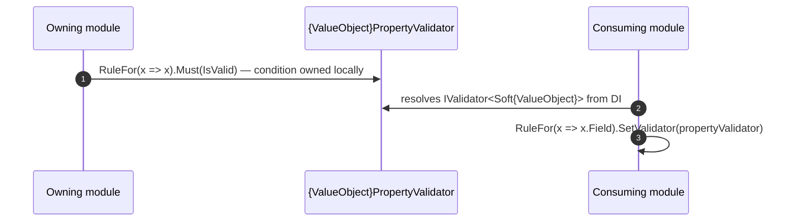

# Goal
- Let each module publish a FluentValidation validator for every public RequestDto and value-concept property it owns
- Let other modules validate values and DTOs they receive through `IValidator<T>` resolved from DI, without referencing this module's `Domain` or `Application` types directly
- Make this solution work completely on its own, with every validator owning its own condition locally

# Capabilities
- Other modules validate a `Soft{ValueObject}` by resolving `IValidator<Soft{ValueObject}>` from DI
- Other modules validate a DTO by resolving `IValidator<{Dto}>` from DI
- Isolated, per-field conformance coverage without assembling a whole valid DTO around the field under test
- A cross-aggregate condition that needs preloaded data is checked before the Handler runs, through a small DI-injected async wrapper — usable once the module has some data-loading abstraction (e.g. `solution-repository-integration`'s `IReadRepository<T>`) to inject; see Boundaries

# Core Principles
- `{ValueObject}PropertyValidator : AbstractValidator<Soft{ValueObject}>` owns its own condition, written locally in this file
- `{Dto}Validator : AbstractValidator<{Dto}>` composes property validators via `SetValidator(IValidator<Soft{ValueObject}>)` for every value-concept property, and checks a cross-field condition spanning several of the DTO's own fields locally, with `.Must(...)`
- `{ValueObject}PropertyValidator` exists even though it could look like a one-line pass-through: it gives other modules DI decoupling (they depend on `IValidator<Soft{ValueObject}>`, never on this module's `Application` internals), and gives one field its own isolated conformance surface
- Every validator is registered via `AddValidatorsFromAssembly` — never manually
- ResponseDto does not get a validator by default; only when a concrete requirement (external contract check, untrusted response source) explicitly demands one
- A condition that needs preloaded data becomes a small, DI-injected async wrapper class (`{Feature}Check`) that loads the data and checks it locally, via `CustomAsync` — this solution defines the *pattern* only; it does not create a repository or any other data-loading abstraction, and `{Feature}Check`'s `Load` step is deliberately left unimplemented until the solution that introduces one supplies the concrete body via its own `.extend.md` on this same class (see Boundaries and [[skills/dotnet/architecture/draft/solutions/solution-dto-property-validators.skill/adr/defer-feature-check-loading-to-persistence-solution|Defer {Feature}Check's Load to the persistence-introducing solution]])
- This solution does not require a shared rules abstraction to exist — a later, optional `solution-domain-behaviour`/`solution-domain-rules` may keep validator-side and Entity-side conditions in sync some other way, but every validator here already works standalone

# Boundaries
- Which `Soft{ValueObject}`/DTO exists to validate is not decided by this solution — that's `solution-value-objects`
- Whether a validator's condition agrees with the same concept's Entity-side enforcement (`solution-domain-behaviour`) is not guaranteed or checked by this solution — the two are written independently today
- Loading data for an async cross-aggregate check (repository calls) is this solution's job for the *validator* path only — the same load also has to happen again, independently, on the Handler's side before the Entity method runs
- `built_on_plateau` for this solution is `plateau-stateless-non-interactive-service`, which has no repository or any other data-loading abstraction. `{Feature}Check`'s `Load` method is therefore deliberately left unimplemented by this solution — it stays a documented shape, not a usable capability, until a solution that introduces persistence (e.g. `solution-repository-integration`, composed in `plateau-statefull-service`) supplies the concrete `Load` body via its own `{Feature}Check.cs.extend.md` on this same class. See [[skills/dotnet/architecture/draft/solutions/solution-dto-property-validators.skill/adr/defer-feature-check-loading-to-persistence-solution|Defer {Feature}Check's Load to the persistence-introducing solution]]

# Adr
- [[skills/dotnet/architecture/draft/solutions/solution-dto-property-validators.skill/adr/use-abstract-validator-for-soft-value-objects|Use AbstractValidator for Soft{ValueObject} validators]]
  - Selected variant: `AbstractValidator<Soft{ValueObject}>`, not `PropertyValidator<T,TProperty>` — the latter cannot be resolved generically as `IValidator<Soft{ValueObject}>` by another module through DI
- [[skills/dotnet/architecture/draft/solutions/solution-dto-property-validators.skill/adr/dto-validators-only-for-request-dtos|DTO validators only for RequestDto by default]]
  - Selected variant: validators created by default only for RequestDto; ResponseDto validators only when explicitly required
- [[skills/dotnet/architecture/draft/solutions/solution-dto-property-validators.skill/adr/defer-feature-check-loading-to-persistence-solution|Defer {Feature}Check's Load to the persistence-introducing solution]]
  - Selected variant: `{Feature}Check.cs.create.md` leaves `Load` unimplemented; `solution-repository-integration` supplies the concrete body via a `{Feature}Check.cs.extend.md` targeting the same class

# Requirements
SOLUTION:
- [[skills/dotnet/architecture/draft/solutions/solution-sln-structure.skill/solution-sln-structure.skill|solution-sln-structure]]
  - [[skills/dotnet/architecture/draft/solutions/solution-sln-structure.skill/Implementation/{Module}.Application.csproj.create|{Module}.Application.csproj]] - hosts every validator this solution creates
- [[skills/dotnet/architecture/draft/solutions/solution-value-objects.skill/solution-value-objects.skill|solution-value-objects]]
  - [[skills/dotnet/architecture/draft/solutions/solution-value-objects.skill/Implementation/{Module}.Interfaces.csproj.extend/Soft{ValueObject}.cs.create|Soft{ValueObject}.cs]] - the type every `{ValueObject}PropertyValidator` validates
- [[skills/dotnet/architecture/draft/solutions/solution-validation-behavior.skill/solution-validation-behavior.skill|solution-validation-behavior]]
  - [[skills/dotnet/architecture/draft/solutions/solution-validation-behavior.skill/Implementation/BuildingBlocks.csproj.extend|BuildingBlocks.csproj]] - the `ValidationBehavior` pipeline that runs every validator this solution creates before the Handler

NUGET:
- `FluentValidation` {version} - `AbstractValidator<T>`, `IValidator<T>`, `CustomAsync`

# Template Skill Mutations

PROJECT:
- [[skills/dotnet/architecture/draft/solutions/solution-dto-property-validators.skill/Implementation/{Module}.Application.csproj.extend|{Module}.Application.csproj]] - extend - Add `/Validators/Property`, `/Validators/Model`, `/Validators/Async` folders, ensure `AddValidatorsFromAssembly` is called
  - [[skills/dotnet/architecture/draft/solutions/solution-dto-property-validators.skill/Implementation/{Module}.Application.csproj.extend/{ValueObject}PropertyValidator.cs.create|{ValueObject}PropertyValidator.cs]] - create - `AbstractValidator<Soft{ValueObject}>` with its own local condition
  - [[skills/dotnet/architecture/draft/solutions/solution-dto-property-validators.skill/Implementation/{Module}.Application.csproj.extend/{Dto}.Validator.cs.create|{Dto}.Validator.cs]] - create - `AbstractValidator<{Dto}>` composing property validators and local cross-field conditions
  - [[skills/dotnet/architecture/draft/solutions/solution-dto-property-validators.skill/Implementation/{Module}.Application.csproj.extend/{Feature}Check.cs.create|{Feature}Check.cs]] - create - DI-injected async wrapper that preloads data and checks a locally-owned cross-aggregate condition

# Workflow

## Validate a value-concept property (happy path)

## Cross-aggregate async check

1. A repository-bound `{Feature}Check` class loads the values a cross-aggregate condition needs.
2. It checks the condition locally and adds a failure into `ValidationContext` via `context.AddFailure(...)` when it fails.
3. The Command validator references it with `RuleFor(x => x).CustomAsync(check.CheckAsync)`.
4. `ValidationBehavior` runs this before the Handler — the client sees the rejection without the Handler ever running; the Handler's own preload and Entity method call (`solution-domain-behaviour`) remain the authoritative backstop.

# Rules

## MUST
- [[skills/dotnet/architecture/draft/solutions/solution-dto-property-validators.skill/Implementation/{Module}.Application.csproj.extend#MUST|{Module}.Application.csproj]]
  - [[skills/dotnet/architecture/draft/solutions/solution-dto-property-validators.skill/Implementation/{Module}.Application.csproj.extend/{ValueObject}PropertyValidator.cs.create#MUST|{ValueObject}PropertyValidator.cs]]
  - [[skills/dotnet/architecture/draft/solutions/solution-dto-property-validators.skill/Implementation/{Module}.Application.csproj.extend/{Dto}.Validator.cs.create#MUST|{Dto}.Validator.cs]]
  - [[skills/dotnet/architecture/draft/solutions/solution-dto-property-validators.skill/Implementation/{Module}.Application.csproj.extend/{Feature}Check.cs.create#MUST|{Feature}Check.cs]]

## SHOULD
- [[skills/dotnet/architecture/draft/solutions/solution-dto-property-validators.skill/Implementation/{Module}.Application.csproj.extend/{Feature}Check.cs.create#SHOULD|{Feature}Check.cs]]

## MUST NOT
- [[skills/dotnet/architecture/draft/solutions/solution-dto-property-validators.skill/Implementation/{Module}.Application.csproj.extend#MUST NOT|{Module}.Application.csproj]]
  - [[skills/dotnet/architecture/draft/solutions/solution-dto-property-validators.skill/Implementation/{Module}.Application.csproj.extend/{ValueObject}PropertyValidator.cs.create#MUST NOT|{ValueObject}PropertyValidator.cs]]
  - [[skills/dotnet/architecture/draft/solutions/solution-dto-property-validators.skill/Implementation/{Module}.Application.csproj.extend/{Dto}.Validator.cs.create#MUST NOT|{Dto}.Validator.cs]]

# Check list
- [ ] Every `{ValueObject}PropertyValidator` extends `AbstractValidator<Soft{ValueObject}>` and owns a fully local condition
- [ ] Every `{Dto}Validator` composes `SetValidator(IValidator<Soft{ValueObject}>)` for each value-concept property, never validates a value-concept property inline
- [ ] Every validator is registered via `AddValidatorsFromAssembly`
- [ ] ResponseDto has a validator only when an explicit requirement exists
- [ ] Every `{Feature}Check` loads data and checks its condition in the same class, no comparison duplicated elsewhere
- [ ] `{Feature}Check.cs.create.md`'s `Load` does not reference a concrete data-loading abstraction — that is left to the persistence-introducing solution's `.extend.md`
- [ ] Other modules resolve validators through `IValidator<T>`, never by referencing this module's `Application` types
