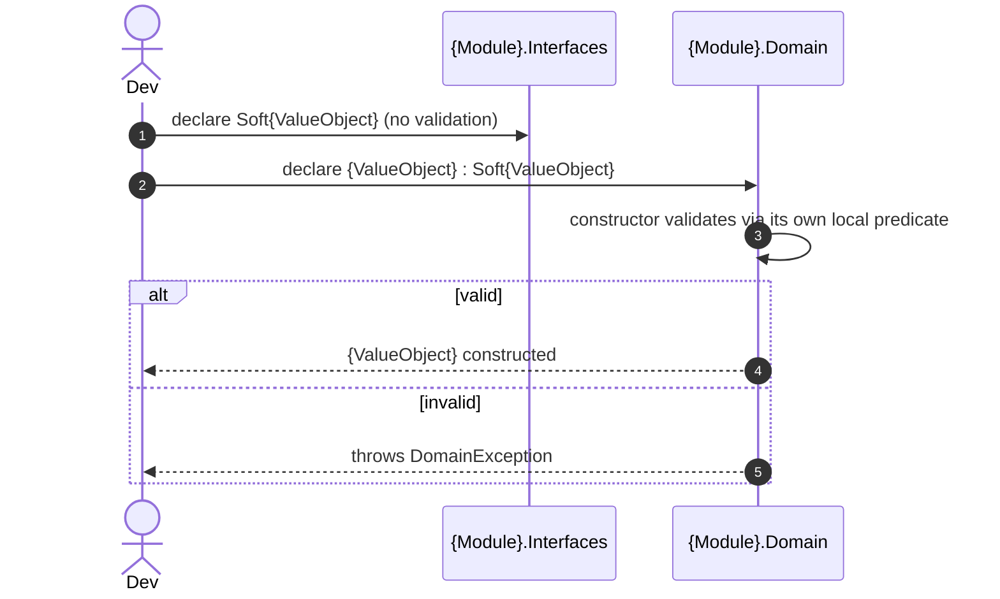

# Goal
- Eliminate primitive obsession by encoding domain semantics into dedicated Value Object types, in both a permissive and a strict strength
- Let a DTO, a Command, or another module hold a value-object-shaped value without being forced to accept the strict type's throw-on-construct semantics
- Prevent invalid domain state inside `{Module}.Domain` by making the strict `{ValueObject}` self-validating at construction time
- Ensure equality is based on value, not reference — two instances with the same data are equal, at both strengths
- Define single-property and multi-property shapes for both the permissive and the strict type

# Capabilities
- Elimination of primitive obsession via semantic domain types, usable both inside Domain and across module/DTO boundaries
- A stable, validation-agnostic public shape (`Soft{ValueObject}`) that other modules and DTOs can reference without depending on `{Module}.Domain`
- A self-validating, invariant-enforcing Domain type (`{ValueObject}`) that inherits the public shape rather than duplicating it
- Structural equality at both strengths

# Core Principles
- Semantics belong to types, not primitives — if a primitive carries business meaning, it gets a `Soft{ValueObject}`/`{ValueObject}` pair
- `Soft{ValueObject}` is a plain, validation-agnostic record — it allows invalid values on purpose, so a DTO with bad client data can still reach the layer that validates it
- `{ValueObject}` is immutable, self-validating, and inherits from `Soft{ValueObject}` — it never duplicates the shape, only adds invariant enforcement
- `{ValueObject}` validates through its own local predicate — a `private static` method on the same class — so this solution is complete and usable entirely on its own, with no dependency on a shared rules abstraction
- `{ValueObject}` has no identity — it is defined entirely by its value, at both strengths
- A `Soft{ValueObject}` does not require a matching `{ValueObject}` — some values are only ever consumed at the permissive strength (e.g. presentation-only DTO fields); the reverse does not hold, every `{ValueObject}` requires a `Soft{ValueObject}` base
- Multi-property types require a private/protected parameterless constructor for EF Core materialization; single-property types should provide implicit conversion operators for ergonomic usage
- `{Module}.Domain` references its own `{Module}.Interfaces` only for the `Soft{ValueObject}` base types — never the reverse
- Value Objects reusable across two or more modules belong in `Shared.csproj`, not duplicated per module

# Boundaries
- The validation predicate lives locally in `{ValueObject}.cs`, written and owned by this solution — it is not shared or reusable across VOs by construction. `solution-domain-rules` may later centralize it into a reusable, cross-adapter form, but this solution does not require or assume that centralization exists.
- `DomainException` thrown by a Value Object constructor is not caught by this solution — some global exception-handling mechanism is expected to catch it; `solution-mediator-exception-handler` currently does this when applied, but this solution does not require it.
- Multi-property `{ValueObject}` persistence mapping (`OwnsOne`) is not configured by this solution — `solution-domain-configuration` owns that entirely.
- Cross-module DI resolution of a validator for `Soft{ValueObject}` is not provided by this solution — `solution-dto-property-validators` owns that.

# Adr
- [[skills/dotnet/architecture/draft/solutions/solution-value-objects.skill/adr/soft-and-strict-value-object-split|Soft (permissive) and strict Value Object as two types, one inheriting the other]]
  - Selected variant: two-type split, `{ValueObject} : Soft{ValueObject}` — chosen to keep `{Module}.Interfaces` declarations-only and validation-agnostic while still giving `{Module}.Domain` a self-enforcing invariant type
- [[skills/dotnet/architecture/draft/solutions/solution-value-objects.skill/adr/response-dto-uses-soft-value-objects|ResponseDto uses Soft{ValueObject} or primitive, mapped from the domain {ValueObject}]]
  - Selected variant: `ResponseDto`/`RequestDto` properties use `Soft{ValueObject}` (or the underlying primitive), never the domain `{ValueObject}` directly — `{Module}.Application` maps between the two

# Requirements
SOLUTION:
- [[skills/dotnet/architecture/draft/solutions/solution-sln-structure.skill/solution-sln-structure.skill|solution-sln-structure]]
  - [[skills/dotnet/architecture/draft/solutions/solution-sln-structure.skill/Implementation/{Module}.Interfaces.csproj.create|{Module}.Interfaces.csproj]] - hosts `Soft{ValueObject}`
  - [[skills/dotnet/architecture/draft/solutions/solution-sln-structure.skill/Implementation/{Module}.Domain.csproj.create|{Module}.Domain.csproj]] - hosts `{ValueObject}` and the entities that use it
    - [[skills/dotnet/architecture/draft/solutions/solution-sln-structure.skill/Implementation/{Module}.Domain.csproj.create/{Entity}.cs.create|{Entity}.cs]] - entity pattern extended with Value Object properties
  - [[skills/dotnet/architecture/draft/solutions/solution-sln-structure.skill/Implementation/Shared.csproj.create|Shared.csproj]] - hosts cross-module reusable Value Objects

NUGET:
- None — relies only on patterns defined by dependency solutions.

# Template Skill Mutations

PROJECT:
- [[skills/dotnet/architecture/draft/solutions/solution-value-objects.skill/Implementation/{Module}.Interfaces.csproj.extend|{Module}.Interfaces.csproj]] - extend - Add ValueObjects folder
  - [[skills/dotnet/architecture/draft/solutions/solution-value-objects.skill/Implementation/{Module}.Interfaces.csproj.extend/Soft{ValueObject}.cs.create|Soft{ValueObject}.cs]] - create - Permissive value-object record, allows invalid values
- [[skills/dotnet/architecture/draft/solutions/solution-value-objects.skill/Implementation/{Module}.Domain.csproj.extend|{Module}.Domain.csproj]] - extend - Add ValueObjects folder, reference `{Module}.Interfaces`
  - [[skills/dotnet/architecture/draft/solutions/solution-value-objects.skill/Implementation/{Module}.Domain.csproj.extend/{ValueObject}.cs.create|{ValueObject}.cs]] - create - Strict Value Object, inherits from `Soft{ValueObject}`, validates via its own local predicate
  - [[skills/dotnet/architecture/draft/solutions/solution-value-objects.skill/Implementation/{Module}.Domain.csproj.extend/{Entity}.cs.extend|{Entity}.cs]] - extend - Use `{ValueObject}` types on entity properties

# Workflow

## Add a value-object-shaped field (happy path)

1. Declare `Soft{ValueObject}` in `{Module}.Interfaces/ValueObjects` — a plain record, no validation.
2. Declare `{ValueObject} : Soft{ValueObject}` in `{Module}.Domain/ValueObjects` — constructor validates via its own `private static` predicate and throws `DomainException` on failure.
3. Use `{ValueObject}` on the owning Entity's property.
4. DTOs and other modules reference `Soft{ValueObject}`, never `{ValueObject}` directly (see the `response-dto-uses-soft-value-objects` ADR).

## Soft-only field (steady state)

1. A value only ever needs the permissive shape (e.g. a presentation-only DTO field with no Domain-side invariant to enforce).
2. `Soft{ValueObject}` is declared without a matching `{ValueObject}` — this is a valid, complete application of this solution on its own.

# Rules

## MUST
- [[skills/dotnet/architecture/draft/solutions/solution-value-objects.skill/Implementation/{Module}.Interfaces.csproj.extend#MUST|{Module}.Interfaces.csproj]]
  - [[skills/dotnet/architecture/draft/solutions/solution-value-objects.skill/Implementation/{Module}.Interfaces.csproj.extend/Soft{ValueObject}.cs.create#MUST|Soft{ValueObject}.cs]]
- [[skills/dotnet/architecture/draft/solutions/solution-value-objects.skill/Implementation/{Module}.Domain.csproj.extend#MUST|{Module}.Domain.csproj]]
  - [[skills/dotnet/architecture/draft/solutions/solution-value-objects.skill/Implementation/{Module}.Domain.csproj.extend/{ValueObject}.cs.create#MUST|{ValueObject}.cs]]
  - [[skills/dotnet/architecture/draft/solutions/solution-value-objects.skill/Implementation/{Module}.Domain.csproj.extend/{Entity}.cs.extend#MUST|{Entity}.cs]]

## SHOULD
- [[skills/dotnet/architecture/draft/solutions/solution-value-objects.skill/Implementation/{Module}.Interfaces.csproj.extend#SHOULD|{Module}.Interfaces.csproj]]
  - [[skills/dotnet/architecture/draft/solutions/solution-value-objects.skill/Implementation/{Module}.Interfaces.csproj.extend/Soft{ValueObject}.cs.create#SHOULD|Soft{ValueObject}.cs]]
- [[skills/dotnet/architecture/draft/solutions/solution-value-objects.skill/Implementation/{Module}.Domain.csproj.extend#SHOULD|{Module}.Domain.csproj]]
  - [[skills/dotnet/architecture/draft/solutions/solution-value-objects.skill/Implementation/{Module}.Domain.csproj.extend/{ValueObject}.cs.create#SHOULD|{ValueObject}.cs]]

## MUST NOT
- [[skills/dotnet/architecture/draft/solutions/solution-value-objects.skill/Implementation/{Module}.Interfaces.csproj.extend#MUST NOT|{Module}.Interfaces.csproj]]
  - [[skills/dotnet/architecture/draft/solutions/solution-value-objects.skill/Implementation/{Module}.Interfaces.csproj.extend/Soft{ValueObject}.cs.create#MUST NOT|Soft{ValueObject}.cs]]
- [[skills/dotnet/architecture/draft/solutions/solution-value-objects.skill/Implementation/{Module}.Domain.csproj.extend#MUST NOT|{Module}.Domain.csproj]]
  - [[skills/dotnet/architecture/draft/solutions/solution-value-objects.skill/Implementation/{Module}.Domain.csproj.extend/{ValueObject}.cs.create#MUST NOT|{ValueObject}.cs]]
  - [[skills/dotnet/architecture/draft/solutions/solution-value-objects.skill/Implementation/{Module}.Domain.csproj.extend/{Entity}.cs.extend#MUST NOT|{Entity}.cs]]

# Check list
- [ ] `Soft{ValueObject}` is a plain record in `{Module}.Interfaces/ValueObjects`, no validation, no `Check()`
- [ ] `{ValueObject}` inherits from `Soft{ValueObject}`, lives in `{Module}.Domain/ValueObjects`
- [ ] `{ValueObject}` constructor validates via a local `private static` predicate and throws `DomainException` on failure
- [ ] `{ValueObject}` has no public setters, is structurally equal, has no infrastructure dependency
- [ ] Multi-property types have a parameterless constructor for EF materialization; single-property types have implicit conversion operators
- [ ] Entity properties other than `Id`/`Version`/unconstrained generics are `{ValueObject}` types when the value carries invariant state or business meaning
- [ ] DTOs and other modules reference `Soft{ValueObject}`, never `{ValueObject}` directly
- [ ] Cross-module Value Objects live in `Shared`, not duplicated per module
