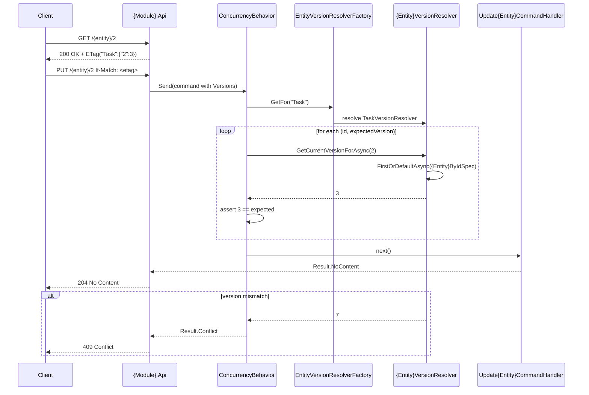

# Core Principals
- Every domain entity is classified along two axes: ownership (internal vs external identity) and mutability (immutable vs mutable). The resulting four types determine exactly which infrastructure patterns apply.
- Cross-cutting contracts and primitives live in `Shared`; concrete technical patterns live in `BuildingBlocks`; persistence implementations live in `App.Infrastructure`; composition root lives in `App.Host`.
- Mutable entities use PostgreSQL `xmin` as an optimistic concurrency token. The version is never set by application code; it is transported via ETag/If-Match and checked by a pipeline behavior before the handler runs.
- Concurrency checks are performed through a factory-resolver chain: `IEntityVersionResolverFactory` resolves the correct `IEntityVersionResolver` for a stable business entity name; per-entity resolvers in module Application projects read the current version using the module's own specifications and repositories.
- External-created entities carry a client-supplied `Guid` used for idempotency. A dedicated pipeline behavior short-circuits duplicate creates before the handler runs.
- Write operations are commands, read operations are queries, and both are routed through MediatR. Pipeline behaviors (validation, concurrency, Guid resolution, unit-of-work) are registered centrally in `App.Host`.
- Each module owns its Domain, Application, Interfaces, and Api projects. Cross-module read models live in `App.Queries`. Cross-module foreign key configurations live in `App.Infrastructure`.

__Applied solutions:__
- [[skills/dotnet/architecture/solutions/🧩validated/solution-entity-classification.skill/solution-entity-classification.skill.md|solution-entity-classification]]
- [[skills/dotnet/architecture/solutions/🧩validated/solution-entity-concurrency-change.skill/solution-entity-concurrency-change.skill.md|solution-entity-concurrency-change]]
- [[skills/dotnet/architecture/solutions/🧩validated/solution-external-created-entity.skill/solution-external-created-entity.skill.md|solution-external-created-entity]]
- [[skills/dotnet/architecture/solutions/🧩validated/solution-command-integration.skill/solution-command-integration.skill.md|solution-command-integration]]
- [[skills/dotnet/architecture/solutions/🧩validated/solution-query-integration.skill/solution-query-integration.skill.md|solution-query-integration]]
- [[skills/dotnet/architecture/solutions/🧩validated/solution-repository-integration.skill/solution-repository-integration.skill.md|solution-repository-integration]]
- [[skills/dotnet/architecture/solutions/🧩validated/solution-unit-of-work.skill/solution-unit-of-work.skill.md|class-unit-of-work]]
- [[skills/dotnet/architecture/solutions/🧩validated/solution-pipeline-registration.skill/solution-pipeline-registration.skill.md|class-pipeline-registration]]
- [[skills/dotnet/architecture/solutions/🧩validated/solution-solution-structure.skill/solution-solution-structure.skill.md|solution-solution-structure]] - [[skills/dotnet/architecture/solutions/🧩validated/solution-solution-structure.skill/Implementation/Repository.create.md|Repository.create]]
- [[skills/dotnet/architecture/solutions/🧩validated/solution-soft-value-objects-and-dto-validators.skill/solution-soft-value-objects-and-dto-validators.skill.md|solution-soft-value-objects-and-dto-validators]]

# Capabilities

## Solution structure
- Defines modules as self-contained bounded contexts with four projects (`Api`, `Application`, `Domain`, `Interfaces`).
- Enforces inward dependency direction and prevents hidden coupling between modules.
- Establishes solution-wide layer responsibilities (`Shared`, `BuildingBlocks`, `App.Host`, `App.Infrastructure`, `App.Queries`).
- Provides clear file and project placement rules across the entire solution.

## Domain modeling
- Encodes domain semantics into immutable, self-validating Value Objects.
- Encapsulates reusable business predicates as stateless, deterministic Domain Rules.
- Keeps domain entities free of EF attributes and infrastructure concerns via dedicated `IEntityTypeConfiguration<T>` classes.
- Extracts cross-module Value Objects and Rules into `Shared`.

## Validation
- Exposes soft, validation-agnostic value objects from `{Module}.Interfaces` so other modules can use them in commands and DTOs without referencing Domain.
- Keeps strict invariant enforcement in Domain Value Objects that inherit from their soft counterparts.
- Registers FluentValidation validators for public DTOs and Soft Value Object properties in `{Module}.Application`.
- Allows other modules to validate values by resolving `IValidator<T>` from DI without direct coupling to the owning module's Application or Domain.

## Entity identity and lifecycle
- Classifies every entity by ownership (internal/external) and mutability (immutable/mutable).
- Applies the right infrastructure deterministically based on entity type.
- Supports externally-created entities with client-generated `Guid` correlation handles and idempotent create flows.
- Prevents over-engineering by avoiding unnecessary concurrency or external-identity infrastructure.

## Concurrency and consistency
- Adds optimistic concurrency control with `Version`/`xmin` for all mutable entities.
- Encodes entity versions into ETags and validates `If-Match` preconditions before handlers run.
- Returns consistent `409 Conflict`/`412 Precondition Failed` semantics for stale or missing preconditions.

## Commands and queries
- Standardizes command/handler/validator structure with a fixed load → guard → domain call → stage → return flow.
- Separates read and write operations via `ICommand<T>` and `IQuery<T>` markers.
- Enables cross-module writes and reads through MediatR without direct coupling.
- Supports cross-module JOIN queries in a dedicated `App.Queries` layer.

## Persistence
- Decouples the Application layer from EF Core via `IRepository<T>` and `IReadRepository<T>` abstractions.
- Encapsulates query intent into named, reusable specifications.
- Commits all staged changes atomically through a single Unit of Work after the top-level command.
- Prevents premature commits for nested sub-commands via a scoped depth tracker.

## Pipeline
- Centralizes all MediatR pipeline behavior registrations in `App.Host`.
- Defines canonical execution order: Validation → Guid resolution → Concurrency → Unit of work.
- Validates transport input before any expensive checks run.
- Short-circuits duplicate external creates and stale updates before handlers execute.

## API publication
- Publishes a thin HTTP adapter layer over MediatR with no business logic leakage.
- Provides consistent controller naming, route conventions, and `Result<T>`-to-HTTP mapping.
- Returns uniform `ProblemDetails` error responses with explicit `ProducesResponseType` declarations.
- Separates entity lifecycle controllers from system-level Minimal API endpoints.

# Usecases

## Update a mutable entity with optimistic concurrency control

__Applied solutions:__
- [[skills/dotnet/architecture/solutions/🧩validated/solution-entity-concurrency-change.skill/solution-entity-concurrency-change.skill.md|solution-entity-concurrency-change]]
