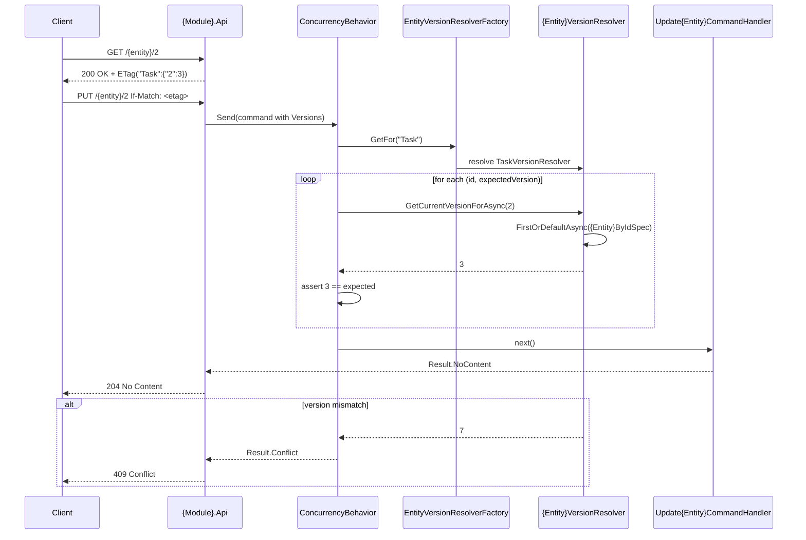

# Core Principals
- Every domain entity is classified along two axes: ownership (internal vs external identity) and mutability (immutable vs mutable). The resulting four types determine exactly which infrastructure patterns apply.
- Cross-cutting contracts and primitives live in `Shared`; concrete technical patterns live in `BuildingBlocks`; persistence implementations live in `App.Infrastructure`; composition root lives in `App.Host`.
- Mutable entities use PostgreSQL `xmin` as an optimistic concurrency token. The version is never set by application code; it is transported via ETag/If-Match and checked by a pipeline behavior before the handler runs.
- Concurrency checks are performed through a factory-resolver chain: `IEntityVersionResolverFactory` resolves the correct `IEntityVersionResolver` for a stable business entity name; per-entity resolvers in module Application projects read the current version using the module's own specifications and repositories.
- External-created entities carry a client-supplied `Guid` used for idempotency. A dedicated pipeline behavior short-circuits duplicate creates before the handler runs.
- Write operations are commands, read operations are queries, and both are routed through MediatR. Pipeline behaviors (validation, concurrency, Guid resolution, unit-of-work) are registered centrally in `App.Host`.
- Each module owns its Domain, Application, Interfaces, and Api projects. Cross-module read models live in `App.Queries`. Cross-module foreign key configurations live in `App.Infrastructure`.

__Applied solutions:__
- [[skills/dotnet/architecture/solutions/🧩validated/solution-entity-classification.skill/solution-entity-classification.skill.md|solution-entity-classification]]
- [[skills/dotnet/architecture/solutions/🧩validated/solution-entity-concurrency-change.skill/solution-entity-concurrency-change.skill.md|solution-entity-concurrency-change]]
- [[skills/dotnet/architecture/solutions/🧩validated/solution-external-created-entity.skill/solution-external-created-entity.skill.md|solution-external-created-entity]]
- [[skills/dotnet/architecture/solutions/🧩validated/solution-command-integration.skill/solution-command-integration.skill.md|solution-command-integration]]
- [[skills/dotnet/architecture/solutions/🧩validated/solution-query-integration.skill/solution-query-integration.skill.md|solution-query-integration]]
- [[skills/dotnet/architecture/solutions/🧩validated/solution-repository-integration.skill/solution-repository-integration.skill.md|solution-repository-integration]]
- [[skills/dotnet/architecture/solutions/🧩validated/solution-unit-of-work.skill/solution-unit-of-work.skill.md|class-unit-of-work]]
- [[skills/dotnet/architecture/solutions/🧩validated/solution-pipeline-registration.skill/solution-pipeline-registration.skill.md|class-pipeline-registration]]
- [[skills/dotnet/architecture/solutions/🧩validated/solution-solution-structure.skill/solution-solution-structure.skill.md|solution-solution-structure]] - [[skills/dotnet/architecture/solutions/🧩validated/solution-solution-structure.skill/Implementation/Repository.create.md|Repository.create]]

# Usecases

## Update a mutable entity with optimistic concurrency control

__Applied solutions:__
- [[skills/dotnet/architecture/solutions/🧩validated/solution-entity-concurrency-change.skill/solution-entity-concurrency-change.skill.md|solution-entity-concurrency-change]]
