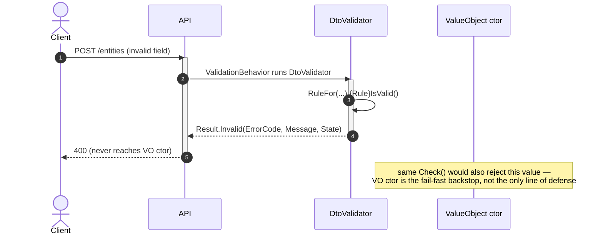

# Goal

- Give every validation rule — one field, several fields of one container, or state across several Entities — exactly one place where its condition, error code, default message, and structured data are declared.
- Make it possible to tell, mechanically, whether a rule is fully wired: every layer that must call it does, and mutation testing proves each layer independently.
- Let a rule already proven for a Value Object be reused, unmodified, by a DTO validator, an async Command validator, or an external .NET service — never re-declared.

# Capabilities

- One rule shape (`IsValid()` + `IRuleBuilder` extension + `Check()`) that VO constructors, Entity methods, `PropertyValidator`s, and DTO/Command validators all call the same way, regardless of whether the rule is Format, Semantic, or Domain.
- Decentralized rejection codes (`{ModuleName}.{Класс}.{Причина}`) with an architecture test guaranteeing uniqueness, instead of a hand-maintained central registry.
- A default, parameterized error message for every rule, with structured `State` still available for a frontend that wants its own text.
- A documented boundary for when a Domain rule can stay synchronous (same aggregate) versus when it must become a Try/Confirm process (different aggregate or different service) — see [[./domain-validation.md|domain-validation.md]].
- Reuse of `Domain.Rules` as a standalone, FluentValidation-dependent csproj by other .NET services without adopting this service's exception or pipeline conventions.

# Core Principles

- A Rule is a static predicate over a **wrapper** of the values it needs — never over a pre-computed verdict the caller already decided. See [[./adr/format-semantic-domain-unification.md|the unification ADR]] (with the [wrapper-mechanism diagram](./adr/diagrams/wrapper-mechanism.mmd)) for why Format/Semantic/Domain are one mechanism, not three.
- The wrapper is either an existing `SoftVO` property of the container (Format), a `SoftVO`/tuple assembled on the spot from the container's own fields (Semantic), or the same assembled from data loaded elsewhere (Domain) — the rule itself never knows which.
- Name the wrapper (`SoftVO`) only when the combination of fields is a reusable domain concept on its own; leave it an anonymous tuple when it exists only for this one comparison.
- `Domain.Rules` never performs I/O. Loading is always the caller's job — the Handler, a DI-injected async wrapper class, or FluentValidation's `CustomAsync`/`MustAsync` — never the rule.
- `ErrorCode`, default `Message`, and `State` are declared exactly once, inside the `IRuleBuilder` extension method; every other adapter calls it or forwards its `ValidationResult`, never re-declares `Must`/`WithErrorCode`/`WithMessage`.
- A blocking check reads `result.Errors.Any(e => e.Severity == Severity.Error)` (or `FirstOrDefault` for the exception to throw), never bare `ValidationResult.IsValid` — `IsValid` ignores `Severity`, so a mixed Error/Warning result would incorrectly block on a Warning.
- Entity stays fail-fast: a rule violation throws before the mutating method assigns anything; there is no "EntityValidator" that checks the Entity after the fact.
- A Domain rule that needs data from another aggregate or another service is not "just read it" — see [[adr/rule-as-irulebuilder-extension.md|the Rule shape ADR]] for the same-aggregate case and [[./domain-validation.md|domain-validation.md]] for when to switch to Try/Confirm.
- Writing the rule and proving its condition is correct (this solution) is not the same problem as proving every Entity method that should call the rule actually does — for that, see the sibling solution [solution-cecil-architecture-tests](../solution-cecil-architecture-tests.skill/solution-cecil-architecture-tests.skill.md), specifically its registry-driven guarded-property coverage check.

# Adr

- [[adr/rule-as-irulebuilder-extension.md|Rule as bool primitive + IRuleBuilder extension]]
  - Selected variant: static class with `IsValid()` + `IRuleBuilder<T,TValue>` extension + `Check()`, `Domain.Rules` depending on FluentValidation directly.
- [[adr/format-semantic-domain-unification.md|Format/Semantic/Domain are one mechanism]]
  - Selected variant: one mechanism, classified only by where the wrapper's values come from.

# Requirements

SOLUTION:
- [solution-value-objects-and-rules](.claude/skills/solution-value-objects-and-rules/SKILL.md)
  - `{Module}.Domain.csproj` — hosts the `Value Object`/`Entity` types this solution extends with `Check()`-based invariant enforcement.
- [solution-soft-value-objects-and-dto-validators](.claude/skills/solution-soft-value-objects-and-dto-validators/SKILL.md)
  - `{Module}.Interfaces.csproj` — hosts `Soft{ValueObject}`, which this solution's `Check()` extension attaches to without adding a member to the type itself.
  - `{Module}.Application.csproj` — hosts `{ValueObject}PropertyValidator`, which this solution reduces to a one-line call into the matching `IRuleBuilder` extension.
- [solution-validation-behavior](.claude/skills/solution-validation-behavior/SKILL.md)
  - `BuildingBlocks.csproj` — the `ValidationBehavior` pipeline that runs every DTO/Command validator (including this solution's Semantic/Domain rules) before the Handler.

NUGET:
- FluentValidation {existing solution version}
  - `IRuleBuilder<T,TProperty>`, `AbstractValidator<T>`, `InlineValidator<T>`, `ValidationResult`/`ValidationFailure` — the entire mechanism this solution is built on.

# Template Skill Mutations

This solution's "implementation" is illustrated, not templated per class — the shape of a rule is the same regardless of module/entity names, so it is easiest to learn from three worked examples rather than from `{ClassName}.cs.create.md` fragments. Each file below plays the role `Implementation/` normally plays; when this package is promoted into the skill library, split them into the standard `Implementation/{ProjectName}.csproj.extend/{ClassName}.cs.create.md` layout if per-file linking becomes necessary.

PROJECT:
- [[./format-validation.md|format-validation.md]] — extend — one field, one `SoftVO`, the full `Rule`/VO/`PropertyValidator`/DTO/Entity/`.feature` chain (`Complexity`), plus multiple rules on one VO (`TaskTitle`).
- [[./semantic-validation.md|semantic-validation.md]] — extend — two ways to wrap several fields of one container: a named `SoftVO` (`Schedule`) and an anonymous tuple (`TaskLink` self-link), both reducing to format-validation.md's mechanism once the wrapper exists.
- [[./domain-validation.md|domain-validation.md]] — extend — preloading data from another Entity before running the same Semantic mechanism (`Account`/`Transaction`), `EntityNotLoadedException`, and the Try/Confirm process for when the data does not live in the same aggregate.
- `Shared.Exceptions.EntityNotLoadedException.cs` — create — thrown when an Entity method needs a navigation the Handler did not load; never mapped to a 4xx client error, always a 500 + critical log, since it signals a Handler defect, not invalid input. See [[./domain-validation.md|domain-validation.md]].

# Workflow

## Add a Format or Semantic rule (happy path)

1. Declare (or reuse) the wrapper: an existing `SoftVO` property (Format), or a `SoftVO`/tuple assembled from the container's own fields (Semantic).
2. Write `IsValid()` + the `IRuleBuilder` extension (`ErrorCode`/`Message`/`State`) + `Check()` in `{Module}.Domain.Rules`.
3. Call `Check()` from the VO constructor or Entity method (throws on the first `Error`-severity failure).
4. Call the extension (or `.SetValidator()` of the matching `PropertyValidator`) from the DTO/Command validator.
5. Write one `.feature` scenario with boundary values on both sides of every threshold; bind it in every adapter that calls the rule.

## Add a Domain rule that needs data from another aggregate/service

1. Confirm the two Entities are one aggregate (same `Version`/write-lock). If yes, follow the Semantic workflow above — the wrapper is just assembled from a preloaded navigation instead of the container's own fields (see `Account`/`Transaction` in [[./domain-validation.md|domain-validation.md]]).
2. If they are **not** one aggregate — different aggregates in the same service, or different services — do not attempt ad hoc synchronization. Go straight to Try/Confirm:
   - Try: create the dependent Entity in a `Pending` status, using a preliminary check against a locally-replicated snapshot of the owning data.
   - Confirm: the owning aggregate's existing, unmodified rule/method (the same one used in the same-aggregate case) runs authoritatively, publishing `Confirmed`/`Rejected`.
   - The dependent Entity transitions `Pending → Confirmed/Rejected` on delivery.

# Rules

## MUST
- [[./format-validation.md|format-validation.md]]
  - Declare `ErrorCode`/default `Message`/`State` exactly once, inside the `IRuleBuilder` extension — never re-declared by a `PropertyValidator`, a DTO validator, or a VO constructor.
  - Use `result.Errors.FirstOrDefault(e => e.Severity == Severity.Error)` (or `.Any(...)`) to decide whether to throw — never bare `ValidationResult.IsValid`.
- [[./semantic-validation.md|semantic-validation.md]]
  - Name the wrapper (`SoftVO`) only when the field combination is a reusable domain concept; otherwise use an anonymous tuple.
  - Assemble the wrapper from the container's own already-available fields — never perform I/O to build a Semantic wrapper.
- [[./domain-validation.md|domain-validation.md]]
  - Perform the actual comparison inside `Domain.Rules`, over already-loaded raw values — never pass a pre-computed boolean verdict into a rule.
  - Load data only in the caller (Handler, DI-injected async wrapper, `CustomAsync`) — `Domain.Rules` never references a repository or `DbContext`.
  - Throw `EntityNotLoadedException`, not `DomainException`, when an Entity method needs a navigation the Handler did not load.
  - Use Try/Confirm, not ad hoc cross-aggregate locking or a synchronous cross-service call, once the checked data does not live in the same aggregate as the write.

## SHOULD
- [[./domain-validation.md|domain-validation.md]]
  - Reuse the owning aggregate's existing rule/method unmodified as the Confirm step of a Try/Confirm process — Confirm should never re-implement the condition.
  - Prefer `CustomAsync` + forwarding an existing `Check()`'s `ValidationResult.Errors` over `MustAsync` + manually re-declaring `WithErrorCode`/`WithMessage`, whenever a synchronous counterpart already exists.

## MAY
- [[./format-validation.md|format-validation.md]]
  - Skip the `PropertyValidator`/DI-resolvable layer for a rule-local anonymous-tuple wrapper that no other module needs to resolve via `IValidator<T>`.

## MUST NOT
- [[./domain-validation.md|domain-validation.md]]
  - Introduce a separate "EntityValidator" that checks an Entity after mutation — Entity stays fail-fast, checked before assignment.
  - Map `EntityNotLoadedException` to the same 4xx path as `DomainException` — it is a Handler defect, not invalid input.

# Anti-patterns

- **Re-declaring `WithErrorCode`/`WithMessage` at every call site "just in case"**
  - Consequence: the same rule ends up with two different codes/messages depending on which adapter tripped it — the exact defect found and fixed while building `domain-validation.md`'s async `Command` validator.
  - Instead: declare them once, in the `IRuleBuilder` extension; async call sites without a sync counterpart to forward from are the only place a new `ErrorCode` constant is legitimate.

- **Passing a pre-computed boolean into a Domain rule**
  - Consequence: the actual comparison escapes `Domain.Rules`, so mutation testing isolated to that project has nothing left to mutate — the `.feature` scenarios stop proving anything about the real condition.
  - Instead: pass the raw, already-loaded values; let the rule perform the comparison.

- **Checking `!result.IsValid` instead of filtering by `Severity`**
  - Consequence: the first `Warning`-severity rule added to a shared `Check()` silently starts blocking construction, because `IsValid` does not consider `Severity`.
  - Instead: `result.Errors.Any(e => e.Severity == Severity.Error)`.

- **Trying to make two different aggregates' writes safe by "just loading and locking carefully"**
  - Consequence: a hand-rolled serialization scheme that is easy to get subtly wrong under real concurrency, and diverges further from the cross-service case every time it is patched.
  - Instead: Try/Confirm, unconditionally, the moment the check spans more than one aggregate.

# Check list

- [ ] Every rejection code is `public const string` next to the rule that produces it, format `{ModuleName}.{Класс}.{Причина}`, unique across `Domain.Rules` (architecture test, not a central file).
- [ ] Every rule has exactly one `IRuleBuilder` extension declaring `Must`/`WithErrorCode`/`WithMessage`/`WithState`; no other file re-declares any of the four.
- [ ] Every throw-site reads `Severity`, not bare `IsValid`.
- [ ] Every Domain rule receives already-loaded raw values, never a pre-computed verdict; `Domain.Rules` has no repository/`DbContext` reference anywhere.
- [ ] `EntityNotLoadedException` is used for every "required navigation not loaded" case, mapped to 500, never confused with `DomainException` in tests or in `ExceptionHandlingBehavior`.
- [ ] A cross-aggregate/cross-service Domain rule is implemented as Try/Confirm, with the Confirm step reusing the same-aggregate rule/method unmodified.
- [ ] Each rule's `.feature` is bound in every adapter that must call it (VO/Entity, `PropertyValidator`/wrapper class, raw `Check()` where a dedicated conformance project exists), and each binding has its own mutation-testing config.
