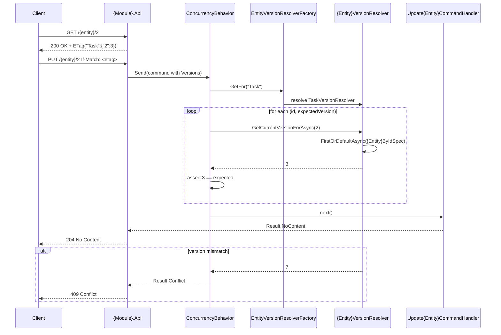

# Goal
- Define `Version` / `xmin` as the concurrency token on every mutable entity — the database-level last line of defence
- Define `IVersioned` in Shared as the marker all mutable entities implement
- Define `IHasVersions` in Shared as the interface all update commands implement to carry client-supplied version information
- Define `IEntityVersionResolverFactory` and `IEntityVersionResolver` in Shared: the factory maps stable string entity names to resolvers, and each resolver reads the current version for one entity
- Define `ETagEncoder` in BuildingBlocks to encode entity versions as base64 JSON ETags for HTTP transport
- Define `ConcurrencyBehavior` in BuildingBlocks as the pipeline behavior that validates all versions before the handler runs
- Define the full ETag flow: GET encodes version into `ETag` header, PUT/PATCH decodes `If-Match` header, missing or malformed `If-Match` returns 412 before MediatR dispatch

# Capabilities
- Optimistic concurrency control for all mutable entities
- Early detection of stale updates before the handler runs
- ETag-based HTTP precondition handling
- Database-level last line of defence via `xmin` concurrency token
- Consistent `409`/`412` response semantics for conflicts

# Core Principles
- `Version` is a `uint` property mapped to PostgreSQL `xmin` — auto-incremented by the database on every row change, never set by application code
- `IVersioned`, `IHasVersions`, `IEntityVersionResolverFactory`, and `IEntityVersionResolver` live in Shared — common contracts referenced by Domain, Application, Api, and Infrastructure layers
- `ETagEncoder` and `ConcurrencyBehavior` live in BuildingBlocks — concrete implementations of technical patterns
- `EntityVersionResolverFactory` (the factory) lives in App.Infrastructure and discovers mappings by scanning module Domain config classes and module Application resolver classes
- `{Module}.Application` realizes `IEntityVersionResolver` for every versioned entity — each resolver uses the module's `{Entity}ByIdSpec` and `IReadRepository<{Entity}>`
- Entity name string keys in `IHasVersions` are stable business names — never C# type names or namespaces — decouples HTTP contract from assembly structure
- `ConcurrencyBehavior` constrained on `where TRequest : IHasVersions` — only update commands are checked, not all commands
- Missing `If-Match` returns 412 Precondition Failed — not 400 (bad input) or 409 (conflict) — 412 means precondition not supplied
- EF concurrency token is the final guard — `ConcurrencyBehavior` is the early client-friendly check that gives a meaningful 409 before EF raises `DbUpdateConcurrencyException`
- All version mismatches return `Result.Conflict` from the behavior — handler never runs for stale updates
- ETag encodes ALL entity versions involved in the operation — not only the primary entity
- No generic `ByIdSpec` lives in BuildingBlocks — per-entity specs belong in `{Module}.Application`

# Workflow

# Requirements
SOLUTION:
- [[skills/dotnet/architecture/solutions/🧩validated/solution-sln-structure.skill/solution-sln-structure.skill|solution-sln-structure]]
  - [[skills/dotnet/architecture/solutions/🧩validated/solution-sln-structure.skill/Implementation/Shared.csproj.create|Shared.csproj]] - hosts common concurrency contracts (`IVersioned`, `IHasVersions`, `IEntityVersionResolverFactory`, `IEntityVersionResolver`)
  - [[skills/dotnet/architecture/solutions/🧩validated/solution-sln-structure.skill/Implementation/BuildingBlocks.csproj.create|BuildingBlocks.csproj]] - hosts `ETagEncoder` and `ConcurrencyBehavior`
  - [[skills/dotnet/architecture/solutions/🧩validated/solution-sln-structure.skill/Implementation/App.Infrastructure.csproj.create|App.Infrastructure.csproj]] - hosts `EntityVersionResolverFactory` factory
  - [[skills/dotnet/architecture/solutions/🧩validated/solution-sln-structure.skill/Implementation/App.Host.csproj.create|App.Host.csproj]] - hosts resolver factory registration
  - [[skills/dotnet/architecture/solutions/🧩validated/solution-sln-structure.skill/Implementation/{Module}.Api.csproj.create|{Module}.Api.csproj]] - hosts ETag and If-Match controller handling
  - [[skills/dotnet/architecture/solutions/🧩validated/solution-sln-structure.skill/Implementation/{Module}.Interfaces.csproj.create|{Module}.Interfaces.csproj]] - hosts update/patch commands implementing `IHasVersions`
  - [[skills/dotnet/architecture/solutions/🧩validated/solution-sln-structure.skill/Implementation/{Module}.Application.csproj.create|{Module}.Application.csproj]] - hosts `{Entity}VersionResolver` implementations
- [[skills/dotnet/architecture/solutions/🧩validated/solution-domain-configuration.skill/solution-domain-configuration.skill.md|solution-domain-configuration.skill]]
  - [[skills/dotnet/architecture/solutions/🧩validated/solution-domain-configuration.skill/Implementation/{Module}.Domain.csproj.extend.md|{Module}.Domain.csproj]] - provides EF Core configuration pattern for `Version` mapping
    - [[skills/dotnet/architecture/solutions/🧩validated/solution-domain-configuration.skill/Implementation/{Module}.Domain.csproj.extend/{Entity}Config.cs.create.md|{Entity}Config.cs]] - maps `Version` to `xmin` with `IsConcurrencyToken`
- [[skills/dotnet/architecture/solutions/🧩validated/solution-domain-behaviour.skill/solution-domain-behaviour.skill.md|solution-domain-behaviour.skill]]
  - [[skills/dotnet/architecture/solutions/🧩validated/solution-domain-behaviour.skill/Implementation/{Module}.Domain.csproj.extend.md|{Module}.Domain.csproj]] - defines mutable entities that require concurrency control
- [[skills/dotnet/architecture/solutions/🧩validated/solution-repository-integration.skill/solution-repository-integration.skill.md|solution-repository-integration.skill]]
  - [[skills/dotnet/architecture/solutions/🧩validated/solution-repository-integration.skill/Implementation/Shared.csproj.extend.md|Shared.csproj]] - provides `IReadRepository<T>` used by `{Entity}VersionResolver`
    - [[skills/dotnet/architecture/solutions/🧩validated/solution-repository-integration.skill/Implementation/Shared.csproj.extend/IReadRepository.cs.create.md|IReadRepository.cs]] - used by `{Entity}VersionResolver` to read entity versions
  - [[skills/dotnet/architecture/solutions/🧩validated/solution-repository-integration.skill/Implementation/{Module}.Application.csproj.extend.md|{Module}.Application.csproj]] - provides `{Entity}ByIdSpec` used by `{Entity}VersionResolver`
- [[skills/dotnet/architecture/solutions/🧩validated/solution-command-integration.skill/solution-command-integration.skill.md|solution-command-integration.skill]]
  - [[skills/dotnet/architecture/solutions/🧩validated/solution-command-integration.skill/Implementation/Shared.csproj.extend.md|Shared.csproj]] - provides `ICommand<T>` marker extended with `IHasVersions`
    - [[skills/dotnet/architecture/solutions/🧩validated/solution-command-integration.skill/Implementation/Shared.csproj.extend/ICommand.cs.create.md|ICommand.cs]] - marker interface for commands that `ConcurrencyBehavior` constrains on
- [[skills/dotnet/architecture/solutions/🧩validated/solution-http-api-publication.skill/solution-http-api-publication.skill.md|solution-http-api-publication.skill]]
  - [[skills/dotnet/architecture/solutions/🧩validated/solution-http-api-publication.skill/Implementation/{Module}.Api.csproj.extend.md|{Module}.Api.csproj]] - provides controller structure for ETag and If-Match handling
- [[skills/dotnet/architecture/solutions/🧩validated/solution-pipeline-registration.skill/solution-pipeline-registration.skill.md|solution-pipeline-registration.skill]]
  - [[skills/dotnet/architecture/solutions/🧩validated/solution-pipeline-registration.skill/Implementation/App.Host.csproj.extend.md|App.Host.csproj]] - provides centralized `PipelineRegistration` where `ConcurrencyBehavior` is registered

NUGET:
- `System.Text.Json` {version} - provides `JsonSerializer` used in `ETagEncoder`
- `Microsoft.EntityFrameworkCore` {version} - provides `IsConcurrencyToken()` for `Version` EF configuration

# Template Skill Mutations

PROJECT:
- [[./Implementation/{Module}.Domain.csproj.extend.md|{Module}.Domain.csproj]] - extend - Add Version concurrency token to every mutable entity and implement IVersioned
  - [[./Implementation/{Module}.Domain.csproj.extend/{EntityName}.cs.extend.md|{EntityName}.cs]] - extend - Add uint Version property with internal set and implement IVersioned
  - [[./Implementation/{Module}.Domain.csproj.extend/{EntityName}Config.cs.extend.md|{EntityName}Config.cs]] - extend - Map Version to xmin with IsConcurrencyToken and ValueGeneratedOnAddOrUpdate
- [[./Implementation/Shared.csproj.extend.md|Shared.csproj]] - extend - Add IVersioned, IHasVersions, IEntityVersionResolverFactory, and IEntityVersionResolver
  - [[./Implementation/Shared.csproj.extend/IVersioned.cs.create.md|IVersioned.cs]] - create - Marker interface for versioned domain entities
  - [[./Implementation/Shared.csproj.extend/IHasVersions.cs.create.md|IHasVersions.cs]] - create - Interface for update commands carrying client-supplied version information
  - [[./Implementation/Shared.csproj.extend/IEntityVersionResolverFactory.cs.create.md|IEntityVersionResolverFactory.cs]] - create - Factory that maps stable entity names to IEntityVersionResolver
  - [[./Implementation/Shared.csproj.extend/IEntityVersionResolver.cs.create.md|IEntityVersionResolver.cs]] - create - Reads the current version for one versioned entity
- [[./Implementation/BuildingBlocks.csproj.extend.md|BuildingBlocks.csproj]] - extend - Add ETagEncoder and ConcurrencyBehavior
  - [[./Implementation/BuildingBlocks.csproj.extend/ETagEncoder.cs.create.md|ETagEncoder.cs]] - create - Encodes/decodes entity versions as base64 JSON ETags
  - [[./Implementation/BuildingBlocks.csproj.extend/ConcurrencyBehavior.cs.create.md|ConcurrencyBehavior.cs]] - create - Pipeline behavior validating versions through IEntityVersionResolverFactory
- [[./Implementation/App.Infrastructure.csproj.extend.md|App.Infrastructure.csproj]] - extend - Add EntityVersionResolverFactory factory
  - [[./Implementation/App.Infrastructure.csproj.extend/EntityVersionResolverFactory.cs.create.md|EntityVersionResolverFactory.cs]] - create - Maps stable business entity names to Application-layer resolver types
- [[./Implementation/{Module}.Application.csproj.extend.md|{Module}.Application.csproj]] - extend - Add per-entity version resolvers
  - [[./Implementation/{Module}.Application.csproj.extend/{Entity}VersionResolver.cs.create.md|{Entity}VersionResolver.cs]] - create - Entity-specific IEntityVersionResolver implementation using {Entity}ByIdSpec
- [[./Implementation/{Module}.Interfaces.csproj.extend.md|{Module}.Interfaces.csproj]] - extend - Require update and patch commands to implement IHasVersions
  - [[./Implementation/{Module}.Interfaces.csproj.extend/{Command}.cs.extend.md|{Command}.cs]] - extend - Update/patch command implements IHasVersions
- [[./Implementation/{Module}.Api.csproj.extend.md|{Module}.Api.csproj]] - extend - Add ETag header to GET responses and If-Match guard to PUT/PATCH
  - [[./Implementation/{Module}.Api.csproj.extend/Single{Entity}Controller.cs.extend.md|Single{Entity}Controller.cs]] - extend - Add ETag encoding on GET and If-Match decoding on PUT/PATCH
- [[./Implementation/App.Host.csproj.extend.md|App.Host.csproj]] - extend - Register IEntityVersionResolverFactory and module resolvers
  - [[./Implementation/App.Host.csproj.extend/EntityVersionResolverRegistration.cs.create.md|EntityVersionResolverRegistration.cs]] - create - Register factory as Scoped with module Domain and Application assemblies

# Rules

## MUST:
- [[./Implementation/App.Host.csproj.extend.md#MUST|App.Host.csproj.extend]]
	- [[./Implementation/App.Host.csproj.extend/EntityVersionResolverRegistration.cs.create.md#MUST|EntityVersionResolverRegistration.cs.create]]
- [[./Implementation/App.Infrastructure.csproj.extend.md#MUST|App.Infrastructure.csproj.extend]]
	- [[./Implementation/App.Infrastructure.csproj.extend/EntityVersionResolverFactory.cs.create.md#MUST|EntityVersionResolverFactory.cs.create]]
- [[./Implementation/BuildingBlocks.csproj.extend.md#MUST|BuildingBlocks.csproj.extend]]
	- [[./Implementation/BuildingBlocks.csproj.extend/ConcurrencyBehavior.cs.create.md#MUST|ConcurrencyBehavior.cs.create]]
	- [[./Implementation/BuildingBlocks.csproj.extend/ETagEncoder.cs.create.md#MUST|ETagEncoder.cs.create]]
- [[./Implementation/Shared.csproj.extend.md#MUST|Shared.csproj.extend]]
	- [[./Implementation/Shared.csproj.extend/IEntityVersionResolver.cs.create.md#MUST|IEntityVersionResolver.cs.create]]
	- [[./Implementation/Shared.csproj.extend/IEntityVersionResolverFactory.cs.create.md#MUST|IEntityVersionResolverFactory.cs.create]]
	- [[./Implementation/Shared.csproj.extend/IHasVersions.cs.create.md#MUST|IHasVersions.cs.create]]
	- [[./Implementation/Shared.csproj.extend/IVersioned.cs.create.md#MUST|IVersioned.cs.create]]
- [[./Implementation/{Module}.Api.csproj.extend.md#MUST|{Module}.Api.csproj.extend]]
	- [[./Implementation/{Module}.Api.csproj.extend/Single{Entity}Controller.cs.extend.md#MUST|Single{Entity}Controller.cs.extend]]
- [[./Implementation/{Module}.Application.csproj.extend.md#MUST|{Module}.Application.csproj.extend]]
	- [[./Implementation/{Module}.Application.csproj.extend/{Entity}VersionResolver.cs.create.md#MUST|{Entity}VersionResolver.cs.create]]
- [[./Implementation/{Module}.Domain.csproj.extend.md#MUST|{Module}.Domain.csproj.extend]]
	- [[./Implementation/{Module}.Domain.csproj.extend/{EntityName}.cs.extend.md#MUST|{EntityName}.cs.extend]]
	- [[./Implementation/{Module}.Domain.csproj.extend/{EntityName}Config.cs.extend.md#MUST|{EntityName}Config.cs.extend]]
- [[./Implementation/{Module}.Interfaces.csproj.extend.md#MUST|{Module}.Interfaces.csproj.extend]]
	- [[./Implementation/{Module}.Interfaces.csproj.extend/{Command}.cs.extend.md#MUST|{Command}.cs.extend]]
- Every mutable entity has `public uint Version { get; internal set; }`
- Every mutable entity configuration maps `Version` to `xmin` with `IsConcurrencyToken()` and `ValueGeneratedOnAddOrUpdate()`
- Each `{Entity}VersionResolver` uses `IReadRepository<{Entity}>` and the module's `{Entity}ByIdSpec`
- GET responses for mutable entities include `ETag` header with encoded versions
- PUT/PATCH endpoints check `If-Match` presence — return 412 if missing or malformed
- DTOs returned by GET for mutable entities include `Version` field

## MUST NOT:
- [[./Implementation/App.Host.csproj.extend.md#MUST NOT|App.Host.csproj.extend]]
	- [[./Implementation/App.Host.csproj.extend/EntityVersionResolverRegistration.cs.create.md#MUST NOT|EntityVersionResolverRegistration.cs.create]]
- [[./Implementation/App.Infrastructure.csproj.extend.md#MUST NOT|App.Infrastructure.csproj.extend]]
	- [[./Implementation/App.Infrastructure.csproj.extend/EntityVersionResolverFactory.cs.create.md#MUST NOT|EntityVersionResolverFactory.cs.create]]
- [[./Implementation/BuildingBlocks.csproj.extend.md#MUST NOT|BuildingBlocks.csproj.extend]]
	- [[./Implementation/BuildingBlocks.csproj.extend/ConcurrencyBehavior.cs.create.md#MUST NOT|ConcurrencyBehavior.cs.create]]
- [[./Implementation/Shared.csproj.extend.md#MUST NOT|Shared.csproj.extend]]
	- [[./Implementation/Shared.csproj.extend/IEntityVersionResolver.cs.create.md#MUST NOT|IEntityVersionResolver.cs.create]]
	- [[./Implementation/Shared.csproj.extend/IEntityVersionResolverFactory.cs.create.md#MUST NOT|IEntityVersionResolverFactory.cs.create]]
	- [[./Implementation/Shared.csproj.extend/IHasVersions.cs.create.md#MUST NOT|IHasVersions.cs.create]]
	- [[./Implementation/Shared.csproj.extend/IVersioned.cs.create.md#MUST NOT|IVersioned.cs.create]]
- [[./Implementation/{Module}.Api.csproj.extend.md#MUST NOT|{Module}.Api.csproj.extend]]
	- [[./Implementation/{Module}.Api.csproj.extend/Single{Entity}Controller.cs.extend.md#MUST NOT|Single{Entity}Controller.cs.extend]]
- [[./Implementation/{Module}.Application.csproj.extend.md#MUST NOT|{Module}.Application.csproj.extend]]
	- [[./Implementation/{Module}.Application.csproj.extend/{Entity}VersionResolver.cs.create.md#MUST NOT|{Entity}VersionResolver.cs.create]]
- [[./Implementation/{Module}.Domain.csproj.extend.md#MUST NOT|{Module}.Domain.csproj.extend]]
	- [[./Implementation/{Module}.Domain.csproj.extend/{EntityName}.cs.extend.md#MUST NOT|{EntityName}.cs.extend]]
	- [[./Implementation/{Module}.Domain.csproj.extend/{EntityName}Config.cs.extend.md#MUST NOT|{EntityName}Config.cs.extend]]
- [[./Implementation/{Module}.Interfaces.csproj.extend.md#MUST NOT|{Module}.Interfaces.csproj.extend]]
	- [[./Implementation/{Module}.Interfaces.csproj.extend/{Command}.cs.extend.md#MUST NOT|{Command}.cs.extend]]
- Entity name keys use C# type names — breaks on entity rename

# Anti-patterns
- `Version` as plain `uint` on command property instead of `IHasVersions` — does not scale to multi-entity updates
- Handler catches `DbUpdateConcurrencyException` and returns conflict — `ConcurrencyBehavior` should catch this earlier at the application level
- ETag encoding only primary entity version — misses secondary entity conflicts when command touches multiple entities
- `EntityVersionResolverFactory` key using `nameof({EntityName})` or `type.Name` — fragile, breaks on class rename; use the stable `VersionedEntityName` constant
- Hardcoded entity dictionary in `EntityVersionResolverFactory` — duplicates the entity list and is easy to forget; scan config and resolver classes instead
- Defining `IHasVersions`, `IEntityVersionResolverFactory`, or `IEntityVersionResolver` in BuildingBlocks — violates the rule that common contracts live in Shared
- Duplicating `{Entity}ByIdSpec` query logic inside a resolver — reuse the module's spec

# Check list
- [ ] `uint Version { get; internal set; }` on every mutable entity
- [ ] Every mutable entity implements `IVersioned`
- [ ] Every mutable entity config class declares a public `const string VersionedEntityName`
- [ ] `Version` mapped to `xmin` with `IsConcurrencyToken()` and `ValueGeneratedOnAddOrUpdate()` in entity configuration
- [ ] `IVersioned` defined in `Shared/Concurrency/IVersioned.cs`
- [ ] `IHasVersions` defined in `Shared/Concurrency/IHasVersions.cs`
- [ ] `IEntityVersionResolverFactory` defined in `Shared/Concurrency/IEntityVersionResolverFactory.cs`
- [ ] `IEntityVersionResolver` defined in `Shared/Concurrency/IEntityVersionResolver.cs`
- [ ] `ETagEncoder` defined in `BuildingBlocks/Concurrency/ETagEncoder.cs`
- [ ] `ConcurrencyBehavior` defined in `BuildingBlocks/MediatR/ConcurrencyBehavior.cs`
- [ ] `ConcurrencyBehavior` uses `IEntityVersionResolverFactory`
- [ ] `EntityVersionResolverFactory` defined in `App.Infrastructure/Concurrency/EntityVersionResolverFactory.cs`
- [ ] `EntityVersionResolverFactory` registered as `Scoped`
- [ ] `EntityVersionResolverFactory` scans Domain assemblies for `IEntityTypeConfiguration<T>` configs where `T` implements `IVersioned`
- [ ] `EntityVersionResolverFactory` scans Application assemblies for `IEntityVersionResolver` implementations
- [ ] `{Entity}VersionResolver` defined in `{Module}.Application/Concurrency/{Entity}VersionResolver.cs` for every versioned entity
- [ ] `{Entity}VersionResolver` declares `VersionedEntityName` matching `{Entity}Config`
- [ ] `{Entity}VersionResolver` uses `IReadRepository<{Entity}>` and `{Entity}ByIdSpec`
- [ ] All update and patch commands implement `IHasVersions`
- [ ] GET for mutable entity sets `Response.Headers.ETag`
- [ ] DTO for mutable entity includes `Version` field
- [ ] PUT/PATCH checks `If-Match` — returns 412 if missing or malformed
- [ ] 412 added to `[ProducesResponseType]` on all PUT/PATCH actions
- [ ] `switch` default arm throws `InvalidOperationException` in PUT/PATCH actions
