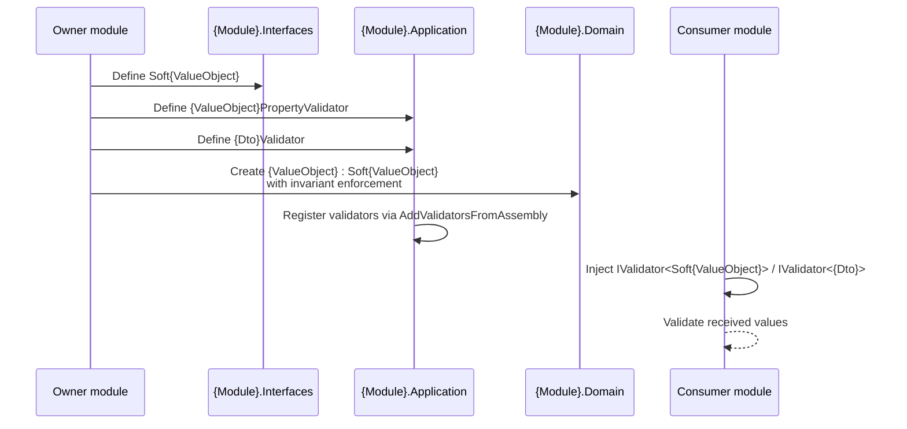

# Goal
- Let each module define validators for every public DTO and value-object property it owns
- Allow other modules to validate values that originate from this module without referencing its Domain or Application projects directly
- Keep strict invariant enforcement in the Domain layer while sharing the value shape from Interfaces
- Standardise the Soft{ValueObject} / PropertyValidator / DTOValidator triplet across modules

# Capabilities
- Other modules can validate `Soft{ValueObject}` properties by resolving `IValidator<Soft{ValueObject}>` from DI
- Other modules can validate DTOs by resolving `IValidator<{Dto}>` from DI
- Domain Value Object remains the authoritative, self-enforcing invariant holder

# Core Principals
- Each `{Module}.Domain.ValueObjects.{ValueObject}` inherits from `{Module}.Interfaces.ValueObjects.Soft{ValueObject}`
- Each public DTO in `{Module}.Interfaces` has a matching FluentValidation validator in `{Module}.Application.Validators`
- Each `Soft{ValueObject}` has a matching `{ValueObject}PropertyValidator` in `{Module}.Application.Validators`
- `Soft{ValueObject}` allows invalid values; Domain Value Object does not
- Validators are registered by FluentValidation's `AddValidatorsFromAssembly` scan of `{Module}.Application`
- Other modules consume validators through the generic `IValidator<T>` abstraction, not by concrete type references
- `{Module}.Domain` references its own `{Module}.Interfaces` only for the `Soft{ValueObject}` base types

# Adr
- [[./adr/soft-value-objects-and-application-validators.md|Soft value objects in Interfaces, validators in Application]]
  - `Soft{ValueObject}` declarations are placed in `{Module}.Interfaces` so other modules can use them in commands and DTOs
  - Validators are placed in `{Module}.Application` and registered by FluentValidation so other modules consume them through `IValidator<T>`
  - `{Module}.Domain.ValueObjects.{ValueObject}` inherits from `Soft{ValueObject}` and remains the only place that enforces invariants

# Requirements
SOLUTION:
- [[skills/dotnet/architecture/solutions/🧩validated/solution-sln-structure.skill/solution-sln-structure.skill|solution-sln-structure]]
  - [[skills/dotnet/architecture/solutions/🧩validated/solution-sln-structure.skill/Implementation/{Module}.Interfaces.csproj.create|{Module}.Interfaces.csproj]] - hosts `Soft{ValueObject}`
  - [[skills/dotnet/architecture/solutions/🧩validated/solution-sln-structure.skill/Implementation/{Module}.Application.csproj.create|{Module}.Application.csproj]] - hosts `{ValueObject}PropertyValidator` and `{Dto}Validator`
  - [[skills/dotnet/architecture/solutions/🧩validated/solution-sln-structure.skill/Implementation/{Module}.Domain.csproj.create|{Module}.Domain.csproj]] - hosts the strict Domain Value Object that inherits from `Soft{ValueObject}`
- [[skills/dotnet/architecture/solutions/🧩validated/solution-validation-behavior.skill/solution-validation-behavior.skill.md|solution-validation-behavior.skill]]
  - [[skills/dotnet/architecture/solutions/🧩validated/solution-validation-behavior.skill/Implementation/BuildingBlocks.csproj.extend.md|BuildingBlocks.csproj]] - provides the `ValidationBehavior` pipeline that consumes FluentValidation validators

NUGET:
- `FluentValidation` {version} - provides `AbstractValidator<T>` for property and DTO validators
- `FluentValidation.DependencyInjectionExtensions` {version} - provides `AddValidatorsFromAssembly` registration

# Template Skill Mutations

PROJECT:
- [[./Implementation/{Module}.Interfaces.csproj.extend.md|{Module}.Interfaces.csproj]] - extend - Add `/ValueObjects` folder for `Soft{ValueObject}` declarations
  - [[./Implementation/{Module}.Interfaces.csproj.extend/Soft{ValueObject}.cs.create.md|Soft{ValueObject}.cs]] - create - Soft value object declaration that allows invalid values
- [[./Implementation/{Module}.Application.csproj.extend.md|{Module}.Application.csproj]] - extend - Add `/Validators` folder for property and DTO validators and ensure `AddValidatorsFromAssembly` is called
  - [[./Implementation/{Module}.Application.csproj.extend/{ValueObject}PropertyValidator.cs.create.md|{ValueObject}PropertyValidator.cs]] - create - FluentValidation validator for `Soft{ValueObject}`
  - [[./Implementation/{Module}.Application.csproj.extend/{Dto}.Validator.cs.create.md|{Dto}.Validator.cs]] - create - FluentValidation validator for the public DTO
- [[./Implementation/{Module}.Domain.csproj.extend.md|{Module}.Domain.csproj]] - extend - Add a project reference to `{Module}.Interfaces`
  - [[./Implementation/{Module}.Domain.csproj.extend/{ValueObject}.cs.extend.md|{ValueObject}.cs]] - extend - Domain Value Object inherits from `Soft{ValueObject}` and enforces invariants

# Workflow

# Rules

MUST:
- `{Module}.Application` must call `AddValidatorsFromAssembly` for its own assembly so that property and DTO validators are registered in DI
- For every `{ValueObject}` in `/{Module}.Domain/ValueObjects` there is a `Soft{ValueObject}` in `/{Module}.Interfaces/ValueObjects`
- `/{Module}.Domain/ValueObjects/{ValueObject}.cs` inherits from `{Module}.Interfaces.ValueObjects.Soft{ValueObject}`
- `Soft{ValueObject}` does not validate values in its constructor or properties
- `/{Module}.Domain/ValueObjects/{ValueObject}.cs` validates invariants in its constructor and throws `DomainException` on invalid values
- For every `Soft{ValueObject}` there is a `{ValueObject}PropertyValidator` in `/{Module}.Application/Validators` extending `AbstractValidator<Soft{ValueObject}>`
- For every DTO published in `/{Module}.Interfaces` there is a `{Dto}Validator` in `/{Module}.Application/Validators` extending `AbstractValidator<{Dto}>`
- Validators are registered by FluentValidation's assembly scan of `{Module}.Application`
- Other modules consume validators through `IValidator<T>` resolved from DI
- DTO validators use `SetValidator(IValidator<Soft{ValueObject}>)` for Soft VO properties
- Property validators are stateless and have no infrastructure dependencies
- `{Module}.Domain.csproj` references `{Module}.Interfaces.csproj` for the `Soft{ValueObject}` base types

SHOULD:
- Reuse the same validation predicate in a static `Soft{ValueObject}.IsValid(...)` method and in `{ValueObject}PropertyValidator` to avoid duplication
- Keep `Soft{ValueObject}` immutable except for allowing invalid values (use `init` setters or public setters only when necessary)
- Name property validator `{ValueObject}PropertyValidator`
- Name DTO validator `{Dto}Validator`

MUST NOT:
- `Soft{ValueObject}` throw exceptions for invalid values
- Domain Value Object skip validation
- Validators inject repositories, `DbContext`, or services
- Validators contain business rules
- Other modules reference `{Module}.Domain` or `{Module}.Application` to validate values

# Anti-patterns
- Domain Value Object not inheriting from `Soft{ValueObject}`
- `Soft{ValueObject}` validating values or throwing exceptions
- Property validator placed in `{Module}.Interfaces` or `{Module}.Domain`
- Duplicating validation logic between Domain Value Object and `{ValueObject}PropertyValidator`
- Consuming module referencing `{Module}.Application` to instantiate a concrete validator
- Using a DTO validator to enforce business state instead of transport/value correctness
- Cross-module consumers reference to `{Module}.Domain` or `{Module}.Application` for `DTO` or `Value Object Validation`
# Check list
- [ ] `Soft{ValueObject}` exists for every Domain Value Object
- [ ] Domain Value Object inherits from `Soft{ValueObject}`
- [ ] `Soft{ValueObject}` allows invalid values
- [ ] Domain Value Object throws `DomainException` for invalid values
- [ ] `{ValueObject}PropertyValidator` exists for every `Soft{ValueObject}`
- [ ] `{Dto}Validator` exists for every public DTO
- [ ] Validators are in `/{Module}.Application/Validators`
- [ ] Validators are registered by `AddValidatorsFromAssembly` in `{Module}.Application`
- [ ] `{Module}.Domain.csproj` references `{Module}.Interfaces.csproj`
- [ ] `{Module}.Application.csproj` references `FluentValidation`
- [ ] Other modules resolve validators through `IValidator<T>`

# Unittest TestCases
- [ ] When `Soft{ValueObject}` is created with an invalid value Then no exception is thrown
- [ ] When `Soft{ValueObject}` is created with a valid value Then properties are set correctly
- [ ] When Domain `{ValueObject}` is created with an invalid value Then `DomainException` is thrown
- [ ] When `{ValueObject}PropertyValidator` validates a valid `Soft{ValueObject}` Then no errors are returned
- [ ] When `{ValueObject}PropertyValidator` validates an invalid `Soft{ValueObject}` Then validation errors are returned
- [ ] When `{Dto}Validator` validates a valid DTO Then no errors are returned
- [ ] When `{Dto}Validator` validates a DTO with an invalid `Soft{ValueObject}` property Then validation errors are returned
- [ ] When another module resolves `IValidator<Soft{ValueObject}>` Then it receives the registered property validator without referencing `{Module}.Application`
- [ ] When Domain `{ValueObject}` is constructed Then it accepts the same valid values as `{ValueObject}PropertyValidator`
