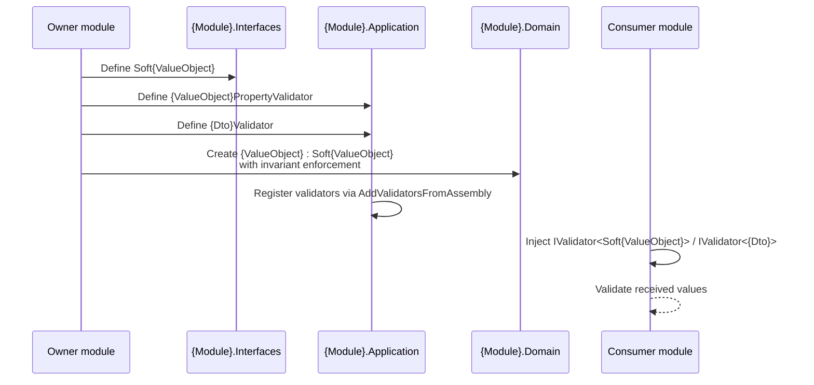

# Goal
- Let each module define validators for every public RequestDto and value-object property it owns
- Do not require validators for ResponseDto unless a concrete requirement explicitly demands it
- Allow other modules to validate values that originate from this module without referencing its Domain or Application projects directly
- Keep strict invariant enforcement in the Domain layer while sharing the value shape from Interfaces
- Standardise the Soft{ValueObject} / PropertyValidator / DTOValidator triplet across modules

# Capabilities
- Other modules can validate `Soft{ValueObject}` properties by resolving `IValidator<Soft{ValueObject}>` from DI
- Other modules can validate DTOs by resolving `IValidator<{Dto}>` from DI
- Domain Value Object remains the authoritative, self-enforcing invariant holder

# Core Principles
- Each `{Module}.Domain.ValueObjects.{ValueObject}` inherits from `{Module}.Interfaces.ValueObjects.Soft{ValueObject}`
- Each public RequestDto in `{Module}.Interfaces` has a matching FluentValidation validator in `{Module}.Application.Validators`
- ResponseDto does not have a validator by default; create one only when explicitly required
- Each `Soft{ValueObject}` has a matching `{ValueObject}PropertyValidator` in `{Module}.Application.Validators`
- `Soft{ValueObject}` allows invalid values; Domain Value Object does not
- Validators are registered by FluentValidation's `AddValidatorsFromAssembly` scan of `{Module}.Application`
- Other modules consume validators through the generic `IValidator<T>` abstraction, not by concrete type references
- `{Module}.Domain` references its own `{Module}.Interfaces` only for the `Soft{ValueObject}` base types
- Rule is the single source of truth; `{ValueObject}PropertyValidator` and `{Dto}Validator` validate only by calling Rules
- Rule provides a `Soft{ValueObject}` overload that delegates to the primitive overload; Domain Value Object uses the same Rule because it inherits from `Soft{ValueObject}`

# Adr
- [[skills/dotnet/architecture/solutions/🧩validated/solution-soft-value-objects-and-dto-validators.skill/adr/soft-value-objects-and-application-validators|Soft value objects in Interfaces, validators in Application]]
  - `Soft{ValueObject}` declarations are placed in `{Module}.Interfaces` so other modules can use them in commands and DTOs
  - Validators are placed in `{Module}.Application` and registered by FluentValidation so other modules consume them through `IValidator<T>`
  - `{Module}.Domain.ValueObjects.{ValueObject}` inherits from `Soft{ValueObject}` and remains the only place that enforces invariants
- [[skills/dotnet/architecture/solutions/🧩validated/solution-soft-value-objects-and-dto-validators.skill/adr/use-abstract-validator-for-soft-value-objects|Use AbstractValidator for Soft{ValueObject} validators]]
  - `{ValueObject}PropertyValidator` must inherit from `AbstractValidator<Soft{ValueObject}>` so it can be registered as `IValidator<Soft{ValueObject}>` and reused by any consumer module
  - `PropertyValidator<T, TProperty>` is not suitable because it is bound to a specific parent DTO type and cannot be resolved generically by other modules
- [[skills/dotnet/architecture/solutions/🧩validated/solution-soft-value-objects-and-dto-validators.skill/adr/dto-validators-only-for-request-dtos|DTO validators only for RequestDto by default]]
  - DTO validators are created by default only for RequestDto; ResponseDto validators are created only when explicitly required
  - The validation pipeline targets incoming requests, while outgoing responses are produced by trusted application logic

# Requirements
SOLUTION:
- [[skills/dotnet/architecture/solutions/🧩validated/solution-sln-structure.skill/solution-sln-structure.skill|solution-sln-structure]]
  - [[skills/dotnet/architecture/solutions/🧩validated/solution-sln-structure.skill/Implementation/{Module}.Interfaces.csproj.create|{Module}.Interfaces.csproj]] - hosts `Soft{ValueObject}`
  - [[skills/dotnet/architecture/solutions/🧩validated/solution-sln-structure.skill/Implementation/{Module}.Application.csproj.create|{Module}.Application.csproj]] - hosts `{ValueObject}PropertyValidator` and `{Dto}Validator`
  - [[skills/dotnet/architecture/solutions/🧩validated/solution-sln-structure.skill/Implementation/{Module}.Domain.csproj.create|{Module}.Domain.csproj]] - hosts the strict Domain Value Object that inherits from `Soft{ValueObject}` and the Rule it calls
- [[skills/dotnet/architecture/solutions/🧩validated/solution-value-objects-and-rules.skill/solution-value-objects-and-rules.skill|solution-value-objects-and-rules]]
  - [[skills/dotnet/architecture/solutions/🧩validated/solution-value-objects-and-rules.skill/Implementation/{Module}.Domain.csproj.extend/{Rule}.cs.create|{Rule}.cs]] - defines the Rule used by the Domain Value Object, PropertyValidator, and DTO Validator
- [[skills/dotnet/architecture/solutions/🧩validated/solution-validation-behavior.skill/solution-validation-behavior.skill|solution-validation-behavior]]
  - [[skills/dotnet/architecture/solutions/🧩validated/solution-validation-behavior.skill/Implementation/BuildingBlocks.csproj.extend|BuildingBlocks.csproj]] - provides the `ValidationBehavior` pipeline that consumes FluentValidation validators

NUGET:
- `FluentValidation` {version} - provides `AbstractValidator<T>` for property and DTO validators
- `FluentValidation.DependencyInjectionExtensions` {version} - provides `AddValidatorsFromAssembly` registration

# Template Skill Mutations

PROJECT:
- [[skills/dotnet/architecture/solutions/🧩validated/solution-soft-value-objects-and-dto-validators.skill/Implementation/{Module}.Interfaces.csproj.extend|{Module}.Interfaces.csproj]] - extend - Add `/ValueObjects` folder for `Soft{ValueObject}` declarations
  - [[skills/dotnet/architecture/solutions/🧩validated/solution-soft-value-objects-and-dto-validators.skill/Implementation/{Module}.Interfaces.csproj.extend/Soft{ValueObject}.cs.create|Soft{ValueObject}.cs]] - create - Soft value object declaration that allows invalid values
- [[skills/dotnet/architecture/solutions/🧩validated/solution-soft-value-objects-and-dto-validators.skill/Implementation/{Module}.Application.csproj.extend|{Module}.Application.csproj]] - extend - Add `/Validators` folder for property and DTO validators and ensure `AddValidatorsFromAssembly` is called
  - [[skills/dotnet/architecture/solutions/🧩validated/solution-soft-value-objects-and-dto-validators.skill/Implementation/{Module}.Application.csproj.extend/{ValueObject}PropertyValidator.cs.create|{ValueObject}PropertyValidator.cs]] - create - FluentValidation validator for `Soft{ValueObject}`
  - [[skills/dotnet/architecture/solutions/🧩validated/solution-soft-value-objects-and-dto-validators.skill/Implementation/{Module}.Application.csproj.extend/{Dto}.Validator.cs.create|{Dto}.Validator.cs]] - create - FluentValidation validator for the public DTO
- [[skills/dotnet/architecture/solutions/🧩validated/solution-soft-value-objects-and-dto-validators.skill/Implementation/{Module}.Domain.csproj.extend|{Module}.Domain.csproj]] - extend - Add a project reference to `{Module}.Interfaces`
  - [[skills/dotnet/architecture/solutions/🧩validated/solution-soft-value-objects-and-dto-validators.skill/Implementation/{Module}.Domain.csproj.extend/{ValueObject}.cs.extend|{ValueObject}.cs]] - extend - Domain Value Object inherits from `Soft{ValueObject}` and enforces invariants

# Workflow

# Rules

## MUST:
- [[skills/dotnet/architecture/solutions/🧩validated/solution-soft-value-objects-and-dto-validators.skill/Implementation/{Module}.Application.csproj.extend#MUST|{Module}.Application.csproj]]
	- [[skills/dotnet/architecture/solutions/🧩validated/solution-soft-value-objects-and-dto-validators.skill/Implementation/{Module}.Application.csproj.extend/{Dto}.Validator.cs.create#MUST|{Dto}.Validator.cs]]
	- [[skills/dotnet/architecture/solutions/🧩validated/solution-soft-value-objects-and-dto-validators.skill/Implementation/{Module}.Application.csproj.extend/{ValueObject}PropertyValidator.cs.create#MUST|{ValueObject}PropertyValidator.cs]]
- [[skills/dotnet/architecture/solutions/🧩validated/solution-soft-value-objects-and-dto-validators.skill/Implementation/{Module}.Domain.csproj.extend#MUST|{Module}.Domain.csproj]]
	- [[skills/dotnet/architecture/solutions/🧩validated/solution-soft-value-objects-and-dto-validators.skill/Implementation/{Module}.Domain.csproj.extend/{ValueObject}.cs.extend#MUST|{ValueObject}.cs]]
- [[skills/dotnet/architecture/solutions/🧩validated/solution-soft-value-objects-and-dto-validators.skill/Implementation/{Module}.Interfaces.csproj.extend#MUST|{Module}.Interfaces.csproj]]
	- [[skills/dotnet/architecture/solutions/🧩validated/solution-soft-value-objects-and-dto-validators.skill/Implementation/{Module}.Interfaces.csproj.extend/Soft{ValueObject}.cs.create#MUST|Soft{ValueObject}.cs]]

## SHOULD:
- [[skills/dotnet/architecture/solutions/🧩validated/solution-soft-value-objects-and-dto-validators.skill/Implementation/{Module}.Domain.csproj.extend#SHOULD|{Module}.Domain.csproj]]
	- [[skills/dotnet/architecture/solutions/🧩validated/solution-soft-value-objects-and-dto-validators.skill/Implementation/{Module}.Domain.csproj.extend/{ValueObject}.cs.extend#SHOULD|{ValueObject}.cs]]
- [[skills/dotnet/architecture/solutions/🧩validated/solution-soft-value-objects-and-dto-validators.skill/Implementation/{Module}.Interfaces.csproj.extend#SHOULD|{Module}.Interfaces.csproj]]
	- [[skills/dotnet/architecture/solutions/🧩validated/solution-soft-value-objects-and-dto-validators.skill/Implementation/{Module}.Interfaces.csproj.extend/Soft{ValueObject}.cs.create#SHOULD|Soft{ValueObject}.cs]]

## MUST NOT:
- [[skills/dotnet/architecture/solutions/🧩validated/solution-soft-value-objects-and-dto-validators.skill/Implementation/{Module}.Application.csproj.extend#MUST NOT|{Module}.Application.csproj]]
	- [[skills/dotnet/architecture/solutions/🧩validated/solution-soft-value-objects-and-dto-validators.skill/Implementation/{Module}.Application.csproj.extend/{Dto}.Validator.cs.create#MUST NOT|{Dto}.Validator.cs]]
	- [[skills/dotnet/architecture/solutions/🧩validated/solution-soft-value-objects-and-dto-validators.skill/Implementation/{Module}.Application.csproj.extend/{ValueObject}PropertyValidator.cs.create#MUST NOT|{ValueObject}PropertyValidator.cs]]
- [[skills/dotnet/architecture/solutions/🧩validated/solution-soft-value-objects-and-dto-validators.skill/Implementation/{Module}.Domain.csproj.extend#MUST NOT|{Module}.Domain.csproj]]
	- [[skills/dotnet/architecture/solutions/🧩validated/solution-soft-value-objects-and-dto-validators.skill/Implementation/{Module}.Domain.csproj.extend/{ValueObject}.cs.extend#MUST NOT|{ValueObject}.cs]]
- [[skills/dotnet/architecture/solutions/🧩validated/solution-soft-value-objects-and-dto-validators.skill/Implementation/{Module}.Interfaces.csproj.extend#MUST NOT|{Module}.Interfaces.csproj]]
	- [[skills/dotnet/architecture/solutions/🧩validated/solution-soft-value-objects-and-dto-validators.skill/Implementation/{Module}.Interfaces.csproj.extend/Soft{ValueObject}.cs.create#MUST NOT|Soft{ValueObject}.cs]]
- Other modules reference `{Module}.Domain` or `{Module}.Application` to validate values

# Anti-patterns
- Domain Value Object not inheriting from `Soft{ValueObject}`
- Domain Value Object validating values without calling a Rule
- `Soft{ValueObject}` validating values or throwing exceptions
- Property validator or DTO validator checking values inline instead of calling a Rule
- Property validator placed in `{Module}.Interfaces` or `{Module}.Domain`
- Duplicating validation logic between Domain Value Object and `{ValueObject}PropertyValidator`
- Consuming module referencing `{Module}.Application` to instantiate a concrete validator
- Using a DTO validator to enforce business state instead of transport/value correctness
- Cross-module consumers reference to `{Module}.Domain` or `{Module}.Application` for `DTO` or `Value Object Validation`
# Check list
- [ ] `Soft{ValueObject}` exists for every Domain Value Object
- [ ] Domain Value Object inherits from `Soft{ValueObject}`
- [ ] `Soft{ValueObject}` allows invalid values
- [ ] Domain Value Object throws `DomainException` for invalid values
- [ ] `{ValueObject}PropertyValidator` exists for every `Soft{ValueObject}`
- [ ] `{Dto}Validator` exists for every public RequestDto
- [ ] ResponseDto has a validator only when an explicit requirement exists
- [ ] DTO value-concept properties are `Soft{ValueObject}` types, not primitives
- [ ] Validators are in `/{Module}.Application/Validators`
- [ ] Validators are registered by `AddValidatorsFromAssembly` in `{Module}.Application`
- [ ] `{Module}.Domain.csproj` references `{Module}.Interfaces.csproj`
- [ ] `{Module}.Application.csproj` references `FluentValidation`
- [ ] Rule has both primitive and `Soft{ValueObject}` overloads
- [ ] Domain Value Object validates values by calling the Rule
- [ ] PropertyValidator validates `Soft{ValueObject}` by calling the Rule
- [ ] DTO Validator validates values by calling Rules
- [ ] Other modules resolve validators through `IValidator<T>`
