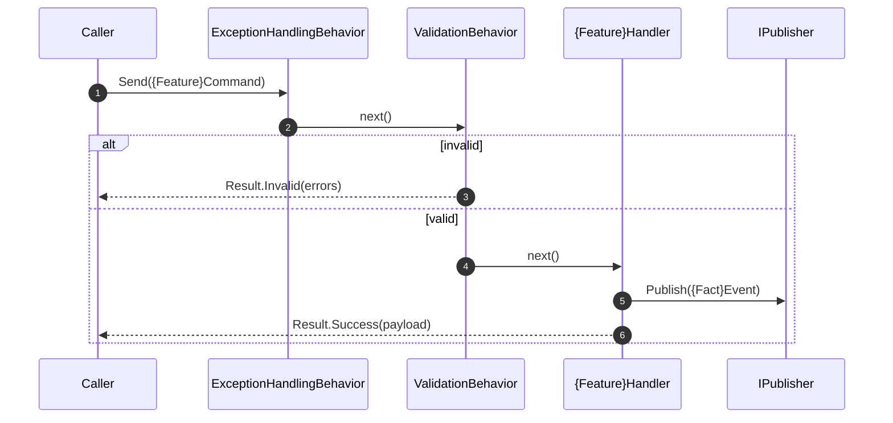
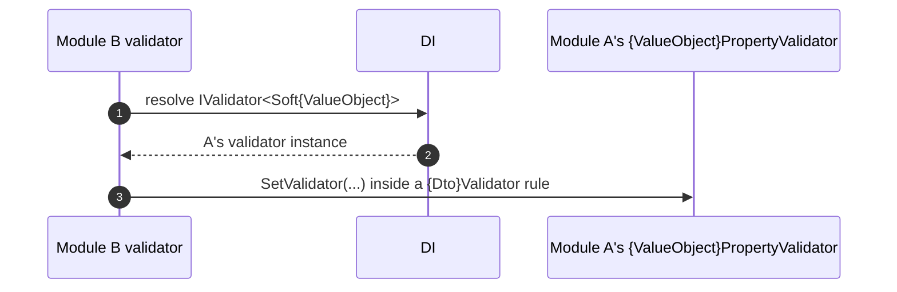

# Goal
Establish the common baseline every v3.1 service shares before any variability is chosen: a repository with Central Package Management, modules made of exactly `Interfaces` + `Application`, and a composition root that wires the MediatR pipeline, module registration, and logging. A module at this plateau has public contracts, validated request dispatch, notification pub/sub, and a conformance test suite — but **no domain layer, no persistence, and no external API**.

# Core Principles
- **Central Package Management** — every NuGet version is pinned once in `Directory.Packages.props`; project files carry versionless `<PackageReference>`.
- **Two-project module** — a module is `{Module}.Interfaces` (public contracts) + `{Module}.Application` (handlers, validators). `{Module}.Domain` and `{Module}.Api` do not exist here; they arrive with their features.
- **One MediatR mechanism** — `ICommand`/`ICommand<T>`, `IQuery<T>`, `INotificationEvent` in `Shared/MediatR`. Cross-module interaction is `ISender.Send` / `IPublisher.Publish` against `{Module}.Interfaces` contracts, never a direct call. Handlers follow `guard → work/dispatch → return Result<T>`; at this plateau there is no `load/stage` step.
- **Pipeline, ordered in one place** — `ExceptionHandlingBehavior` first (wraps everything, logs `Critical`, returns a generic `Result.Error`), then `ValidationBehavior` (collect-all, short-circuits with `Result.Invalid` before the handler). Order lives only in `PipelineRegistration.AddPipeline()`.
- **Soft Value Objects at the boundary** — a value carrying business meaning on a DTO/command/query is a `Soft{ValueObject}` record in `{Module}.Interfaces` (permissive, no validation); a `{ValueObject}PropertyValidator : AbstractValidator<Soft{ValueObject}>` owns its condition and is resolvable cross-module via `IValidator<T>`.
- **Structured logging** — every class logs through `ILogger<T>`; the provider and levels are configured once in `App.Host`; searched-for lines carry an `EventId` from `Shared.Logging.LogEvents`.
- **One test project per production project** — `Shared.Tests`, `BuildingBlocks.Tests`, `{Module}.Interfaces.Tests`, `{Module}.Application.Tests`, each mirroring its counterpart's allowed dependencies. `{Module}.Domain.Tests` appears only with a domain layer. The `make unit-test` target is the gate.

# Capabilities
- request dispatch
  - Commands, queries, and notifications dispatched through MediatR; every request validated by `ValidationBehavior` before its handler; every unhandled exception mapped to `Result.Error` by `ExceptionHandlingBehavior`.
- cross-module contracts
  - A module exposes `Soft{ValueObject}`, DTOs, and command/query/event records from `{Module}.Interfaces`; another module consumes them and resolves `IValidator<Soft{ValueObject}>` / `IValidator<{Dto}>` from DI without referencing internals.
- composition
  - `Program.cs` calls only `AddAppLogging()`, `AddModules()`, `AddPipeline()`. Each module self-registers via `Add{Module}Module()` (MediatR + validator assembly scan).
- conformance
  - `make unit-test` runs every test project; `make test-report` adds coverage; `make mutation-test` runs Stryker (heavy, off the fast gate).

# Usecases

## Dispatch a command through the validated pipeline

## Validate another module's Soft Value Object

# Structure
See [[skills/dotnet/architecture/v3.1/plateau/plateau-core/structure/plateau-core--sln-core.skill.md|plateau-core--sln-core]] for the repository layout and the per-project / per-class skills.

# Example
A complete, runnable minimal service is in [`example/`](./example/) — a `Sample` module with one command, one query, one notification, and one Soft Value Object, wired through the full pipeline. `dotnet build Sample.slnx` and `make unit-test` are green (the plateau's ground-truth check).
