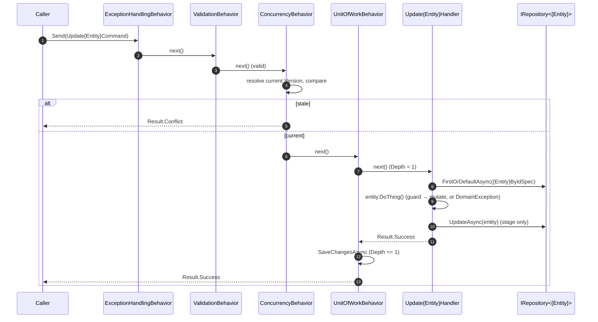
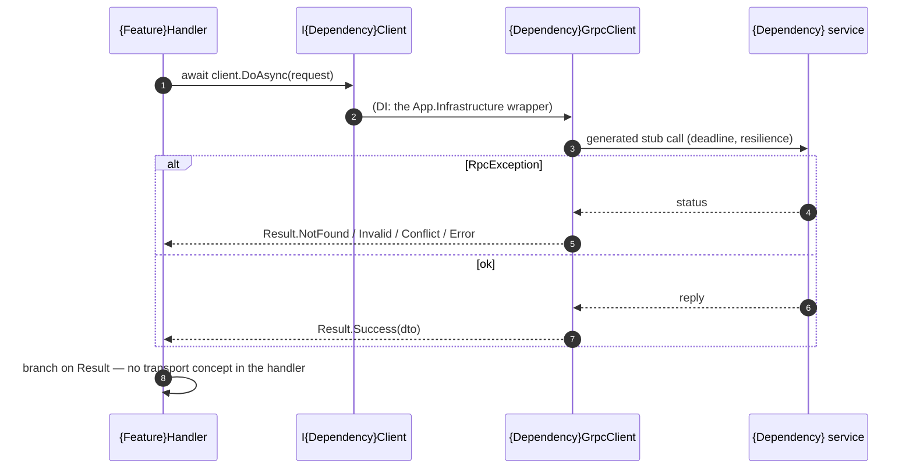

# Goal
Take plateau-core's contract-and-pipeline baseline and make it a deployable service that owns state: a module gains a domain layer (`{Module}.Domain` — guarded entities, strict `{ValueObject}`s), the repository writes to a real `AppDbContext`, every command commits atomically through `UnitOfWorkBehavior`, mutable entities are guarded against lost updates by `ConcurrencyBehavior`, user-initiated entities carry creation/update timestamps, an HTTP API exposes the module, and handlers can call other internal services over gRPC.

# Core Principles
- **Everything plateau-core defines still holds** — CPM, the two-then-more-project module, the MediatR mechanism, the exception + validation pipeline, Soft Value Objects, logging, the conformance harness. This plateau only adds.
- **Domain layer = a feature.** `{Module}.Domain` exists only for a module that has one (VP1). Entities have no public setters for guarded state; every mutating method validates via a locally-owned condition and throws `DomainException`. Bulky logic moves to `static` domain services in `/Services`.
- **Strict Value Objects.** A value carrying a domain invariant is a `sealed record {ValueObject} : Soft{ValueObject}` in `{Module}.Domain/ValueObjects` — it reuses the Soft shape and validates in its constructor. DTOs and other modules still use `Soft{ValueObject}`.
- **One persistence stack.** `App.Infrastructure` holds the single `AppDbContext` (applies every module's `IEntityTypeConfiguration` by assembly scan), one generic Ardalis `Repository<T>`, and `UnitOfWork`. `{Module}.Application` never sees `DbContext` — only `IRepository<T>` / `IReadRepository<T>` from `Shared` and named `Specification<T>` classes in `/Specifications`.
- **The handler grows a load/stage step.** With persistence, a command handler is `guard → load → domain call → stage → return Result<T>`; it never calls `SaveChangesAsync`. `UnitOfWorkBehavior`, registered last, commits once after the outermost handler; a throw discards everything.
- **Optimistic concurrency for mutable entities.** A mutable entity implements `IVersioned` (`uint Version`, database-owned); its update commands implement `IHasVersions`; `ConcurrencyBehavior` (after validation) resolves the current version per entity through `IEntityVersionResolverFactory` and returns `Result.Conflict` before the handler runs on a stale write. `{Module}.Application` supplies one `{Entity}VersionResolver` per versioned entity.
- **Timestamps are two clocks.** A user-initiated entity implements `ICreationInfoModel` (and `IUpdateInfoModel` if the user edits it). The command carries `ActionTimeStamp` (validated: not default, not future); the handler copies it to the user timestamps; `AppDbContext.OnBeforeSaving` sets the server timestamps. VP7 is decided per entity, independent of concurrency.
- **Inbound HTTP.** `solution-api-project` adds `{Module}.Api` (a thin MediatR adapter) and `App.Host`'s `ApiRegistration` partial with `static partial void` hooks; `solution-http-api-publication` implements the HTTP hook. The API layer has no business logic and no dedicated test project.
- **Outbound gRPC.** Internal service-to-service calls go over gRPC. A handler injects `I{Dependency}Client` from `Shared` (returning `Result<T>`); `App.Infrastructure` wraps a generated stub as `{Dependency}GrpcClient`, mapping `RpcException` → `Result` with the mirror of the inbound status table.

# Capabilities
- domain
  - Entities with unbreakable invariants (guarded methods + strict `{ValueObject}`s); `DomainException` the single failure model, mapped to `Result.Error` by the exception behavior.
- persistence
  - `AppDbContext` + generic repository + named specs; atomic commit per command tree via `UnitOfWorkBehavior`; sub-command dispatch is safe (depth-tracked, one commit).
  - Cross-module read models via `App.Queries` (`Specification<T, TResult>` projections) — the only project that sees more than one module's entities.
- concurrency
  - `409 Conflict` on a stale update, decided before the handler runs; `ETag`/`If-Match` transport encoding once an entity is exposed over HTTP.
- audit
  - Creation and update timestamps on user-initiated entities, split into user-supplied and server-authoritative.
- transport
  - Inbound: an HTTP API per module (`{Module}.Api`), wired through `ApiRegistration`'s partial hooks.
  - Outbound: `Result`-returning gRPC clients per dependency, resilient, testable with a trivial fake.

# Usecases

## A command that loads, mutates a guarded entity, and commits

## A handler calls another internal service over gRPC

# Structure
See [[skills/dotnet/architecture/v3.1/plateau/plateau-domain-service/structure/plateau-domain-service--sln-domain-service.skill.md|plateau-domain-service--sln-domain-service]] for the repository layout and the per-project / per-class skills. `structure/` carries plateau-core's elements (union-merged, re-prefixed) plus the domain, persistence, concurrency, timestamp, API, and gRPC-client elements this plateau adds.

# Example
[`example/`](./example/) evolves plateau-core's: the `Sample` module now manages a persisted `TodoItem` (guarded `Rename`/`Complete`, strict `ItemTitle`, `IVersioned`, timestamps), with `App.Infrastructure` on the EF Core in-memory provider. `Program.cs` walks add → get → rename → stale-rename (`Conflict`) → complete → rename-completed (`Error`) → invalid (`Invalid`). `dotnet build` and `make unit-test` are green (10 scenarios across five test projects, including `Sample.Domain.Tests`). The API (VP8) and gRPC-client (VP11) surfaces are documented in `structure/` but only lightly exercised in the example.
