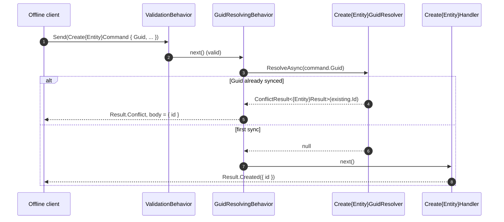
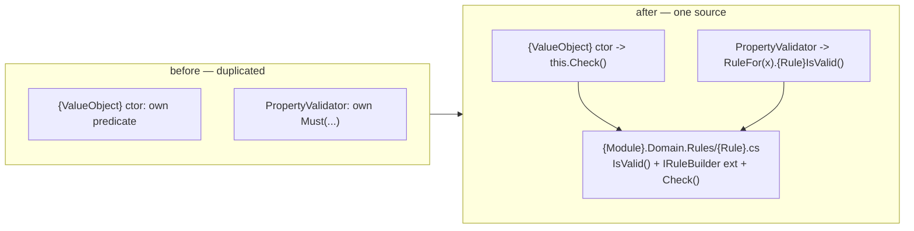

# Goal
Take plateau-domain-service and make it safe for an offline-first client: a create command carries a client-generated `Guid` and creation is idempotent (a retried sync returns the original entity, not a duplicate or an error), and the validation conditions live in one portable `{Module}.Domain.Rules` project so the exact same rule can run in the offline client and on the server. Entities are classified explicitly by ownership × mutability, and the rule mechanism itself is guarded by build-time architecture tests.

# Core Principles
- **Everything plateau-domain-service defines still holds** — the domain layer, the persistence stack, optimistic concurrency, timestamps, the HTTP API, the outbound gRPC client. This plateau only adds.
- **Idempotent creation (VP6).** An entity created outside the system carries an immutable `Guid` correlation handle, set once in its factory. The create command implements `Shared.Guid.IHasGuid`; `GuidResolvingBehavior` (registered after `ConcurrencyBehavior`, before `UnitOfWorkBehavior`) asks the entity's `IGuidResolver<TResponse>` whether the `Guid` already exists and, if so, returns a `ConflictResult<T>` carrying the existing entity's response — the handler and the commit never run. A unique DB index on `Guid` is the last-line guard for a race that passes the pipeline twice. The internal `int Id` stays the only domain identity.
- **Centralized Rules (VP4).** A condition that turns out duplicated across a strict `{ValueObject}` constructor, an entity method, a `{ValueObject}PropertyValidator`, and a `{Dto}Validator` moves to one `{Rule}` class in `{Module}.Domain.Rules` — `IsValid()` (pure predicate) + one `IRuleBuilder` extension (the only place `ErrorCode`/`Message`/`State` are declared) + `Check()`. Every consumer is redirected to it; the local copies are deleted. `{Module}.Domain.Rules` references only FluentValidation and `{Module}.Interfaces` — it is portable to any .NET service (or a Blazor client) without this service's exception or pipeline conventions. It never does I/O.
- **Entity classification is explicit (entity-classification).** Every entity is one of Internal/External × Immutable/Mutable, documented next to its definition. The classification determines exactly which of `solution-entity-concurrency-change` (mutable) and `solution-external-created-entity` (external) applies — no partial application, no concurrency on an immutable entity, no `Guid` infrastructure on an internal one.
- **The rule mechanism is structurally verified (cecil).** `solution-cecil-architecture-tests` (VP4's mandatory companion) adds Mono.Cecil `[Fact]`s over the compiled IL: every `Check()` is actually called by production code (no dead rule), `DomainException` / `EntityNotLoadedException` are thrown only from their intended layer, rejection-code constants stay unique and well-formed, and every entity member writing a rule-guarded property also calls that rule.
- **Rules are proven once, from every layer.** `{Module}.Domain.Rules.Spec` holds `.feature` files only (not a project). `{Module}.Domain.Rules.Tests` proves the rule's own `Check()`; `{Module}.Domain.Tests` re-proves `@format` scenarios through the VO/entity (fail-fast, `DomainException`); `{Module}.Application.Tests` re-proves `@semantic`/`@domain` scenarios through the validators (collect-all, `ValidationResult`) — one Gherkin source, three independent proofs.

# Capabilities
- offline sync
  - A retried create returns `409 Conflict` with the original entity's body (same shape as the `201`), so an offline client's replayed sync is safe. No duplicate row, no exception.
- portable rules
  - The same `{Rule}.Check()` / `IRuleBuilder` extension runs in the offline client and on the server; a fix to a condition is a fix everywhere it is used.
- classification
  - A reviewable per-entity decision (Internal/External × Immutable/Mutable) driving exactly which cross-cutting infrastructure the entity gets.
- structural guarantees
  - Build-time proof that no rule is dead, no exception type leaks its layer, no generated code collides, and no guarded write bypasses its rule.

# Usecases

## An offline client syncs a create it may have sent before

## Centralize a condition once it is duplicated

# Structure
See [[skills/dotnet/architecture/v3.1/plateau/plateau-offline-sync-service/structure/plateau-offline-sync-service--sln-offline-sync-service.skill.md|plateau-offline-sync-service--sln-offline-sync-service]]. `structure/` carries plateau-domain-service's elements (union-merged, re-prefixed) plus the `{Module}.Domain.Rules` project, the Guid/idempotency elements, and the Cecil architecture-test elements this plateau adds. The `registry/` folder records the two ordering-only pipeline-position entries (`command-cs`, `pipelineregistration-cs`).

# Example
[`example/`](./example/) evolves plateau-domain-service's: `TodoItem` is "External Mutable" (`Guid` + `Version`), `AddItemCommand` carries the client `Guid`, and `Sample.Domain.Rules` holds `ItemTitleRules` (redirected from both `ItemTitle` and the property validator). `Program.cs` sends a create, then replays the exact same create and gets `Conflict` with the original id. `dotnet build` and `make unit-test` are green (13 scenarios across six test projects, including `Sample.Domain.Rules.Tests`). The full `.Spec` shared-feature apparatus and the Cecil tests are documented in `structure/` but only lightly exercised in the example.
