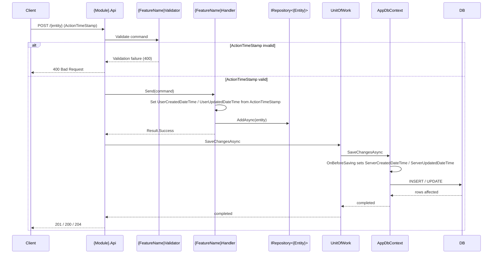

# Goal

- Add `DateTimeOffset` timestamp fields to every entity that is created and/or updated by a user.
- Distinguish between the **user timestamp** (the moment the user invoked the command) and the **server timestamp** (the moment the persistence layer commits the change).
- Keep timestamp contracts in `Shared` so Domain, Application, Interfaces, and Infrastructure can reference them without coupling to BuildingBlocks.
- Ensure that user timestamps are validated early, assigned in handlers, and never mixed with server-assigned timestamps.

# Capabilities

- Every user-initiated entity exposes when it was created and, when mutable, when it was last updated.
- Consumers can see both the user-supplied action time and the authoritative server commit time.
- Commands that affect timestamped entities carry a single `ActionTimeStamp`.
- Invalid future timestamps are rejected before the handler runs.
- Server timestamps are assigned automatically by `AppDbContext`, requiring no handler code.

# Core Principles

- **VP7 is an independent per-entity axis.** "User-initiated" is decided per entity by whoever applies this solution — an entity whose lifecycle is driven by a user action (create, edit) — **regardless of its VP5/VP6 classification**. This solution does not depend on `solution-entity-classification` and does not require optimistic concurrency (VP5) or client-generated identity (VP6).
- An entity that a user only ever creates (never edits) receives a creation timestamp only; one the user also edits receives both.
- The user may only supply `ActionTimeStamp`; the server alone decides `ServerCreatedDateTime` and `ServerUpdatedDateTime`.
- Timestamp contracts live in `Shared.Timestamps`.
- `ActionTimeStamp` validation is transport correctness and belongs in the command validator.
- User timestamp assignment belongs in the handler because the handler knows which entity is being created or updated.
- Server timestamp assignment belongs in `AppDbContext.OnBeforeSaving` because it is the single persistence boundary.
- All timestamp values use `DateTimeOffset` and server-side calculations use `DateTimeOffset.UtcNow`.

# Timestamp Matrix

Decided per entity by whoever applies VP7 — independent of the entity's VP5/VP6 classification:

| Entity's user lifecycle | Timestamp Interfaces |
| --- | --- |
| Not user-initiated (system/import-only) | None — VP7 not applied |
| User creates, never edits | `ICreationInfoModel` |
| User creates and edits | `ICreationInfoModel`, `IUpdateInfoModel` |

# Boundaries
- **Entity contribution (bounded contract).** This solution's footprint on `{Entity}.cs` is: implement `Shared.Timestamps.ICreationInfoModel` (and `IUpdateInfoModel` when the user edits the entity), add the creation/update timestamp properties, and add a `SetTimestamps(...)` method this solution owns. It touches no method that `solution-domain-behaviour` or any other solution defines. VP7 is one of the disjoint per-entity interface contributions the [delta-conflict analysis](skills/dotnet/architecture/v3.1/delta-conflict-analysis.md#entity-cs) records as canonical.
- Server timestamps (`ServerCreatedDateTime`/`ServerUpdatedDateTime`) are assigned in `AppDbContext.OnBeforeSaving`, not by any handler. The user-supplied `ActionTimeStamp` lives on the command, not the entity — the entity only stores what the handler copies onto it.
- Inbound API (VP8/VP9) is not required; a module reached only over messaging still timestamps its user-initiated entities.

# Adr

- [[skills/dotnet/architecture/v3.1/solutions/solution-entity-edit-timestamp.skill/adr/timestamp-handling.md|Timestamp handling ADR]]
  - Validator checks `ActionTimeStamp`; handler assigns user timestamps; `AppDbContext` assigns server timestamps.
  - A user-created entity implements `ICreationInfoModel`; one the user also edits also implements `IUpdateInfoModel` — the choice is per entity, not derived from VP5/VP6.
  - Timestamp command marker lives in `Shared.Timestamps` as `ICommandWithTimestamp`.

# Requirements

SOLUTION:
- [[skills/dotnet/architecture/v3.1/solutions/solution-domain-configuration.skill/solution-domain-configuration.skill.md|solution-domain-configuration]]
  - [[skills/dotnet/architecture/v3.1/solutions/solution-domain-configuration.skill/Implementation/{Module}.Domain.csproj.extend.md|{Module}.Domain.csproj]] - provides the EF Core configuration pattern for timestamp columns.
- [[skills/dotnet/architecture/v3.1/solutions/solution-repository-integration.skill/solution-repository-integration.skill.md|solution-repository-integration]]
  - [[skills/dotnet/architecture/v3.1/solutions/solution-repository-integration.skill/Implementation/Shared.csproj.extend.md|Shared.csproj]] - provides `IRepository<T>` and `IReadRepository<T>` used by handlers.
  - [[skills/dotnet/architecture/v3.1/solutions/solution-repository-integration.skill/Implementation/App.Infrastructure.csproj.extend/AppDbContext.cs.create.md|AppDbContext.cs]] - hosts `AppDbContext`, extended here to assign server timestamps before saving.
- [[skills/dotnet/architecture/v3.1/solutions/solution-unit-of-work.skill/solution-unit-of-work.skill.md|solution-unit-of-work]]
  - [[skills/dotnet/architecture/v3.1/solutions/solution-unit-of-work.skill/Implementation/App.Infrastructure.csproj.extend/UnitOfWork.cs.create.md|UnitOfWork.cs]] - delegates to `AppDbContext.SaveChangesAsync`, which triggers `OnBeforeSaving`.

NUGET:
- No new packages are required for this solution. Existing packages from dependency solutions are sufficient:
  - `Microsoft.EntityFrameworkCore` - used in `AppDbContext.OnBeforeSaving`.
  - `FluentValidation` - used in command validators.
  - `Ardalis.Result` and `MediatR` - used in commands and handlers.

# Template Skill Mutations

PROJECT:
- [[skills/dotnet/architecture/v3.1/solutions/solution-entity-edit-timestamp.skill/Implementation/Shared.csproj.extend.md|Shared.csproj]] - extend - Add timestamp contracts in `/Timestamps`
  - [[skills/dotnet/architecture/v3.1/solutions/solution-entity-edit-timestamp.skill/Implementation/Shared.csproj.extend/ICreationInfoModelReadOnly.cs.create.md|ICreationInfoModelReadOnly.cs]] - create - Read-only creation timestamp contract.
  - [[skills/dotnet/architecture/v3.1/solutions/solution-entity-edit-timestamp.skill/Implementation/Shared.csproj.extend/ICreationInfoModel.cs.create.md|ICreationInfoModel.cs]] - create - Mutable creation timestamp contract implemented by entities.
  - [[skills/dotnet/architecture/v3.1/solutions/solution-entity-edit-timestamp.skill/Implementation/Shared.csproj.extend/IUpdateInfoModelReadOnly.cs.create.md|IUpdateInfoModelReadOnly.cs]] - create - Read-only update timestamp contract.
  - [[skills/dotnet/architecture/v3.1/solutions/solution-entity-edit-timestamp.skill/Implementation/Shared.csproj.extend/IUpdateInfoModel.cs.create.md|IUpdateInfoModel.cs]] - create - Mutable update timestamp contract implemented by entities.
  - [[skills/dotnet/architecture/v3.1/solutions/solution-entity-edit-timestamp.skill/Implementation/Shared.csproj.extend/ICommandWithTimestamp.cs.create.md|ICommandWithTimestamp.cs]] - create - Command marker that carries `ActionTimeStamp`.
- [[skills/dotnet/architecture/v3.1/solutions/solution-entity-edit-timestamp.skill/Implementation/{Module}.Domain.csproj.extend.md|{Module}.Domain.csproj]] - extend - Add timestamp properties to classified entities and map them in EF configuration
  - [[skills/dotnet/architecture/v3.1/solutions/solution-entity-edit-timestamp.skill/Implementation/{Module}.Domain.csproj.extend/{Entity}.cs.extend.md|{Entity}.cs]] - extend - Implement `ICreationInfoModel` (and `IUpdateInfoModel` for mutable entities).
  - [[skills/dotnet/architecture/v3.1/solutions/solution-entity-edit-timestamp.skill/Implementation/{Module}.Domain.csproj.extend/{Entity}Config.cs.extend.md|{Entity}Config.cs]] - extend - Configure `DateTimeOffset` timestamp columns as required.
- [[skills/dotnet/architecture/v3.1/solutions/solution-entity-edit-timestamp.skill/Implementation/{Module}.Interfaces.csproj.extend.md|{Module}.Interfaces.csproj]] - extend - Commands for timestamped entities implement `ICommandWithTimestamp`
  - [[skills/dotnet/architecture/v3.1/solutions/solution-entity-edit-timestamp.skill/Implementation/{Module}.Interfaces.csproj.extend/{Command}.cs.extend.md|{Command}.cs]] - extend - Add `ActionTimeStamp` property and `ICommandWithTimestamp` implementation.
- [[skills/dotnet/architecture/v3.1/solutions/solution-entity-edit-timestamp.skill/Implementation/{Module}.Application.csproj.extend.md|{Module}.Application.csproj]] - extend - Handlers assign user timestamps; validators reject invalid `ActionTimeStamp`
  - [[skills/dotnet/architecture/v3.1/solutions/solution-entity-edit-timestamp.skill/Implementation/{Module}.Application.csproj.extend/{FeatureName}.Handler.cs.extend.md|{FeatureName}.Handler.cs]] - extend - Assign `UserCreatedDateTime`/`UserUpdatedDateTime` from `ActionTimeStamp`.
  - [[skills/dotnet/architecture/v3.1/solutions/solution-entity-edit-timestamp.skill/Implementation/{Module}.Application.csproj.extend/{FeatureName}.Validator.cs.extend.md|{FeatureName}.Validator.cs]] - extend - Ensure `ActionTimeStamp` is not default and not in the future.
- [[skills/dotnet/architecture/v3.1/solutions/solution-entity-edit-timestamp.skill/Implementation/App.Infrastructure.csproj.extend.md|App.Infrastructure.csproj]] - extend - Override `SaveChanges`/`SaveChangesAsync` to set server timestamps
  - [[skills/dotnet/architecture/v3.1/solutions/solution-entity-edit-timestamp.skill/Implementation/App.Infrastructure.csproj.extend/AppDbContext.cs.extend.md|AppDbContext.cs]] - extend - Add `OnBeforeSaving` and set `ServerCreatedDateTime`/`ServerUpdatedDateTime`.

# Workflow

# Rules

## MUST
- [[skills/dotnet/architecture/v3.1/solutions/solution-entity-edit-timestamp.skill/Implementation/App.Infrastructure.csproj.extend.md#MUST|App.Infrastructure.csproj]]
	- [[skills/dotnet/architecture/v3.1/solutions/solution-entity-edit-timestamp.skill/Implementation/App.Infrastructure.csproj.extend/AppDbContext.cs.extend.md#MUST|AppDbContext.cs]]
- [[skills/dotnet/architecture/v3.1/solutions/solution-entity-edit-timestamp.skill/Implementation/Shared.csproj.extend.md#MUST|Shared.csproj]]
	- [[skills/dotnet/architecture/v3.1/solutions/solution-entity-edit-timestamp.skill/Implementation/Shared.csproj.extend/ICommandWithTimestamp.cs.create.md#MUST|ICommandWithTimestamp.cs]]
	- [[skills/dotnet/architecture/v3.1/solutions/solution-entity-edit-timestamp.skill/Implementation/Shared.csproj.extend/ICreationInfoModel.cs.create.md#MUST|ICreationInfoModel.cs]]
	- [[skills/dotnet/architecture/v3.1/solutions/solution-entity-edit-timestamp.skill/Implementation/Shared.csproj.extend/ICreationInfoModelReadOnly.cs.create.md#MUST|ICreationInfoModelReadOnly.cs]]
	- [[skills/dotnet/architecture/v3.1/solutions/solution-entity-edit-timestamp.skill/Implementation/Shared.csproj.extend/IUpdateInfoModel.cs.create.md#MUST|IUpdateInfoModel.cs]]
	- [[skills/dotnet/architecture/v3.1/solutions/solution-entity-edit-timestamp.skill/Implementation/Shared.csproj.extend/IUpdateInfoModelReadOnly.cs.create.md#MUST|IUpdateInfoModelReadOnly.cs]]
- [[skills/dotnet/architecture/v3.1/solutions/solution-entity-edit-timestamp.skill/Implementation/{Module}.Application.csproj.extend.md#MUST|{Module}.Application.csproj]]
	- [[skills/dotnet/architecture/v3.1/solutions/solution-entity-edit-timestamp.skill/Implementation/{Module}.Application.csproj.extend/{FeatureName}.Handler.cs.extend.md#MUST|{FeatureName}.Handler.cs]]
	- [[skills/dotnet/architecture/v3.1/solutions/solution-entity-edit-timestamp.skill/Implementation/{Module}.Application.csproj.extend/{FeatureName}.Validator.cs.extend.md#MUST|{FeatureName}.Validator.cs]]
- [[skills/dotnet/architecture/v3.1/solutions/solution-entity-edit-timestamp.skill/Implementation/{Module}.Domain.csproj.extend.md#MUST|{Module}.Domain.csproj]]
	- [[skills/dotnet/architecture/v3.1/solutions/solution-entity-edit-timestamp.skill/Implementation/{Module}.Domain.csproj.extend/{Entity}.cs.extend.md#MUST|{Entity}.cs]]
	- [[skills/dotnet/architecture/v3.1/solutions/solution-entity-edit-timestamp.skill/Implementation/{Module}.Domain.csproj.extend/{Entity}Config.cs.extend.md#MUST|{Entity}Config.cs]]
- [[skills/dotnet/architecture/v3.1/solutions/solution-entity-edit-timestamp.skill/Implementation/{Module}.Interfaces.csproj.extend.md#MUST|{Module}.Interfaces.csproj]]
	- [[skills/dotnet/architecture/v3.1/solutions/solution-entity-edit-timestamp.skill/Implementation/{Module}.Interfaces.csproj.extend/{Command}.cs.extend.md#MUST|{Command}.cs]]

## SHOULD
- Avoid assigning both user and server timestamps in the same layer.
- Avoid checking `ActionTimeStamp > DateTimeOffset.UtcNow` inside every handler instead of the validator.
- Avoid using a pipeline behavior to assign user timestamps — it lacks the handler's context about which entity is the target of the command.
- Avoid adding `ServerUpdatedDateTime` to an `External Immutable` entity that is never updated.
- Avoid using `DateTime.Now` and losing time-zone information.
- Avoid exposing public setters on entity timestamp properties.
- Avoid mapping timestamp columns with `[Column]` or `[Required]` attributes on the entity class.

# Check list
- [ ] `Shared/Timestamps/ICreationInfoModelReadOnly.cs` exists.
- [ ] `Shared/Timestamps/ICreationInfoModel.cs` exists.
- [ ] `Shared/Timestamps/IUpdateInfoModelReadOnly.cs` exists.
- [ ] `Shared/Timestamps/IUpdateInfoModel.cs` exists.
- [ ] `Shared/Timestamps/ICommandWithTimestamp.cs` exists.
- [ ] Mutable entities implement both `ICreationInfoModel` and `IUpdateInfoModel`.
- [ ] `External Immutable` entities implement `ICreationInfoModel` only.
- [ ] `Internal Immutable` entities implement none of the timestamp interfaces.
- [ ] Create/update commands implement `ICommandWithTimestamp`.
- [ ] Validator rejects `default(DateTimeOffset)` and future `ActionTimeStamp`.
- [ ] Create handler for mutable entity sets `UserCreatedDateTime` and `UserUpdatedDateTime`.
- [ ] Update handler sets only `UserUpdatedDateTime`.
- [ ] Create handler for `External Immutable` sets only `UserCreatedDateTime`.
- [ ] `AppDbContext` overrides `SaveChanges` and `SaveChangesAsync`.
- [ ] `OnBeforeSaving` sets `ServerCreatedDateTime` for `Added` `ICreationInfoModel` entries.
- [ ] `OnBeforeSaving` sets `ServerUpdatedDateTime` for `Added`/`Modified` `IUpdateInfoModel` entries.
- [ ] EF configuration marks timestamp columns as required `DateTimeOffset`.
