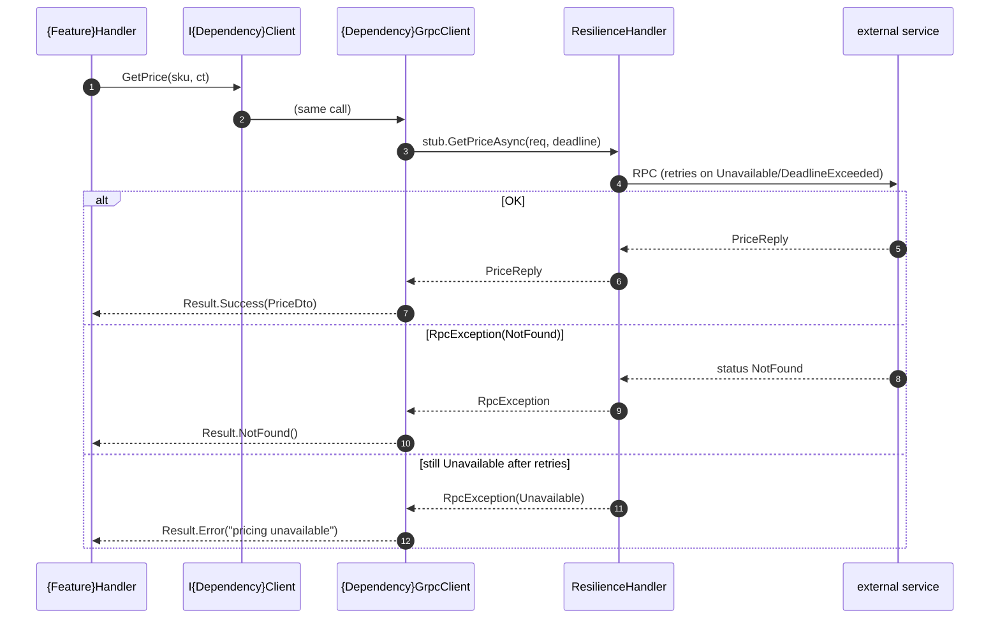

# Goal
- Give a module one way to call an external gRPC service: an injected `I{Dependency}Client` (a `Shared` contract) whose methods return `Ardalis.Result<T>` — a handler never sees the generated stub, `RpcException`, `StatusCode`, deadlines, or channels.
- Generate the client stub from the dependency's own `.proto` at build time — the wire types are never hand-written.
- Map every RPC status to a `Result` in one adapter per dependency, using the same status table `solution-grpc-integration` maps in the other direction.

# Capabilities
- A DI-injected `I{Dependency}Client` returning `Result<T>` — testable by substituting a fake in `{Module}.Application.Tests`, no gRPC infrastructure in the test.
- Per-dependency channel configuration (address, TLS, default deadline) bound from `IConfiguration`.
- A resilience handler (timeout, retry on `Unavailable`/`DeadlineExceeded`, circuit breaker) applied once per dependency at registration.
- Symmetry with `solution-grpc-integration`: the same `Result` ↔ `StatusCode` mapping, so a call chain `module A → module B` over gRPC round-trips a `Result` faithfully.

# Core Principle
- **Contract in `Shared`, stub in `App.Infrastructure`** - `I{Dependency}Client` is a narrow `Shared.Clients` interface — one method per operation the module actually calls. `{Dependency}GrpcClient` implements it in `App.Infrastructure`, wrapping the generated stub. A handler references only `I{Dependency}Client`.
- **The `.proto` is a copy of the dependency's contract** - it lives in `App.Infrastructure/Protos`, generated to C# by `Grpc.Tools`; the generated stub and message types are never edited.
- **Every failure is a `Result`, never an exception** - `RpcException`/`StatusCode` is caught in the adapter and mapped via `GrpcStatusExtensions.ToResult(...)`: `NotFound → Result.NotFound()`, `InvalidArgument → Result.Invalid(...)`, `Unavailable`/`DeadlineExceeded` → `Result.Error(...)` (after resilience has already retried), `PermissionDenied`/`Unauthenticated` → `Result.Forbidden()`/`Result.Unauthorized()`.
- **Every call carries a deadline** - from the dependency's configured default, overridable per call. A deadline-less gRPC call can hang on an unresponsive peer forever.
- **Independent of `solution-http-api-client`** (VP10) - a module may talk to one dependency over gRPC and another over HTTP; each dependency gets its own `I{Dependency}Client`. Neither solution requires the other.

# Boundaries
- Inbound gRPC (this module's own service) is [[skills/dotnet/architecture/v3.1/solutions/solution-grpc-integration.skill/solution-grpc-integration.skill.md|solution-grpc-integration]] (VP9) — unrelated; it never shares a `.proto` or a project folder with this one (inbound `.proto`s live in `{Module}.Api/Protos`, this one's in `App.Infrastructure/Protos`).
- The `I{Dependency}Client` interface shape is shared with `solution-http-api-client` (VP10): both expose "a per-dependency contract returning `Result<T>`". A module applying **both** does so for **different** dependencies, so it creates different files (`IPricingClient` vs `IInventoryClient`) — never the same file twice. If a future need arises to reach one dependency over both transports, a shared `solution-outbound-client` prerequisite would own the `/Clients` folder; today neither solution needs it.
- The dependency's `.proto` contract is owned by that service's team; this solution consumes a vendored copy and does not keep it in sync automatically.
- Cross-cutting call tracing (an `Activity` per RPC) is a Plateau Component concern, not this solution's.

# Adr
- [[skills/dotnet/architecture/v3.1/solutions/solution-grpc-client.skill/adr/generated-stub-behind-shared-result-interface.md|Generated stub behind a narrow Shared Result-returning interface]]
  - Selected variant: generated `Grpc.Tools` stub, wrapped per dependency by `{Dependency}GrpcClient : I{Dependency}Client` in `App.Infrastructure`; the handler-facing contract is `I{Dependency}Client` in `Shared`, returning `Result<T>`.

# Requirements
SOLUTION:
- [[skills/dotnet/architecture/v3.1/solutions/solution-infrastructure-project.skill/solution-infrastructure-project.skill.md|solution-infrastructure-project]]
  - [[skills/dotnet/architecture/v3.1/solutions/solution-infrastructure-project.skill/Implementation/App.Infrastructure.csproj.create.md|App.Infrastructure.csproj]] - hosts `Protos/` and `Clients/`
- [[skills/dotnet/architecture/v3.1/solutions/solution-app-logging.skill/solution-app-logging.skill.md|solution-app-logging]]
  - `ILogger<{Dependency}GrpcClient>` - the adapter logs a mapped failure once, at `Warning`

NUGET (versions in `Directory.Packages.props` per [[skills/dotnet/architecture/v3.1/solutions/solution-central-package-management.skill/solution-central-package-management.skill.md|solution-central-package-management]]):
- `Grpc.Net.ClientFactory` - `AddGrpcClient<T>()`, DI-managed channels
- `Google.Protobuf`, `Grpc.Tools` - `.proto` → C# client stub at build time
- `Microsoft.Extensions.Http.Resilience` - the standard resilience handler on the gRPC channel
- `Ardalis.Result` - `Result<T>` and its statuses

# Template Skill Mutations

PROJECT:
- [[skills/dotnet/architecture/v3.1/solutions/solution-grpc-client.skill/Implementation/Shared.csproj.extend.md|Shared.csproj]] - extend - add `Clients/` for the per-dependency contracts
  - [[skills/dotnet/architecture/v3.1/solutions/solution-grpc-client.skill/Implementation/Shared.csproj.extend/I{Dependency}Client.cs.create.md|I{Dependency}Client.cs]] - create - narrow per-dependency contract returning `Result<T>`
- [[skills/dotnet/architecture/v3.1/solutions/solution-grpc-client.skill/Implementation/App.Infrastructure.csproj.extend.md|App.Infrastructure.csproj]] - extend - add `Protos/` + `Clients/`, `Grpc.Tools` client codegen
  - [[skills/dotnet/architecture/v3.1/solutions/solution-grpc-client.skill/Implementation/App.Infrastructure.csproj.extend/{Dependency}.proto.create.md|{Dependency}.proto]] - create - vendored copy of the dependency's contract, `GrpcServices=Client`
  - [[skills/dotnet/architecture/v3.1/solutions/solution-grpc-client.skill/Implementation/App.Infrastructure.csproj.extend/{Dependency}GrpcClient.cs.create.md|{Dependency}GrpcClient.cs]] - create - adapter: generated stub → `Result<T>`
  - [[skills/dotnet/architecture/v3.1/solutions/solution-grpc-client.skill/Implementation/App.Infrastructure.csproj.extend/GrpcStatusExtensions.cs.create.md|GrpcStatusExtensions.cs]] - create - `RpcException`/`StatusCode` → `Result` mapping (mirror of `solution-grpc-integration`'s `ToRpcException`)
- [[skills/dotnet/architecture/v3.1/solutions/solution-grpc-client.skill/Implementation/App.Host.csproj.extend.md|App.Host.csproj]] - extend - `AddGrpcClients()` — one `AddGrpcClient<T>()` per dependency, channel + resilience
  - [[skills/dotnet/architecture/v3.1/solutions/solution-grpc-client.skill/Implementation/App.Host.csproj.extend/GrpcClientRegistration.cs.create.md|GrpcClientRegistration.cs]] - create - the registration extension

# Workflow

## Call an external gRPC dependency (happy path)
1. Vendor the dependency's `.proto` into `App.Infrastructure/Protos/{Dependency}.proto` (`option csharp_namespace`, `GrpcServices=Client` in the csproj `<Protobuf>` item).
2. Declare `I{Dependency}Client` in `Shared/Clients` — one method per operation the module calls, each returning `Result<T>`.
3. Implement `{Dependency}GrpcClient : I{Dependency}Client` in `App.Infrastructure/Clients` — inject the generated `{Dependency}.{Dependency}Client` stub, apply the configured deadline, `try { … } catch (RpcException e) { return e.ToResult<T>(); }`.
4. Register it in `GrpcClientRegistration.AddGrpcClients()`: `AddGrpcClient<{Dependency}GrpcClient>(o => o.Address = cfg[...])` + `.AddStandardResilienceHandler()`, and bind `I{Dependency}Client` → `{Dependency}GrpcClient`.
5. A handler injects `I{Dependency}Client` and branches on the returned `Result`.

## Failure mapping
`GrpcStatusExtensions.ToResult<T>(RpcException)` — the mirror of `solution-grpc-integration`'s `Result.ToRpcException()`:

| `StatusCode` | `Result` |
| --- | --- |
| `NotFound` | `Result.NotFound()` |
| `InvalidArgument` / `FailedPrecondition` | `Result.Invalid(new ValidationError(e.Status.Detail))` |
| `AlreadyExists` | `Result.Conflict(e.Status.Detail)` |
| `PermissionDenied` | `Result.Forbidden()` |
| `Unauthenticated` | `Result.Unauthorized()` |
| `Unavailable` / `DeadlineExceeded` / `Internal` / `Unknown` | `Result.Error(e.Status.Detail)` |

# Rule

## MUST
- [[skills/dotnet/architecture/v3.1/solutions/solution-grpc-client.skill/Implementation/Shared.csproj.extend/I{Dependency}Client.cs.create.md#MUST|I{Dependency}Client.cs]]
- [[skills/dotnet/architecture/v3.1/solutions/solution-grpc-client.skill/Implementation/App.Infrastructure.csproj.extend/{Dependency}GrpcClient.cs.create.md#MUST|{Dependency}GrpcClient.cs]]
- [[skills/dotnet/architecture/v3.1/solutions/solution-grpc-client.skill/Implementation/App.Host.csproj.extend/GrpcClientRegistration.cs.create.md#MUST|GrpcClientRegistration.cs]]
- **Handler-facing type is `I{Dependency}Client` returning `Result<T>`** - never the generated stub, `RpcException`, or `StatusCode` in a handler or a test.
  - Risk: a handler holding the stub owns deadlines, status mapping, and channel lifecycle — transport concerns scattered through the module, and the handler cannot be unit-tested without a gRPC server.
  - Fix: the adapter in `App.Infrastructure` owns all of it; the handler injects `I{Dependency}Client` and branches on `Result`.
- **Generate the stub from `.proto`; apply a deadline to every call** - `<Protobuf Include="Protos/{Dependency}.proto" GrpcServices="Client" />`; `CallOptions` with `deadline: DateTime.UtcNow + _options.DefaultTimeout`.
  - Risk: a hand-written stub drifts from the contract; a deadline-less call hangs indefinitely on a stalled peer, exhausting the caller's thread/connection pool.
  - Fix: codegen + a deadline on every RPC, default from configuration.
- **Map failures through `GrpcStatusExtensions.ToResult`** - one place, matching `solution-grpc-integration`'s table.
  - Risk: ad-hoc mapping per method makes `module A → module B` round-trips lossy (a `NotFound` from B surfaces as a generic error in A).
  - Fix: the shared extension; a status not in the table maps to `Result.Error`.
- **Channel address, TLS, and default deadline come from `IConfiguration`** - bound to a per-dependency options type.
  - Risk: a hard-coded address cannot vary per environment and leaks topology into the repo.
  - Fix: `services.Configure<{Dependency}ClientOptions>(cfg.GetSection("GrpcClients:{Dependency}"))`.

## SHOULD
- Register the resilience handler with retry limited to `Unavailable`/`DeadlineExceeded` (idempotent-safe statuses) — never blanket-retry a mutating RPC.
- Log a mapped failure once, at `Warning`, in the adapter, with the dependency name and `StatusCode` — not at every call site.

# Check list
- [ ] `I{Dependency}Client` in `Shared/Clients`, one method per called operation, each returns `Result<T>`.
- [ ] `{Dependency}.proto` vendored in `App.Infrastructure/Protos`, csproj `<Protobuf … GrpcServices="Client" />`.
- [ ] `{Dependency}GrpcClient : I{Dependency}Client` in `App.Infrastructure/Clients` wraps the generated stub, applies the configured deadline, catches `RpcException` and returns `Result`.
- [ ] `GrpcStatusExtensions.ToResult` is the only status→`Result` mapping.
- [ ] `AddGrpcClient<T>()` + `.AddStandardResilienceHandler()` per dependency; `I{Dependency}Client` bound to the adapter.
- [ ] Channel address / deadline from `IConfiguration`.
- [ ] No generated type, `RpcException`, or `StatusCode` reaches a handler or a test.
