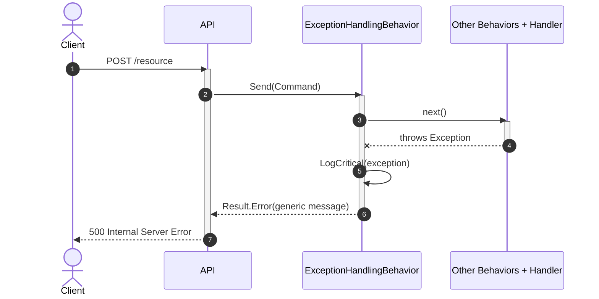

# Goal
- Prevent any unhandled exception from escaping the MediatR pipeline into the API layer
- Centralize exception handling in a single cross-cutting pipeline behavior
- Log every intercepted exception as a critical error with full diagnostic context
- Return a safe, generic `Ardalis.Result` error to API consumers without leaking implementation details

# Capabilities
- Global exception interception for all MediatR requests that return `Ardalis.Result`
- Consistent safe API response for unexpected failures
- Centralized critical logging with exception details
- No per-handler try/catch boilerplate
- Protection against information leakage through error messages

# Core Principles
- `ExceptionHandlingBehavior` is generic — one implementation protects all commands and queries
- Catches any `Exception` thrown by the handler or any inner pipeline behavior
- Logs the full exception at `LogLevel.Critical` before producing the API response
- Returns `Result.Error` with a fixed, user-friendly message — never the original exception message or stack trace
- Constrained to `where TRequest : IRequest<TResponse>` and `where TResponse : IResult`
- Registered as the first pipeline behavior so it wraps all subsequent behaviors and the handler
- API layer never sees raw exceptions — only `Result` objects

# Requirements
SOLUTION:
- [[skills/dotnet/architecture/v3.1/solutions/solution-sln-structure.skill/solution-sln-structure.skill|solution-sln-structure]]
  - [[skills/dotnet/architecture/v3.1/solutions/solution-sln-structure.skill/Implementation/BuildingBlocks.csproj.create|BuildingBlocks.csproj]] - hosts `ExceptionHandlingBehavior`
  - [[skills/dotnet/architecture/v3.1/solutions/solution-sln-structure.skill/Implementation/App.Host.csproj.create|App.Host.csproj]] - hosts centralized `PipelineRegistration` where the behavior is registered
- [[skills/dotnet/architecture/v3.1/solutions/solution-pipeline-registration.skill/solution-pipeline-registration.skill|solution-pipeline-registration]]
  - [[skills/dotnet/architecture/v3.1/solutions/solution-pipeline-registration.skill/Implementation/App.Host.csproj.extend|App.Host.csproj]] - provides centralized `PipelineRegistration.AddPipeline()` extension point and is the single source of truth for pipeline behavior order — this solution prepends `ExceptionHandlingBehavior` there, before every other behavior

NUGET:
- `MediatR` {version} - provides `IPipelineBehavior<TRequest, TResponse>` and `IRequest<T>`
- `Ardalis.Result` {version} - provides `Result.Error` and `IResult`
- `Microsoft.Extensions.Logging.Abstractions` {version} - provides `ILogger<T>`

# Template Skill Mutations

PROJECT:
- [[skills/dotnet/architecture/v3.1/solutions/solution-mediator-exception-handler.skill/Implementation/BuildingBlocks.csproj.extend|BuildingBlocks.csproj]] - extend - Add `ExceptionHandlingBehavior` pipeline behavior
  - [[skills/dotnet/architecture/v3.1/solutions/solution-mediator-exception-handler.skill/Implementation/BuildingBlocks.csproj.extend/ExceptionHandlingBehavior.cs.create|ExceptionHandlingBehavior.cs]] - create - Pipeline behavior that catches unhandled exceptions and returns a generic `Result.Error`
- [[skills/dotnet/architecture/v3.1/solutions/solution-mediator-exception-handler.skill/Implementation/App.Host.csproj.extend|App.Host.csproj]] - extend - Register `ExceptionHandlingBehavior` first in the pipeline chain
  - [[skills/dotnet/architecture/v3.1/solutions/solution-mediator-exception-handler.skill/Implementation/App.Host.csproj.extend/PipelineRegistration.cs.extend|PipelineRegistration.cs]] - extend - Prepend `ExceptionHandlingBehavior` registration before all other behaviors

# Workflow

## Successful request
1. API receives a request and dispatches a MediatR request.
2. Pipeline behaviors run in registration order.
3. `ExceptionHandlingBehavior` invokes the next delegate.
4. Handler completes successfully and returns a `Result`.
5. `ExceptionHandlingBehavior` passes the result through unchanged.
6. API maps the `Result` to the HTTP response.

## Unhandled exception
1. API receives a request and dispatches a MediatR request.
2. Pipeline behaviors run in registration order.
3. `ExceptionHandlingBehavior` invokes the next delegate.
4. Handler or an inner behavior throws an unhandled exception.
5. `ExceptionHandlingBehavior` catches the exception.
6. The exception is logged at `LogLevel.Critical` with request type and exception details.
7. `ExceptionHandlingBehavior` returns `Result.Error("An unexpected error occurred. Please try again later.")`.
8. API maps the `Result` to a `500 Internal Server Error` response with the generic message.

# Rules

## MUST
- [[skills/dotnet/architecture/v3.1/solutions/solution-mediator-exception-handler.skill/Implementation/BuildingBlocks.csproj.extend#MUST|BuildingBlocks.csproj]]
  - [[skills/dotnet/architecture/v3.1/solutions/solution-mediator-exception-handler.skill/Implementation/BuildingBlocks.csproj.extend/ExceptionHandlingBehavior.cs.create#MUST|ExceptionHandlingBehavior.cs]]
- [[skills/dotnet/architecture/v3.1/solutions/solution-mediator-exception-handler.skill/Implementation/App.Host.csproj.extend#MUST|App.Host.csproj]]
  - [[skills/dotnet/architecture/v3.1/solutions/solution-mediator-exception-handler.skill/Implementation/App.Host.csproj.extend/PipelineRegistration.cs.extend#MUST|PipelineRegistration.cs]]
- Catch `Exception` — do not catch only specific exception types
- Log the caught exception at `LogLevel.Critical`
- Return a generic `Result.Error` message without exception details
- Register `ExceptionHandlingBehavior` before all other pipeline behaviors in `PipelineRegistration.AddPipeline()`

## SHOULD
- Include the request type name in the log scope or message for easier correlation
- Keep the user-facing message in a constant or configuration value

## MUST NOT
- Return the original exception message or stack trace to the API consumer
- Register `ExceptionHandlingBehavior` after validation, concurrency, or unit-of-work behaviors
- Throw a new exception from inside `ExceptionHandlingBehavior`
- Use `ExceptionHandlingBehavior` for expected business failures — those must return specific `Result` statuses from handlers

# Anti-patterns
- **Catching exceptions inside individual handlers**
  - Consequence: duplicates exception-handling logic, makes behavior inconsistent, and allows some exceptions to leak
  - Instead: let unhandled exceptions propagate to `ExceptionHandlingBehavior`

- **Returning exception details in the API response**
  - Consequence: leaks sensitive implementation details and aids attackers
  - Instead: log full details internally and return a fixed generic message

- **Registering the exception handler last in the pipeline**
  - Consequence: exceptions thrown by outer behaviors (for example, during `UnitOfWorkBehavior` commit) are not caught
  - Instead: register `ExceptionHandlingBehavior` first so it wraps all other behaviors and the handler

- **Using `Result.CriticalError` for every unhandled exception without project convention**
  - Consequence: `CriticalError` may map to a different HTTP status or have special handling in the project
  - Instead: use `Result.Error` as the default; switch to `Result.CriticalError` only when the project convention explicitly requires it

# Check list
- [ ] `ExceptionHandlingBehavior` defined in `BuildingBlocks/MediatR/ExceptionHandlingBehavior.cs`
- [ ] `ExceptionHandlingBehavior` constrained to `where TRequest : IRequest<TResponse>` and `where TResponse : IResult`
- [ ] `ExceptionHandlingBehavior` catches `Exception` in a `try/catch` around `await next()`
- [ ] Caught exceptions are logged at `LogLevel.Critical`
- [ ] API response returns `Result.Error` with a generic message
- [ ] `ExceptionHandlingBehavior` registered in `PipelineRegistration.AddPipeline()` before all other behaviors
- [ ] No exception details are exposed to API consumers
