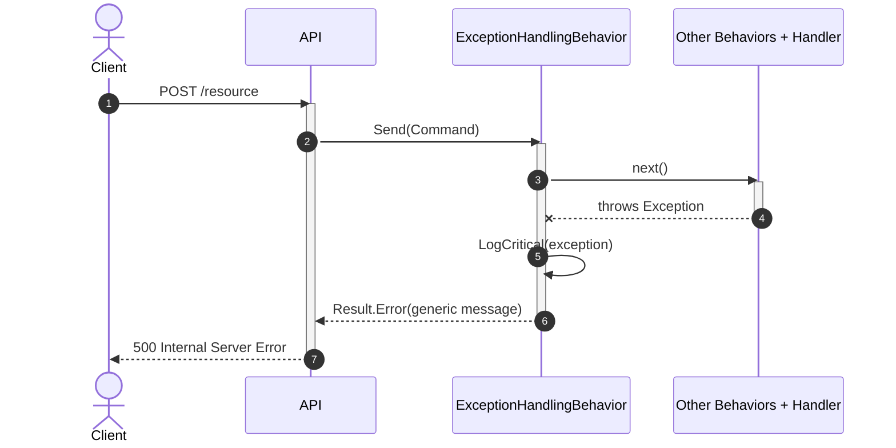

# Goal
- Prevent any unhandled exception from escaping the MediatR pipeline into the API layer
- Centralize exception handling in a single cross-cutting pipeline behavior
- Log every intercepted exception as a critical error with full diagnostic context
- Return a safe, generic `Ardalis.Result` error to API consumers without leaking implementation details

# Capabilities
- Global exception interception for all MediatR requests that return `Ardalis.Result`
- Consistent safe API response for unexpected failures
- Centralized critical logging with exception details
- No per-handler try/catch boilerplate
- Protection against information leakage through error messages

# Core Principles
- `ExceptionHandlingBehavior` is generic — one implementation protects all commands and queries
- Catches any `Exception` thrown by the handler or any inner pipeline behavior
- Logs the full exception at `LogLevel.Critical` before producing the API response
- Returns `Result.Error` with a fixed, user-friendly message — never the original exception message or stack trace
- Constrained to `where TRequest : notnull` and `where TResponse : IResult` (matching MediatR's own `IPipelineBehavior` constraint)
- Registered as the first pipeline behavior so it wraps all subsequent behaviors and the handler
- API layer never sees raw exceptions — only `Result` objects

# Requirements
SOLUTION:
- [[skills/dotnet/architecture/v3.1/solutions/solution-sln-structure.skill/solution-sln-structure.skill.md|solution-sln-structure]]
  - [[skills/dotnet/architecture/v3.1/solutions/solution-sln-structure.skill/Implementation/BuildingBlocks.csproj.create.md|BuildingBlocks.csproj]] - hosts `ExceptionHandlingBehavior`
  - [[skills/dotnet/architecture/v3.1/solutions/solution-sln-structure.skill/Implementation/App.Host.csproj.create.md|App.Host.csproj]] - hosts centralized `PipelineRegistration` where the behavior is registered
- [[skills/dotnet/architecture/v3.1/solutions/solution-pipeline-registration.skill/solution-pipeline-registration.skill.md|solution-pipeline-registration]]
  - [[skills/dotnet/architecture/v3.1/solutions/solution-pipeline-registration.skill/Implementation/App.Host.csproj.extend.md|App.Host.csproj]] - provides centralized `PipelineRegistration.AddPipeline()` extension point and is the single source of truth for pipeline behavior order — this solution prepends `ExceptionHandlingBehavior` there, before every other behavior
- [[skills/dotnet/architecture/v3.1/solutions/solution-app-logging.skill/solution-app-logging.skill.md|solution-app-logging]]
  - [[skills/dotnet/architecture/v3.1/solutions/solution-app-logging.skill/Implementation/Shared.csproj.extend/LogEvents.cs.create.md|LogEvents.cs]] - provides the `LogEvents.UnhandledException` event id this behavior logs with

NUGET:
- `MediatR` {version} - provides `IPipelineBehavior<TRequest, TResponse>` and `IRequest<T>`
- `Ardalis.Result` {version} - provides `Result.Error` and `IResult`
- `Microsoft.Extensions.Logging.Abstractions` {version} - provides `ILogger<T>`

# Template Skill Mutations

PROJECT:
- [[skills/dotnet/architecture/v3.1/solutions/solution-mediator-exception-handler.skill/Implementation/BuildingBlocks.csproj.extend.md|BuildingBlocks.csproj]] - extend - Add `ExceptionHandlingBehavior` pipeline behavior
  - [[skills/dotnet/architecture/v3.1/solutions/solution-mediator-exception-handler.skill/Implementation/BuildingBlocks.csproj.extend/ExceptionHandlingBehavior.cs.create.md|ExceptionHandlingBehavior.cs]] - create - Pipeline behavior that catches unhandled exceptions and returns a generic `Result.Error`
- [[skills/dotnet/architecture/v3.1/solutions/solution-mediator-exception-handler.skill/Implementation/App.Host.csproj.extend.md|App.Host.csproj]] - extend - Register `ExceptionHandlingBehavior` first in the pipeline chain
  - [[skills/dotnet/architecture/v3.1/solutions/solution-mediator-exception-handler.skill/Implementation/App.Host.csproj.extend/PipelineRegistration.cs.extend.md|PipelineRegistration.cs]] - extend - Prepend `ExceptionHandlingBehavior` registration before all other behaviors

# Workflow

## Successful request
1. API receives a request and dispatches a MediatR request.
2. Pipeline behaviors run in registration order.
3. `ExceptionHandlingBehavior` invokes the next delegate.
4. Handler completes successfully and returns a `Result`.
5. `ExceptionHandlingBehavior` passes the result through unchanged.
6. API maps the `Result` to the HTTP response.

## Unhandled exception
1. API receives a request and dispatches a MediatR request.
2. Pipeline behaviors run in registration order.
3. `ExceptionHandlingBehavior` invokes the next delegate.
4. Handler or an inner behavior throws an unhandled exception.
5. `ExceptionHandlingBehavior` catches the exception.
6. The exception is logged at `LogLevel.Critical` with request type and exception details.
7. `ExceptionHandlingBehavior` returns `Result.Error("An unexpected error occurred. Please try again later.")`.
8. API maps the `Result` to a `500 Internal Server Error` response with the generic message.

# Rules

## MUST
- [[skills/dotnet/architecture/v3.1/solutions/solution-mediator-exception-handler.skill/Implementation/BuildingBlocks.csproj.extend.md#MUST|BuildingBlocks.csproj]]
  - [[skills/dotnet/architecture/v3.1/solutions/solution-mediator-exception-handler.skill/Implementation/BuildingBlocks.csproj.extend/ExceptionHandlingBehavior.cs.create.md#MUST|ExceptionHandlingBehavior.cs]]
- [[skills/dotnet/architecture/v3.1/solutions/solution-mediator-exception-handler.skill/Implementation/App.Host.csproj.extend.md#MUST|App.Host.csproj]]
  - [[skills/dotnet/architecture/v3.1/solutions/solution-mediator-exception-handler.skill/Implementation/App.Host.csproj.extend/PipelineRegistration.cs.extend.md#MUST|PipelineRegistration.cs]]
- Catch `Exception`, not only specific types.
  - Risk: a narrow `catch` lets an unanticipated exception reach the API as a raw 500 with a leaked stack trace.
  - Fix: `try { await next(); } catch (Exception ex) { ... }` around the whole downstream pipeline.
- Log the caught exception at `LogLevel.Critical` (through `ILogger<T>` per [[skills/dotnet/architecture/v3.1/solutions/solution-app-logging.skill/solution-app-logging.skill.md|solution-app-logging]], event `LogEvents.UnhandledException`) and return a generic `Result.Error` with no exception details.
  - Risk: returning the exception message or stack trace to the caller discloses implementation internals; not logging it loses the only record.
  - Fix: full detail to the log, a fixed generic message to the caller.
- Register `ExceptionHandlingBehavior` first in `PipelineRegistration.AddPipeline()`, before every other behavior.
  - Risk: registered after validation/concurrency/unit-of-work, it does not catch exceptions those outer behaviors throw (e.g. a commit failure in `UnitOfWorkBehavior`).
  - Fix: first position, so it wraps all other behaviors and the handler.
- Never throw from inside `ExceptionHandlingBehavior`, and never use it for expected business failures.
  - Risk: a throw here escapes entirely unhandled; routing an expected failure through it turns a domain outcome into a generic error and loses the specific `Result` status.
  - Fix: the behavior only maps unexpected exceptions; handlers return specific `Result` statuses for expected failures.

## SHOULD
- Include the request type name in the log scope or message for correlation.
- Keep the user-facing message in a constant or configuration value.
- Use `Result.Error` as the default mapping; switch to `Result.CriticalError` only when a project convention explicitly requires it (it may map to a different HTTP status).

# Check list
- [ ] `ExceptionHandlingBehavior` defined in `BuildingBlocks/MediatR/ExceptionHandlingBehavior.cs`
- [ ] `ExceptionHandlingBehavior` constrained to `where TRequest : notnull` and `where TResponse : IResult`
- [ ] `ExceptionHandlingBehavior` catches `Exception` in a `try/catch` around `await next()`
- [ ] Caught exceptions are logged at `LogLevel.Critical`
- [ ] API response returns `Result.Error` with a generic message
- [ ] `ExceptionHandlingBehavior` registered in `PipelineRegistration.AddPipeline()` before all other behaviors
- [ ] No exception details are exposed to API consumers
