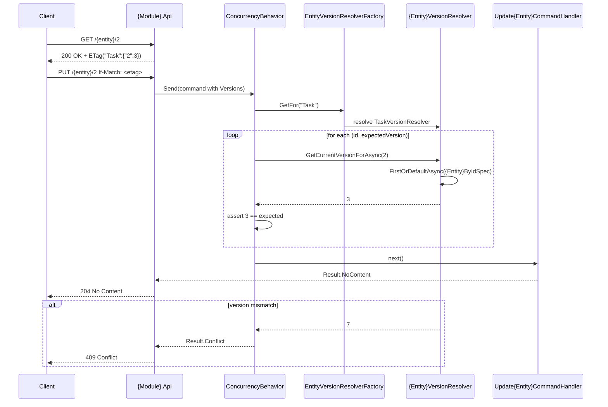

# Goal
- Define `Version` / `xmin` as the concurrency token on every mutable entity — the database-level last line of defence
- Define `IVersioned` in Shared as the marker all mutable entities implement
- Define `IHasVersions` in Shared as the interface all update commands implement to carry client-supplied version information
- Define `IEntityVersionResolverFactory` and `IEntityVersionResolver` in Shared: the factory maps stable string entity names to resolvers, and each resolver reads the current version for one entity
- Define `ConcurrencyBehavior` in BuildingBlocks as the pipeline behavior that validates all versions before the handler runs — transport-agnostic, activates on any `IHasVersions` command regardless of how it was dispatched
- Define `ETagEncoder` in BuildingBlocks and the HTTP ETag/`If-Match` flow as the transport-specific encoding for this mechanism when the entity is exposed over HTTP — see [# Boundaries](#boundaries)

# Capabilities
- Optimistic concurrency control for all mutable entities
- Early detection of stale updates before the handler runs
- ETag-based HTTP precondition handling
- Database-level last line of defence via `xmin` concurrency token
- Consistent `409`/`412` response semantics for conflicts

# Core Principles
- `Version` is a `uint` property mapped to PostgreSQL `xmin` — auto-incremented by the database on every row change, never set by application code
- `IVersioned`, `IHasVersions`, `IEntityVersionResolverFactory`, and `IEntityVersionResolver` live in Shared — common contracts referenced by Domain, Application, Api, and Infrastructure layers
- `ETagEncoder` and `ConcurrencyBehavior` live in BuildingBlocks — concrete implementations of technical patterns
- `EntityVersionResolverFactory` (the factory) lives in App.Infrastructure and discovers mappings by scanning module Domain config classes and module Application resolver classes
- `{Module}.Application` realizes `IEntityVersionResolver` for every versioned entity — each resolver uses the module's `{Entity}ByIdSpec` and `IReadRepository<{Entity}>`
- Entity name string keys in `IHasVersions` are stable business names — never C# type names or namespaces — decouples HTTP contract from assembly structure
- `ConcurrencyBehavior` constrained on `where TRequest : IHasVersions` — only update commands are checked, not all commands
- Missing `If-Match` returns 412 Precondition Failed — not 400 (bad input) or 409 (conflict) — 412 means precondition not supplied
- EF concurrency token is the final guard — `ConcurrencyBehavior` is the early client-friendly check that gives a meaningful 409 before EF raises `DbUpdateConcurrencyException`
- All version mismatches return `Result.Conflict` from the behavior — handler never runs for stale updates
- ETag encodes ALL entity versions involved in the operation — not only the primary entity
- No generic `ByIdSpec` lives in BuildingBlocks — per-entity specs belong in `{Module}.Application`

# Boundaries
- The core mechanism (`Version`/`xmin`, `IVersioned`, `IHasVersions`, `IEntityVersionResolverFactory`/`IEntityVersionResolver`, `ConcurrencyBehavior`) is transport-agnostic — it works for any `IHasVersions` command regardless of whether it was dispatched from an HTTP controller, a gRPC service, or a background job. This solution does not require an HTTP API to exist.
- `ETagEncoder` and the GET-sets-ETag/PUT-PATCH-checks-If-Match flow are the HTTP-specific transport encoding of this same mechanism — applied only once an HTTP API layer (e.g. `solution-http-api-publication`) exists to attach them to. A service with no HTTP API still gets full concurrency protection through `ConcurrencyBehavior` alone; it just carries `IHasVersions` values some other way (a gRPC message field, a job payload) instead of decoding them from an `If-Match` header.
- Which controller class `Single{Entity}Controller.cs.extend` attaches to, and how ETag headers are wired, is `solution-http-api-publication`'s concern to have already established — this solution only describes the delta once that controller exists.

# Workflow

# Requirements
SOLUTION:
- [[skills/dotnet/architecture/v3/solutions/solution-infrastructure-project.skill/solution-infrastructure-project.skill|solution-infrastructure-project]]
  - [[skills/dotnet/architecture/v3/solutions/solution-infrastructure-project.skill/Implementation/App.Infrastructure.csproj.create|App.Infrastructure.csproj]] - hosts `EntityVersionResolverFactory` factory
- [[skills/dotnet/architecture/v3/solutions/solution-domain-configuration.skill/solution-domain-configuration.skill|solution-domain-configuration]]
  - [[skills/dotnet/architecture/v3/solutions/solution-domain-configuration.skill/Implementation/{Module}.Domain.csproj.extend|{Module}.Domain.csproj]] - provides EF Core configuration pattern for `Version` mapping
    - [[skills/dotnet/architecture/v3/solutions/solution-domain-configuration.skill/Implementation/{Module}.Domain.csproj.extend/{Entity}Config.cs.create|{Entity}Config.cs]] - maps `Version` to `xmin` with `IsConcurrencyToken`
- [[skills/dotnet/architecture/v3/solutions/solution-repository-integration.skill/solution-repository-integration.skill|solution-repository-integration]]
  - [[skills/dotnet/architecture/v3/solutions/solution-repository-integration.skill/Implementation/Shared.csproj.extend|Shared.csproj]] - provides `IReadRepository<T>` used by `{Entity}VersionResolver`
    - [[skills/dotnet/architecture/v3/solutions/solution-repository-integration.skill/Implementation/Shared.csproj.extend/IReadRepository.cs.create|IReadRepository.cs]] - used by `{Entity}VersionResolver` to read entity versions
  - [[skills/dotnet/architecture/v3/solutions/solution-repository-integration.skill/Implementation/{Module}.Application.csproj.extend|{Module}.Application.csproj]] - provides `{Entity}ByIdSpec` used by `{Entity}VersionResolver`

NUGET:
- `System.Text.Json` {version} - provides `JsonSerializer` used in `ETagEncoder`
- `Microsoft.EntityFrameworkCore` {version} - provides `IsConcurrencyToken()` for `Version` EF configuration

# Template Skill Mutations

PROJECT:
- [[skills/dotnet/architecture/v3/solutions/solution-entity-concurrency-change.skill/Implementation/{Module}.Domain.csproj.extend|{Module}.Domain.csproj]] - extend - Add Version concurrency token to every mutable entity and implement IVersioned
  - [[skills/dotnet/architecture/v3/solutions/solution-entity-concurrency-change.skill/Implementation/{Module}.Domain.csproj.extend/{EntityName}.cs.extend|{EntityName}.cs]] - extend - Add uint Version property with internal set and implement IVersioned
  - [[skills/dotnet/architecture/v3/solutions/solution-entity-concurrency-change.skill/Implementation/{Module}.Domain.csproj.extend/{EntityName}Config.cs.extend|{EntityName}Config.cs]] - extend - Map Version to xmin with IsConcurrencyToken and ValueGeneratedOnAddOrUpdate
- [[skills/dotnet/architecture/v3/solutions/solution-entity-concurrency-change.skill/Implementation/Shared.csproj.extend|Shared.csproj]] - extend - Add IVersioned, IHasVersions, IEntityVersionResolverFactory, and IEntityVersionResolver
  - [[skills/dotnet/architecture/v3/solutions/solution-entity-concurrency-change.skill/Implementation/Shared.csproj.extend/IVersioned.cs.create|IVersioned.cs]] - create - Marker interface for versioned domain entities
  - [[skills/dotnet/architecture/v3/solutions/solution-entity-concurrency-change.skill/Implementation/Shared.csproj.extend/IHasVersions.cs.create|IHasVersions.cs]] - create - Interface for update commands carrying client-supplied version information
  - [[skills/dotnet/architecture/v3/solutions/solution-entity-concurrency-change.skill/Implementation/Shared.csproj.extend/IEntityVersionResolverFactory.cs.create|IEntityVersionResolverFactory.cs]] - create - Factory that maps stable entity names to IEntityVersionResolver
  - [[skills/dotnet/architecture/v3/solutions/solution-entity-concurrency-change.skill/Implementation/Shared.csproj.extend/IEntityVersionResolver.cs.create|IEntityVersionResolver.cs]] - create - Reads the current version for one versioned entity
- [[skills/dotnet/architecture/v3/solutions/solution-entity-concurrency-change.skill/Implementation/BuildingBlocks.csproj.extend|BuildingBlocks.csproj]] - extend - Add ETagEncoder and ConcurrencyBehavior
  - [[skills/dotnet/architecture/v3/solutions/solution-entity-concurrency-change.skill/Implementation/BuildingBlocks.csproj.extend/ETagEncoder.cs.create|ETagEncoder.cs]] - create - Encodes/decodes entity versions as base64 JSON ETags
  - [[skills/dotnet/architecture/v3/solutions/solution-entity-concurrency-change.skill/Implementation/BuildingBlocks.csproj.extend/ConcurrencyBehavior.cs.create|ConcurrencyBehavior.cs]] - create - Pipeline behavior validating versions through IEntityVersionResolverFactory
- [[skills/dotnet/architecture/v3/solutions/solution-entity-concurrency-change.skill/Implementation/App.Infrastructure.csproj.extend|App.Infrastructure.csproj]] - extend - Add EntityVersionResolverFactory factory
  - [[skills/dotnet/architecture/v3/solutions/solution-entity-concurrency-change.skill/Implementation/App.Infrastructure.csproj.extend/EntityVersionResolverFactory.cs.create|EntityVersionResolverFactory.cs]] - create - Maps stable business entity names to Application-layer resolver types
- [[skills/dotnet/architecture/v3/solutions/solution-entity-concurrency-change.skill/Implementation/{Module}.Application.csproj.extend|{Module}.Application.csproj]] - extend - Add per-entity version resolvers
  - [[skills/dotnet/architecture/v3/solutions/solution-entity-concurrency-change.skill/Implementation/{Module}.Application.csproj.extend/{Entity}VersionResolver.cs.create|{Entity}VersionResolver.cs]] - create - Entity-specific IEntityVersionResolver implementation using {Entity}ByIdSpec
- [[skills/dotnet/architecture/v3/solutions/solution-entity-concurrency-change.skill/Implementation/{Module}.Interfaces.csproj.extend|{Module}.Interfaces.csproj]] - extend - Require update and patch commands to implement IHasVersions
  - [[skills/dotnet/architecture/v3/solutions/solution-entity-concurrency-change.skill/Implementation/{Module}.Interfaces.csproj.extend/{Command}.cs.extend|{Command}.cs]] - extend - Update/patch command implements IHasVersions
- [[skills/dotnet/architecture/v3/solutions/solution-entity-concurrency-change.skill/Implementation/{Module}.Api.csproj.extend|{Module}.Api.csproj]] - extend - Add ETag header to GET responses and If-Match guard to PUT/PATCH
  - [[skills/dotnet/architecture/v3/solutions/solution-entity-concurrency-change.skill/Implementation/{Module}.Api.csproj.extend/Single{Entity}Controller.cs.extend|Single{Entity}Controller.cs]] - extend - Add ETag encoding on GET and If-Match decoding on PUT/PATCH
- [[skills/dotnet/architecture/v3/solutions/solution-entity-concurrency-change.skill/Implementation/App.Host.csproj.extend|App.Host.csproj]] - extend - Register IEntityVersionResolverFactory/module resolvers, and ConcurrencyBehavior in the pipeline
  - [[skills/dotnet/architecture/v3/solutions/solution-entity-concurrency-change.skill/Implementation/App.Host.csproj.extend/EntityVersionResolverRegistration.cs.create|EntityVersionResolverRegistration.cs]] - create - Register factory as Scoped with module Domain and Application assemblies
  - [[skills/dotnet/architecture/v3/solutions/solution-entity-concurrency-change.skill/Implementation/App.Host.csproj.extend/PipelineRegistration.cs.extend|PipelineRegistration.cs]] - extend - Insert `ConcurrencyBehavior` after `ValidationBehavior`

# Rules

## MUST
- [[skills/dotnet/architecture/v3/solutions/solution-entity-concurrency-change.skill/Implementation/App.Host.csproj.extend#MUST|App.Host.csproj]]
	- [[skills/dotnet/architecture/v3/solutions/solution-entity-concurrency-change.skill/Implementation/App.Host.csproj.extend/EntityVersionResolverRegistration.cs.create#MUST|EntityVersionResolverRegistration.cs]]
	- [[skills/dotnet/architecture/v3/solutions/solution-entity-concurrency-change.skill/Implementation/App.Host.csproj.extend/PipelineRegistration.cs.extend#MUST|PipelineRegistration.cs]]
- [[skills/dotnet/architecture/v3/solutions/solution-entity-concurrency-change.skill/Implementation/App.Infrastructure.csproj.extend#MUST|App.Infrastructure.csproj]]
	- [[skills/dotnet/architecture/v3/solutions/solution-entity-concurrency-change.skill/Implementation/App.Infrastructure.csproj.extend/EntityVersionResolverFactory.cs.create#MUST|EntityVersionResolverFactory.cs]]
- [[skills/dotnet/architecture/v3/solutions/solution-entity-concurrency-change.skill/Implementation/BuildingBlocks.csproj.extend#MUST|BuildingBlocks.csproj]]
	- [[skills/dotnet/architecture/v3/solutions/solution-entity-concurrency-change.skill/Implementation/BuildingBlocks.csproj.extend/ConcurrencyBehavior.cs.create#MUST|ConcurrencyBehavior.cs]]
	- [[skills/dotnet/architecture/v3/solutions/solution-entity-concurrency-change.skill/Implementation/BuildingBlocks.csproj.extend/ETagEncoder.cs.create#MUST|ETagEncoder.cs]]
- [[skills/dotnet/architecture/v3/solutions/solution-entity-concurrency-change.skill/Implementation/Shared.csproj.extend#MUST|Shared.csproj]]
	- [[skills/dotnet/architecture/v3/solutions/solution-entity-concurrency-change.skill/Implementation/Shared.csproj.extend/IEntityVersionResolver.cs.create#MUST|IEntityVersionResolver.cs]]
	- [[skills/dotnet/architecture/v3/solutions/solution-entity-concurrency-change.skill/Implementation/Shared.csproj.extend/IEntityVersionResolverFactory.cs.create#MUST|IEntityVersionResolverFactory.cs]]
	- [[skills/dotnet/architecture/v3/solutions/solution-entity-concurrency-change.skill/Implementation/Shared.csproj.extend/IHasVersions.cs.create#MUST|IHasVersions.cs]]
	- [[skills/dotnet/architecture/v3/solutions/solution-entity-concurrency-change.skill/Implementation/Shared.csproj.extend/IVersioned.cs.create#MUST|IVersioned.cs]]
- (only once an HTTP API layer exists — see [# Boundaries](#boundaries)) [[skills/dotnet/architecture/v3/solutions/solution-entity-concurrency-change.skill/Implementation/{Module}.Api.csproj.extend#MUST|{Module}.Api.csproj]]
	- [[skills/dotnet/architecture/v3/solutions/solution-entity-concurrency-change.skill/Implementation/{Module}.Api.csproj.extend/Single{Entity}Controller.cs.extend#MUST|Single{Entity}Controller.cs]]
- [[skills/dotnet/architecture/v3/solutions/solution-entity-concurrency-change.skill/Implementation/{Module}.Application.csproj.extend#MUST|{Module}.Application.csproj]]
	- [[skills/dotnet/architecture/v3/solutions/solution-entity-concurrency-change.skill/Implementation/{Module}.Application.csproj.extend/{Entity}VersionResolver.cs.create#MUST|{Entity}VersionResolver.cs]]
- [[skills/dotnet/architecture/v3/solutions/solution-entity-concurrency-change.skill/Implementation/{Module}.Domain.csproj.extend#MUST|{Module}.Domain.csproj]]
	- [[skills/dotnet/architecture/v3/solutions/solution-entity-concurrency-change.skill/Implementation/{Module}.Domain.csproj.extend/{EntityName}.cs.extend#MUST|{EntityName}.cs]]
	- [[skills/dotnet/architecture/v3/solutions/solution-entity-concurrency-change.skill/Implementation/{Module}.Domain.csproj.extend/{EntityName}Config.cs.extend#MUST|{EntityName}Config.cs]]
- [[skills/dotnet/architecture/v3/solutions/solution-entity-concurrency-change.skill/Implementation/{Module}.Interfaces.csproj.extend#MUST|{Module}.Interfaces.csproj]]
	- [[skills/dotnet/architecture/v3/solutions/solution-entity-concurrency-change.skill/Implementation/{Module}.Interfaces.csproj.extend/{Command}.cs.extend#MUST|{Command}.cs]]
## MUST NOT:
- [[skills/dotnet/architecture/v3/solutions/solution-entity-concurrency-change.skill/Implementation/App.Host.csproj.extend#MUST NOT|App.Host.csproj]]
	- [[skills/dotnet/architecture/v3/solutions/solution-entity-concurrency-change.skill/Implementation/App.Host.csproj.extend/EntityVersionResolverRegistration.cs.create#MUST NOT|EntityVersionResolverRegistration.cs]]
	- [[skills/dotnet/architecture/v3/solutions/solution-entity-concurrency-change.skill/Implementation/App.Host.csproj.extend/PipelineRegistration.cs.extend#MUST NOT|PipelineRegistration.cs]]
- [[skills/dotnet/architecture/v3/solutions/solution-entity-concurrency-change.skill/Implementation/App.Infrastructure.csproj.extend#MUST NOT|App.Infrastructure.csproj]]
	- [[skills/dotnet/architecture/v3/solutions/solution-entity-concurrency-change.skill/Implementation/App.Infrastructure.csproj.extend/EntityVersionResolverFactory.cs.create#MUST NOT|EntityVersionResolverFactory.cs]]
- [[skills/dotnet/architecture/v3/solutions/solution-entity-concurrency-change.skill/Implementation/BuildingBlocks.csproj.extend#MUST NOT|BuildingBlocks.csproj]]
	- [[skills/dotnet/architecture/v3/solutions/solution-entity-concurrency-change.skill/Implementation/BuildingBlocks.csproj.extend/ConcurrencyBehavior.cs.create#MUST NOT|ConcurrencyBehavior.cs]]
- [[skills/dotnet/architecture/v3/solutions/solution-entity-concurrency-change.skill/Implementation/Shared.csproj.extend#MUST NOT|Shared.csproj]]
	- [[skills/dotnet/architecture/v3/solutions/solution-entity-concurrency-change.skill/Implementation/Shared.csproj.extend/IEntityVersionResolver.cs.create#MUST NOT|IEntityVersionResolver.cs]]
	- [[skills/dotnet/architecture/v3/solutions/solution-entity-concurrency-change.skill/Implementation/Shared.csproj.extend/IEntityVersionResolverFactory.cs.create#MUST NOT|IEntityVersionResolverFactory.cs]]
	- [[skills/dotnet/architecture/v3/solutions/solution-entity-concurrency-change.skill/Implementation/Shared.csproj.extend/IHasVersions.cs.create#MUST NOT|IHasVersions.cs]]
	- [[skills/dotnet/architecture/v3/solutions/solution-entity-concurrency-change.skill/Implementation/Shared.csproj.extend/IVersioned.cs.create#MUST NOT|IVersioned.cs]]
- [[skills/dotnet/architecture/v3/solutions/solution-entity-concurrency-change.skill/Implementation/{Module}.Api.csproj.extend#MUST NOT|{Module}.Api.csproj]]
	- [[skills/dotnet/architecture/v3/solutions/solution-entity-concurrency-change.skill/Implementation/{Module}.Api.csproj.extend/Single{Entity}Controller.cs.extend#MUST NOT|Single{Entity}Controller.cs]]
- [[skills/dotnet/architecture/v3/solutions/solution-entity-concurrency-change.skill/Implementation/{Module}.Application.csproj.extend#MUST NOT|{Module}.Application.csproj]]
	- [[skills/dotnet/architecture/v3/solutions/solution-entity-concurrency-change.skill/Implementation/{Module}.Application.csproj.extend/{Entity}VersionResolver.cs.create#MUST NOT|{Entity}VersionResolver.cs]]
- [[skills/dotnet/architecture/v3/solutions/solution-entity-concurrency-change.skill/Implementation/{Module}.Domain.csproj.extend#MUST NOT|{Module}.Domain.csproj]]
	- [[skills/dotnet/architecture/v3/solutions/solution-entity-concurrency-change.skill/Implementation/{Module}.Domain.csproj.extend/{EntityName}.cs.extend#MUST NOT|{EntityName}.cs]]
	- [[skills/dotnet/architecture/v3/solutions/solution-entity-concurrency-change.skill/Implementation/{Module}.Domain.csproj.extend/{EntityName}Config.cs.extend#MUST NOT|{EntityName}Config.cs]]
- [[skills/dotnet/architecture/v3/solutions/solution-entity-concurrency-change.skill/Implementation/{Module}.Interfaces.csproj.extend#MUST NOT|{Module}.Interfaces.csproj]]
	- [[skills/dotnet/architecture/v3/solutions/solution-entity-concurrency-change.skill/Implementation/{Module}.Interfaces.csproj.extend/{Command}.cs.extend#MUST NOT|{Command}.cs]]

# Anti-patterns
- `Version` as plain `uint` on command property instead of `IHasVersions` — does not scale to multi-entity updates
- Handler catches `DbUpdateConcurrencyException` and returns conflict — `ConcurrencyBehavior` should catch this earlier at the application level
- ETag encoding only primary entity version — misses secondary entity conflicts when command touches multiple entities
- `EntityVersionResolverFactory` key using `nameof({EntityName})` or `type.Name` — fragile, breaks on class rename; use the stable `VersionedEntityName` constant
- Hardcoded entity dictionary in `EntityVersionResolverFactory` — duplicates the entity list and is easy to forget; scan config and resolver classes instead
- Defining `IHasVersions`, `IEntityVersionResolverFactory`, or `IEntityVersionResolver` in BuildingBlocks — violates the rule that common contracts live in Shared
- Duplicating `{Entity}ByIdSpec` query logic inside a resolver — reuse the module's spec

# Check list
- [ ] `uint Version { get; internal set; }` on every mutable entity
- [ ] Every mutable entity implements `IVersioned`
- [ ] Every mutable entity config class declares a public `const string VersionedEntityName`
- [ ] `Version` mapped to `xmin` with `IsConcurrencyToken()` and `ValueGeneratedOnAddOrUpdate()` in entity configuration
- [ ] `IVersioned` defined in `Shared/Concurrency/IVersioned.cs`
- [ ] `IHasVersions` defined in `Shared/Concurrency/IHasVersions.cs`
- [ ] `IEntityVersionResolverFactory` defined in `Shared/Concurrency/IEntityVersionResolverFactory.cs`
- [ ] `IEntityVersionResolver` defined in `Shared/Concurrency/IEntityVersionResolver.cs`
- [ ] `ETagEncoder` defined in `BuildingBlocks/Concurrency/ETagEncoder.cs`
- [ ] `ConcurrencyBehavior` defined in `BuildingBlocks/MediatR/ConcurrencyBehavior.cs`
- [ ] `ConcurrencyBehavior` uses `IEntityVersionResolverFactory`
- [ ] `EntityVersionResolverFactory` defined in `App.Infrastructure/Concurrency/EntityVersionResolverFactory.cs`
- [ ] `EntityVersionResolverFactory` registered as `Scoped`
- [ ] `EntityVersionResolverFactory` scans Domain assemblies for `IEntityTypeConfiguration<T>` configs where `T` implements `IVersioned`
- [ ] `EntityVersionResolverFactory` scans Application assemblies for `IEntityVersionResolver` implementations
- [ ] `{Entity}VersionResolver` defined in `{Module}.Application/Concurrency/{Entity}VersionResolver.cs` for every versioned entity
- [ ] `{Entity}VersionResolver` declares `VersionedEntityName` matching `{Entity}Config`
- [ ] `{Entity}VersionResolver` uses `IReadRepository<{Entity}>` and `{Entity}ByIdSpec`
- [ ] All update and patch commands implement `IHasVersions`
- [ ] DTO for mutable entity includes `Version` field

Once an HTTP API layer exists for the entity (see [# Boundaries](#boundaries)):
- [ ] GET for mutable entity sets `Response.Headers.ETag`
- [ ] PUT/PATCH checks `If-Match` — returns 412 if missing or malformed
- [ ] 412 added to `[ProducesResponseType]` on all PUT/PATCH actions
- [ ] `switch` default arm throws `InvalidOperationException` in PUT/PATCH actions
