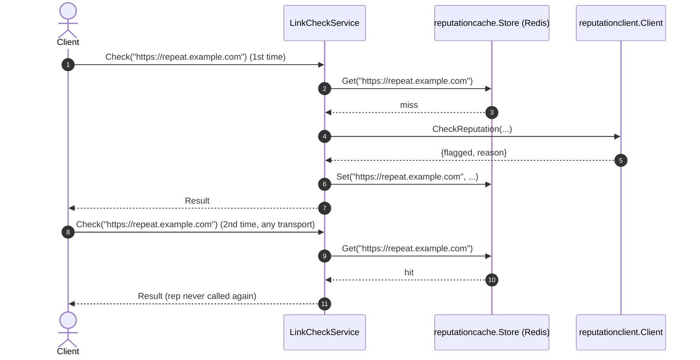

# Goal
Everything [[skills/go/architecture/plateau/plateau-integrated-service/plateau-integrated-service.skill/plateau-integrated-service.skill.md|plateau-integrated-service]] has, plus a Redis-backed cache in front of the reputation lookup — repeated checks of the same URL, over either transport, hit the cache instead of re-calling the external service.

# Core Principles
Union of the parent's principles, plus:
- The cache port (`ReputationCache`) is narrow and business-named, exactly like `ReputationChecker` — never a generic `Cache` interface (see [[skills/go/architecture/solutions/solution-cached-db.skill/solution-cached-db.skill.md|solution-cached-db]]'s own ADR).
- A cache-store failure (Redis unreachable, a malformed cached value) degrades to computing the value normally — it never fails a request that would otherwise have succeeded.
- The cache is shared by construction: one domain-service instance, one cache field, every inbound adapter (HTTP, gRPC) benefits identically — there is no separate "HTTP cache" and "gRPC cache."

# Capabilities
Union of the parent's capabilities, plus:
- caching
  - `reputationcache.Store` (Redis, JSON-encoded `Reputation` values, keyed `reputation:{normalized-url}`, no TTL). A hit skips `reputationclient.Client.CheckReputation` entirely; a miss computes normally and writes the cache afterward.

# Usecases

## Repeated checks of the same URL

Verified for real: 3 HTTP requests for the same URL produced exactly one call to a throwaway fake reputation server (confirmed by that server's own call log); a gRPC request for the same URL immediately afterward also hit the cache.

# Structure
See `structure/` — everything from the parent, union'd with:
- [[structure/plateau-cached-service--package-domain-interfaces.skill.md|package-domain-interfaces]] (extended: `reputation_cache.go`)
- [[structure/plateau-cached-service--file-domain-interfaces-reputation-cache.skill.md|file-domain-interfaces-reputation-cache]] (new)
- [[structure/plateau-cached-service--package-infrastructure-reputationcache.skill.md|package-infrastructure-reputationcache]] (new)
- [[structure/plateau-cached-service--file-infrastructure-reputationcache-store.skill.md|file-infrastructure-reputationcache-store]] (new)
- [[structure/plateau-cached-service--file-domain-services-linkcheck.skill.md|file-domain-services-linkcheck]] (extended: cache-aside wrapping + 2 new godog scenarios)
- [[structure/plateau-cached-service--file-cmd-service-main.skill.md|file-cmd-service-main]] (extended: dial the Redis cache)
- [[structure/plateau-cached-service--file-config-config.skill.md|file-config-config]] (extended: `RedisHost`/`RedisPort`/`RedisPassword`/`RedisDB`)
- [[structure/plateau-cached-service--repo-cached-service.skill.md|repo-cached-service]] (structure-table update only — `solution-cached-db` adds no `Repository` content of its own)
- Unchanged: `package-domain-services`, `package-api-http`, `package-api-grpc`, `package-infrastructure-reputationclient`, `file-domain-interfaces-reputation`, `file-infrastructure-reputationclient-client`, `file-api-http-server`, `file-api-grpc-server`, `file-version-version`, `file-logging-logger`.

# Registry
Four intersections — see `registry/`. Three canonical without qualification; one genuinely interesting:
- [[registry/cmd-service-main-go.md|cmd-service-main-go]] (N=6; `cached-db` inserts before construction like `external-integration` did, no new restructuring)
- [[registry/internal-config-config-go.md|internal-config-config-go]] (N=6, purely additive across four plateaus running)
- [[registry/repo-root.md|repo-root]] (N=4, unchanged — `solution-cached-db` contributes no `Repository` delta)
- [[registry/internal-domain-services-service-go.md|internal-domain-services-service-go]] (N=3; the `{external-integration, cached-db}` pairing is **borderline-`FMC`, defused not by a `depends_on` edge but by `solution-cached-db`'s own Implementation file explicitly naming `solution-external-integration` and stating the merge rule** — read this entry, it's the most interesting registry finding in this catalog so far)

# Ground truth
`example/` evolved from `plateau-integrated-service`'s, verified:
- `go build ./...`, `go vet ./...` — clean.
- `make unit-test` — 11/11 godog scenarios green (9 unchanged + 2 new), using in-memory stub `ReputationCache`/`ReputationChecker` — no network call in the unit-test suite.
- `make mutation-test`/`test-report` — clean runs.
- **Full end-to-end runtime smoke test against a real Redis instance** (installed via `apt`, run manually — container init doesn't auto-start services) and a throwaway fake reputation gRPC server: 3 HTTP requests for the same URL → exactly 1 reputation-service call (confirmed by the fake server's own log and by `redis-cli get` returning the cached JSON) → a gRPC request for the same URL afterward also hit the cache.

To run it yourself: `cd example && go mod tidy && make proto-gen && make build && make unit-test`. Running the full server needs a reachable Redis (`REDIS_HOST`/`REDIS_PORT`) in addition to the reputation service.
