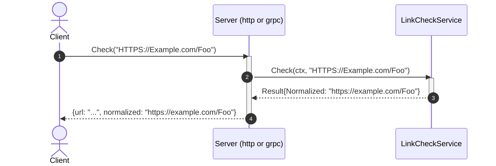
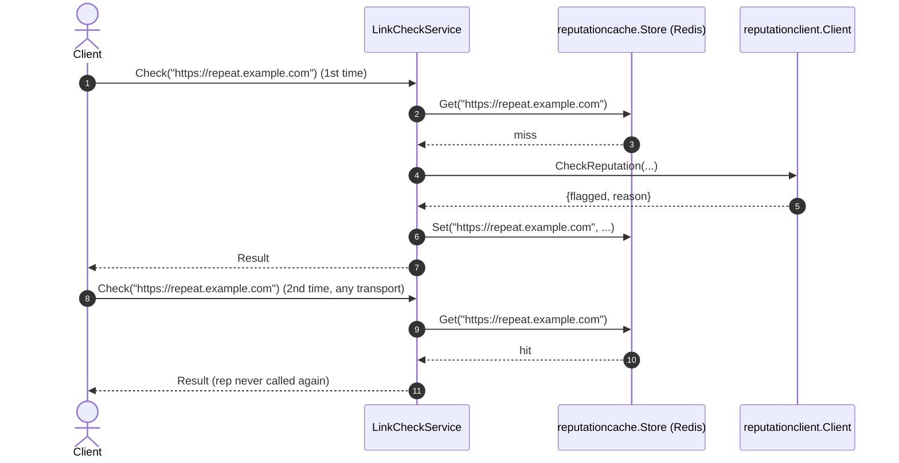

# Goal
A Go web-service with no database, a real domain layer, structured logging, the full godog/coverage/mutation conformance gate, two inbound entry points (HTTP and gRPC), an outbound call to an external reputation service, and a Redis-backed cache in front of that lookup — repeated checks of the same URL, over either transport, hit the cache instead of re-calling the external service.

# Core Principles
- Ports-and-adapters: outbound dependencies are interfaces the domain declares; inbound adapters call the domain service's concrete type directly.
- `cmd/linkcheck/main.go` is the single composition root; reading it alone tells a reader everything the service does, including which inbound servers it runs and which outbound adapters (reputation client, cache) it dials.
- Every business rule is a Cucumber (godog) scenario, co-located with the package it tests — never a plain `_test.go` masquerading as the spec.
- `internal/api/grpc` is exactly as thin as `internal/api/http` — no business logic, only decode/call/encode; two or more concurrent long-running servers in `run()` are run via `errgroup.Group`.
- `internal/domain/interfaces` holds every outbound port (`ReputationChecker`, `ReputationCache`) — the domain never depends on an `internal/infrastructure/*` type or a third-party client type directly.
- Validation happens before the external call — an invalid URL never reaches the reputation service or the cache.
- Every field a port adds to the domain result must reach every inbound adapter present on the plateau.
- The cache port (`ReputationCache`) is narrow and business-named, exactly like `ReputationChecker` — never a generic `Cache` interface (see [[skills/go/architecture/solutions/solution-cached-db.skill/solution-cached-db.skill.md|solution-cached-db]]'s own ADR).
- A cache-store failure (Redis unreachable, a malformed cached value) degrades to computing the value normally — it never fails a request that would otherwise have succeeded.
- The cache is shared by construction: one domain-service instance, one cache field, every inbound adapter (HTTP, gRPC) benefits identically — there is no separate "HTTP cache" and "gRPC cache."

# Capabilities
- api
  - `GET /health` (liveness/readiness). `POST /v1/links/check` (HTTP) and `linkcheck.LinkCheckService/Check` (gRPC) both return `flagged`/`reason` alongside `url`/`normalized`; an unreachable reputation service maps to `502` (HTTP) / `codes.Unavailable` (gRPC), distinct from `400`/`codes.InvalidArgument` for a malformed URL.
- domain
  - `LinkCheckService.Check`: parses a URL, accepts only `http`/`https` schemes, lowercases scheme+host, leaves the path unchanged, rejects everything else via `ErrInvalidURL` — then asks the cache, falling back to `ReputationChecker` on a miss.
- integration
  - `ReputationChecker` port + `reputationclient.Client` gRPC adapter, translating `codes.Unavailable` into the domain's `ErrUnavailable` sentinel.
- caching
  - `reputationcache.Store` (Redis, JSON-encoded `Reputation` values, keyed `reputation:{normalized-url}`, no TTL). A hit skips `reputationclient.Client.CheckReputation` entirely; a miss computes normally and writes the cache afterward.
- testing
  - `make unit-test`/`mutation-test`/`test-report`/`test-and-report` — godog scenarios in `internal/domain/services/features/check.feature`, `go test -cover`, `gremlins`, and a `public/` report site.

# Usecases

## Check a URL over HTTP or gRPC

## Invalid URL
`Check` returns `ErrInvalidURL` for anything that fails to parse, has no host, or uses a scheme other than `http`/`https`, before the cache or the reputation service is ever called; the HTTP adapter maps it to `400`, the gRPC adapter maps it to `codes.InvalidArgument`.

## A flagged URL
`reputationclient.Client.CheckReputation` returns `{flagged, reason}` on a cache miss; both `internal/api/http` and `internal/api/grpc` surface `flagged`/`reason` alongside `url`/`normalized`. An unreachable reputation service maps to `502` (HTTP) / `codes.Unavailable` (gRPC), distinct from the `400`/`codes.InvalidArgument` an actually-malformed URL produces.

## Repeated checks of the same URL

Verified for real: 3 HTTP requests for the same URL produced exactly one call to a throwaway fake reputation server (confirmed by that server's own call log); a gRPC request for the same URL immediately afterward also hit the cache.

# Structure
See `structure/` — this plateau's own copy of every file:
- [[skills/go/architecture/plateau/plateau-cached-service/structure/plateau-cached-service--package-domain-interfaces.skill.md|package-domain-interfaces]] (extended: `reputation_cache.go`)
- [[skills/go/architecture/plateau/plateau-cached-service/structure/plateau-cached-service--file-domain-interfaces-reputation-cache.skill.md|file-domain-interfaces-reputation-cache]] (new)
- [[skills/go/architecture/plateau/plateau-cached-service/structure/plateau-cached-service--package-infrastructure-reputationcache.skill.md|package-infrastructure-reputationcache]] (new)
- [[skills/go/architecture/plateau/plateau-cached-service/structure/plateau-cached-service--file-infrastructure-reputationcache-store.skill.md|file-infrastructure-reputationcache-store]] (new)
- [[skills/go/architecture/plateau/plateau-cached-service/structure/plateau-cached-service--file-domain-services-linkcheck.skill.md|file-domain-services-linkcheck]] (extended: cache-aside wrapping + 2 new godog scenarios)
- [[skills/go/architecture/plateau/plateau-cached-service/structure/plateau-cached-service--file-cmd-service-main.skill.md|file-cmd-service-main]] (extended: dial the Redis cache)
- [[skills/go/architecture/plateau/plateau-cached-service/structure/plateau-cached-service--file-config-config.skill.md|file-config-config]] (extended: `RedisHost`/`RedisPort`/`RedisPassword`/`RedisDB`)
- [[skills/go/architecture/plateau/plateau-cached-service/structure/plateau-cached-service--repo-cached-service.skill.md|repo-cached-service]] (structure-table update only — `solution-cached-db` adds no `Repository` content of its own)
- Unchanged since `plateau-integrated-service`: [[skills/go/architecture/plateau/plateau-cached-service/structure/plateau-cached-service--package-domain-services.skill.md|package-domain-services]], [[skills/go/architecture/plateau/plateau-cached-service/structure/plateau-cached-service--package-api-http.skill.md|package-api-http]], [[skills/go/architecture/plateau/plateau-cached-service/structure/plateau-cached-service--package-api-grpc.skill.md|package-api-grpc]], [[skills/go/architecture/plateau/plateau-cached-service/structure/plateau-cached-service--package-infrastructure-reputationclient.skill.md|package-infrastructure-reputationclient]], [[skills/go/architecture/plateau/plateau-cached-service/structure/plateau-cached-service--file-domain-interfaces-reputation.skill.md|file-domain-interfaces-reputation]], [[skills/go/architecture/plateau/plateau-cached-service/structure/plateau-cached-service--file-infrastructure-reputationclient-client.skill.md|file-infrastructure-reputationclient-client]], [[skills/go/architecture/plateau/plateau-cached-service/structure/plateau-cached-service--file-api-http-server.skill.md|file-api-http-server]], [[skills/go/architecture/plateau/plateau-cached-service/structure/plateau-cached-service--file-api-grpc-server.skill.md|file-api-grpc-server]], [[skills/go/architecture/plateau/plateau-cached-service/structure/plateau-cached-service--file-version-version.skill.md|file-version-version]], [[skills/go/architecture/plateau/plateau-cached-service/structure/plateau-cached-service--file-logging-logger.skill.md|file-logging-logger]].

# Registry
Four intersections — see `registry/`. Three canonical without qualification; one genuinely interesting:
- [[skills/go/architecture/registry/cmd-service-main-go.md|cmd-service-main-go]] (N=6; `cached-db` inserts before construction like `external-integration` did, no new restructuring)
- [[skills/go/architecture/registry/internal-config-config-go.md|internal-config-config-go]] (N=6, purely additive across four plateaus running)
- [[skills/go/architecture/registry/repo-root.md|repo-root]] (N=4, unchanged — `solution-cached-db` contributes no `Repository` delta)
- [[skills/go/architecture/registry/internal-domain-services-service-go.md|internal-domain-services-service-go]] (N=3; the `{external-integration, cached-db}` pairing is **borderline-`FMC`, defused not by a `depends_on` edge but by `solution-cached-db`'s own Implementation file explicitly naming `solution-external-integration` and stating the merge rule** — read this entry, it's the most interesting registry finding in this catalog so far)

# Ground truth
`example/` evolved from `plateau-integrated-service`'s, verified:
- `go build ./...`, `go vet ./...` — clean.
- `make unit-test` — 11/11 godog scenarios green (9 unchanged + 2 new), using in-memory stub `ReputationCache`/`ReputationChecker` — no network call in the unit-test suite.
- `make mutation-test`/`test-report` — clean runs.
- **Full end-to-end runtime smoke test against a real Redis instance** (installed via `apt`, run manually — container init doesn't auto-start services) and a throwaway fake reputation gRPC server: 3 HTTP requests for the same URL → exactly 1 reputation-service call (confirmed by the fake server's own log and by `redis-cli get` returning the cached JSON) → a gRPC request for the same URL afterward also hit the cache.

To run it yourself: `cd example && go mod tidy && make proto-gen && make build && make unit-test`. Running the full server needs a reachable Redis (`REDIS_HOST`/`REDIS_PORT`) in addition to the reputation service.
