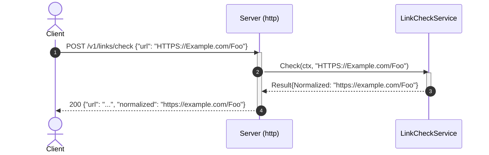
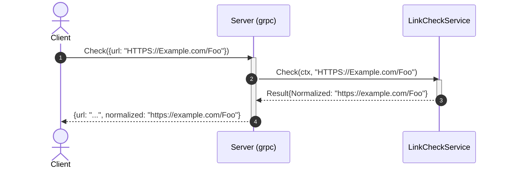

# Goal
A Go web-service with no database, a real domain layer, structured logging, and the full godog/coverage/mutation conformance gate — with two inbound entry points, HTTP and gRPC, both reaching the same `LinkCheckService.Check` from one composition root.

# Core Principles
- Ports-and-adapters: outbound dependencies (once any exist) are interfaces the domain declares; inbound adapters call the domain service's concrete type directly. At this plateau there are still no outbound dependencies at all — `LinkCheckService` is pure computation.
- `cmd/linkcheck/main.go` is the single composition root; reading it alone tells a reader everything the service does, including which inbound servers it runs.
- Every business rule is a Cucumber (godog) scenario, co-located with the package it tests — never a plain `_test.go` masquerading as the spec.
- `internal/api/grpc` is exactly as thin as `internal/api/http` — no business logic, only decode/call/encode.
- Two or more concurrent long-running servers in `run()` are run via `errgroup.Group` — never a single blocking `ListenAndServe()` call once a second server exists.
- This module's own exposed contract (`proto/linkcheck/linkcheck.proto` → `gen/api`) stays in its own flat, unversioned path — a `v1/` path segment under a flat `go_package` produces a Go import-path mismatch (verified, not hypothetical — see [[skills/go/architecture/solutions/solution-grpc-api.skill/solution-grpc-api.skill.md|solution-grpc-api]]'s own Rule).

# Capabilities
- api
  - `GET /health` (liveness/readiness), `POST /v1/links/check` (HTTP), and `linkcheck.LinkCheckService/Check` (gRPC) — all thin translations over the same `LinkCheckService` instance, identical validation/normalization behavior by construction (one domain-service instance, two thin adapters).
- domain
  - `LinkCheckService.Check`: parses a URL, accepts only `http`/`https` schemes, lowercases scheme+host, leaves the path unchanged; rejects everything else via `ErrInvalidURL`.
- testing
  - `make unit-test`/`mutation-test`/`test-report`/`test-and-report` — godog scenarios in `internal/domain/services/features/check.feature`, `go test -cover`, `gremlins`, and a `public/` report site.

# Usecases

## Check a URL over HTTP

## Check a URL over gRPC

## Invalid URL
`Check` returns `ErrInvalidURL` for anything that fails to parse, has no host, or uses a scheme other than `http`/`https`; the HTTP adapter maps it to `400`, the gRPC adapter maps it to `codes.InvalidArgument` — both with the same underlying domain error.

An invalid URL maps to `codes.InvalidArgument` (gRPC) the same way it maps to `400` (HTTP) — see `internal/api/grpc/server.go`'s `toStatus`.

# Structure
See `structure/` — this plateau's own copy of every file:
- [[skills/go/architecture/plateau/plateau-dual-api-service/structure/plateau-dual-api-service--repo-dual-api-service.skill.md|repo-dual-api-service]] (extended: `proto/`, `buf/`, `gen/api/`, `proto-gen` target)
- [[skills/go/architecture/plateau/plateau-dual-api-service/structure/plateau-dual-api-service--package-api-grpc.skill.md|package-api-grpc]] (new)
- [[skills/go/architecture/plateau/plateau-dual-api-service/structure/plateau-dual-api-service--file-api-grpc-server.skill.md|file-api-grpc-server]] (new)
- [[skills/go/architecture/plateau/plateau-dual-api-service/structure/plateau-dual-api-service--file-cmd-service-main.skill.md|file-cmd-service-main]] (extended: `errgroup.Group`)
- [[skills/go/architecture/plateau/plateau-dual-api-service/structure/plateau-dual-api-service--file-config-config.skill.md|file-config-config]] (extended: `GRPCListenPort`)
- Unchanged since `plateau-http-service`: [[skills/go/architecture/plateau/plateau-dual-api-service/structure/plateau-dual-api-service--package-domain-services.skill.md|package-domain-services]], [[skills/go/architecture/plateau/plateau-dual-api-service/structure/plateau-dual-api-service--package-api-http.skill.md|package-api-http]], [[skills/go/architecture/plateau/plateau-dual-api-service/structure/plateau-dual-api-service--file-domain-services-linkcheck.skill.md|file-domain-services-linkcheck]], [[skills/go/architecture/plateau/plateau-dual-api-service/structure/plateau-dual-api-service--file-version-version.skill.md|file-version-version]], [[skills/go/architecture/plateau/plateau-dual-api-service/structure/plateau-dual-api-service--file-logging-logger.skill.md|file-logging-logger]], [[skills/go/architecture/plateau/plateau-dual-api-service/structure/plateau-dual-api-service--file-api-http-server.skill.md|file-api-http-server]].

# Registry
Three intersections, all still canonical (no resolver) but two grew from the parent — see `registry/`:
- [[skills/go/architecture/registry/cmd-service-main-go.md|cmd-service-main-go]] (N=4; `grpc-api` genuinely *restructures* `http-api`'s contribution via its own `depends_on` edge — `TMN`, not `FMN`, for that specific pairing; still canonical)
- [[skills/go/architecture/registry/internal-config-config-go.md|internal-config-config-go]] (N=4, stayed purely additive)
- [[skills/go/architecture/registry/repo-root.md|repo-root]] (N=3, crosses the architectural-signal threshold for the first time; flagged to re-check once `solution-external-integration` also extends the same `proto-gen` target)

# Ground truth
`example/` evolved from `plateau-http-service`'s (copied forward, then extended), verified:
- `buf generate proto/linkcheck --template buf/buf.gen.yaml` (local `protoc-gen-go`/`protoc-gen-go-grpc` plugins, installed via `go install`) — produces `gen/api/{linkcheck.pb.go,linkcheck_grpc.pb.go}`, flat, matching `go_package`.
- `go build ./...` and `go vet ./...` — clean.
- `make unit-test` — 5/5 godog scenarios still green (domain logic unchanged).
- `make mutation-test` — `gremlins` clean run.
- `make test-report` — `public/` assembled.
- Runtime smoke test: built binary started both servers; `GET /health` → `200`; `grpcurl -plaintext -proto proto/linkcheck/linkcheck.proto` against `linkcheck.LinkCheckService/Check` with a valid URL → success with normalized form; with an invalid URL → `InvalidArgument` status. HTTP endpoint re-verified still working alongside gRPC.

To run it yourself: `cd example && go mod tidy && make proto-gen && make build && make unit-test && make run`.
