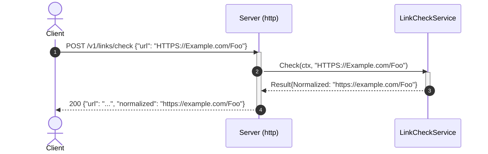

# Goal
The foundation every other plateau in this catalog composes from: a Go web-service with no database, a real domain layer, one inbound HTTP API, structured logging, and the full godog/coverage/mutation conformance gate. No `parent_plateaus` — this is where the catalog's lineage starts.

# Core Principles
- Ports-and-adapters: outbound dependencies (once any exist) are interfaces the domain declares; inbound adapters call the domain service's concrete type directly. At this plateau there are no outbound dependencies at all — `LinkCheckService` is pure computation.
- `cmd/linkcheck/main.go` is the single composition root; reading it alone tells a reader everything the service does.
- Every business rule is a Cucumber (godog) scenario, co-located with the package it tests — never a plain `_test.go` masquerading as the spec.

# Capabilities
- api
  - `GET /health` (liveness/readiness) and `POST /v1/links/check` (validate + normalize a URL), both thin translations over `LinkCheckService`.
- domain
  - `LinkCheckService.Check`: parses a URL, accepts only `http`/`https` schemes, lowercases scheme+host, leaves the path unchanged; rejects everything else via `ErrInvalidURL`.
- testing
  - `make unit-test`/`mutation-test`/`test-report`/`test-and-report` — godog scenarios in `internal/domain/services/features/check.feature`, `go test -cover`, `gremlins`, and a `public/` report site.

# Usecases

## Check a URL over HTTP

## Invalid URL
`Check` returns `ErrInvalidURL` for anything that fails to parse, has no host, or uses a scheme other than `http`/`https`; the HTTP adapter maps it to `400` with a JSON `{"error": "..."}` body. Any other domain error would map to `500`, but none is reachable at this plateau (no outbound dependency can fail yet).

# Structure
See `structure/`:
- [[skills/go/architecture/plateau/plateau-http-service/structure/plateau-http-service--repo-http-service.skill.md|repo-http-service]]
- [[skills/go/architecture/plateau/plateau-http-service/structure/plateau-http-service--package-domain-services.skill.md|package-domain-services]]
- [[skills/go/architecture/plateau/plateau-http-service/structure/plateau-http-service--package-api-http.skill.md|package-api-http]]
- [[skills/go/architecture/plateau/plateau-http-service/structure/plateau-http-service--file-cmd-service-main.skill.md|file-cmd-service-main]]
- [[skills/go/architecture/plateau/plateau-http-service/structure/plateau-http-service--file-config-config.skill.md|file-config-config]]
- [[skills/go/architecture/plateau/plateau-http-service/structure/plateau-http-service--file-version-version.skill.md|file-version-version]]
- [[skills/go/architecture/plateau/plateau-http-service/structure/plateau-http-service--file-logging-logger.skill.md|file-logging-logger]]
- [[skills/go/architecture/plateau/plateau-http-service/structure/plateau-http-service--file-domain-services-linkcheck.skill.md|file-domain-services-linkcheck]]
- [[skills/go/architecture/plateau/plateau-http-service/structure/plateau-http-service--file-api-http-server.skill.md|file-api-http-server]]

# Registry
Three intersections found at this plateau (all canonical `FMN`, no resolver) — see `registry/`:
- [[skills/go/architecture/registry/cmd-service-main-go.md|cmd-service-main-go]] (N=3, architectural signal noted)
- [[skills/go/architecture/registry/internal-config-config-go.md|internal-config-config-go]] (N=3, architectural signal noted)
- [[skills/go/architecture/registry/repo-root.md|repo-root]] (N=2)

# Ground truth
`example/` is a real, runnable Go module (`github.com/example/linkcheck-service`), verified:
- `go build ./...` and `go vet ./...` — clean.
- `make unit-test` — 5/5 godog scenarios green (`internal/domain/services/test`), `TestFeatures` the only test function.
- `make mutation-test` — `gremlins` runs clean (3 killed / 4 survived / 0 timed out / 20 not covered against this plateau's small surface — the HTTP-adapter path has no scenario coverage yet, expected at this plateau).
- `make test-report` — `public/` assembled with `index.html` + three badge files.
- Runtime smoke test: built binary started, `GET /health` → `200`; `POST /v1/links/check` with a valid/invalid URL → `200`/`400` as designed.

To run it yourself: `cd example && go mod tidy && make build && make unit-test && make run`.
