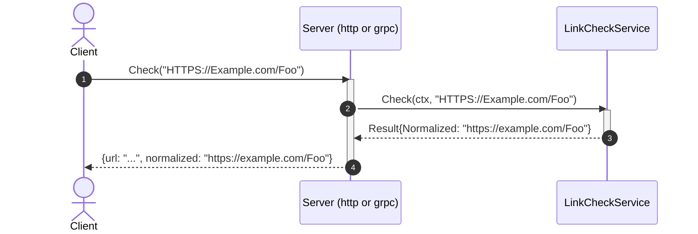
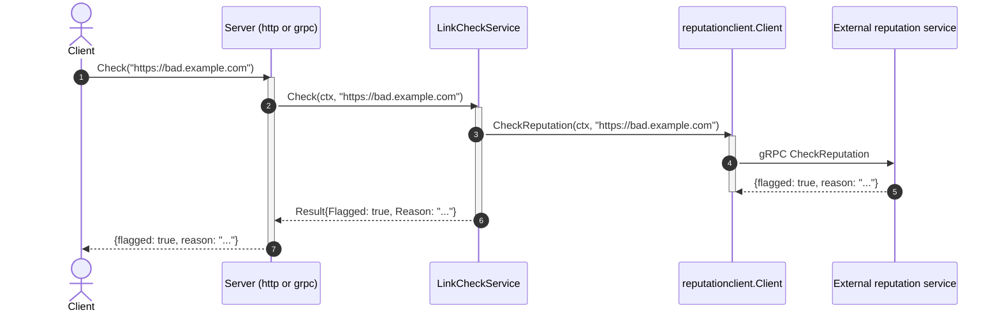

# Goal
A Go web-service with no database, a real domain layer, structured logging, the full godog/coverage/mutation conformance gate, two inbound entry points (HTTP and gRPC), and an outbound call to an external reputation service — `LinkCheckService.Check` validates, normalizes, *and* asks whether the URL is flagged, over both transports.

# Core Principles
- Ports-and-adapters: outbound dependencies are interfaces the domain declares; inbound adapters call the domain service's concrete type directly.
- `cmd/linkcheck/main.go` is the single composition root; reading it alone tells a reader everything the service does, including which inbound servers it runs and which outbound adapters it dials.
- Every business rule is a Cucumber (godog) scenario, co-located with the package it tests — never a plain `_test.go` masquerading as the spec.
- `internal/api/grpc` is exactly as thin as `internal/api/http` — no business logic, only decode/call/encode.
- Two or more concurrent long-running servers in `run()` are run via `errgroup.Group`.
- This module's own exposed contract (`proto/linkcheck/linkcheck.proto` → `gen/api`) stays in its own flat, unversioned path (verified, not hypothetical — see [[skills/go/architecture/solutions/solution-grpc-api.skill/solution-grpc-api.skill.md|solution-grpc-api]]'s own Rule).
- `internal/domain/interfaces` exists for the first time at this plateau (created by [[skills/go/architecture/solutions/solution-go-domain-ports.skill/solution-go-domain-ports.skill.md|solution-go-domain-ports]], a shared prerequisite) — the domain depends on `ReputationChecker`, never on `internal/infrastructure/reputationclient` or any `google.golang.org/grpc` type directly.
- Validation happens before the external call — an invalid URL never reaches the reputation service.
- Every field a port adds to the domain result must reach every inbound adapter present on the plateau — not computed and then silently dropped by one transport.
- This module's own exposed contract (`gen/api`) and an external service's contract this module calls (`gen/reputation`) are always generated into separate Go packages, never merged.

# Capabilities
- api
  - `GET /health` (liveness/readiness). `POST /v1/links/check` (HTTP) and `linkcheck.LinkCheckService/Check` (gRPC) both return `flagged`/`reason` alongside `url`/`normalized`; an unreachable reputation service maps to `502` (HTTP) / `codes.Unavailable` (gRPC), distinct from `400`/`codes.InvalidArgument` for a malformed URL.
- domain
  - `LinkCheckService.Check`: parses a URL, accepts only `http`/`https` schemes, lowercases scheme+host, leaves the path unchanged, rejects everything else via `ErrInvalidURL` — then asks `ReputationChecker` whether the normalized URL is flagged.
- integration
  - `ReputationChecker` port + `reputationclient.Client` gRPC adapter, translating `codes.Unavailable` into the domain's `ErrUnavailable` sentinel.
- testing
  - `make unit-test`/`mutation-test`/`test-report`/`test-and-report` — godog scenarios in `internal/domain/services/features/check.feature`, `go test -cover`, `gremlins`, and a `public/` report site.

# Usecases

## Check a URL over HTTP or gRPC

## Invalid URL
`Check` returns `ErrInvalidURL` for anything that fails to parse, has no host, or uses a scheme other than `http`/`https`, before the reputation service is ever called; the HTTP adapter maps it to `400`, the gRPC adapter maps it to `codes.InvalidArgument`.

## A flagged URL

## Reputation service unavailable
`reputationclient.Client.CheckReputation` translates a gRPC `Unavailable` status into `interfaces.ErrUnavailable`; `LinkCheckService.Check` returns it unwrapped in kind; `internal/api/http` maps it to `502`, `internal/api/grpc` maps it to `codes.Unavailable` — both distinct from the `400`/`codes.InvalidArgument` an actually-malformed URL produces.

# Structure
See `structure/` — this plateau's own copy of every file:
- [[skills/go/architecture/plateau/plateau-integrated-service/structure/plateau-integrated-service--repo-integrated-service.skill.md|repo-integrated-service]] (extended: `proto/reputation/`, `gen/reputation/`, second `proto-gen` line)
- [[skills/go/architecture/plateau/plateau-integrated-service/structure/plateau-integrated-service--package-domain-interfaces.skill.md|package-domain-interfaces]] (new)
- [[skills/go/architecture/plateau/plateau-integrated-service/structure/plateau-integrated-service--file-domain-interfaces-reputation.skill.md|file-domain-interfaces-reputation]] (new)
- [[skills/go/architecture/plateau/plateau-integrated-service/structure/plateau-integrated-service--package-infrastructure-reputationclient.skill.md|package-infrastructure-reputationclient]] (new)
- [[skills/go/architecture/plateau/plateau-integrated-service/structure/plateau-integrated-service--file-infrastructure-reputationclient-client.skill.md|file-infrastructure-reputationclient-client]] (new)
- [[skills/go/architecture/plateau/plateau-integrated-service/structure/plateau-integrated-service--file-domain-services-linkcheck.skill.md|file-domain-services-linkcheck]] (extended: reputation port + 4 new godog scenarios)
- [[skills/go/architecture/plateau/plateau-integrated-service/structure/plateau-integrated-service--file-cmd-service-main.skill.md|file-cmd-service-main]] (extended: dial + pass reputation client)
- [[skills/go/architecture/plateau/plateau-integrated-service/structure/plateau-integrated-service--file-config-config.skill.md|file-config-config]] (extended: `ReputationAddr`)
- [[skills/go/architecture/plateau/plateau-integrated-service/structure/plateau-integrated-service--file-api-http-server.skill.md|file-api-http-server]] (extended: `flagged`/`reason`, `502` mapping)
- [[skills/go/architecture/plateau/plateau-integrated-service/structure/plateau-integrated-service--file-api-grpc-server.skill.md|file-api-grpc-server]] (extended: `flagged`/`reason`, `codes.Unavailable` mapping)
- Unchanged since `plateau-dual-api-service`: [[skills/go/architecture/plateau/plateau-integrated-service/structure/plateau-integrated-service--package-domain-services.skill.md|package-domain-services]], [[skills/go/architecture/plateau/plateau-integrated-service/structure/plateau-integrated-service--package-api-http.skill.md|package-api-http]], [[skills/go/architecture/plateau/plateau-integrated-service/structure/plateau-integrated-service--package-api-grpc.skill.md|package-api-grpc]], [[skills/go/architecture/plateau/plateau-integrated-service/structure/plateau-integrated-service--file-version-version.skill.md|file-version-version]], [[skills/go/architecture/plateau/plateau-integrated-service/structure/plateau-integrated-service--file-logging-logger.skill.md|file-logging-logger]].

# Registry
Six intersections, all canonical — see `registry/`:
- [[skills/go/architecture/registry/cmd-service-main-go.md|cmd-service-main-go]] (N=5; `external-integration` inserts before construction, no second restructuring — confirms the prediction from `plateau-dual-api-service`)
- [[skills/go/architecture/registry/internal-config-config-go.md|internal-config-config-go]] (N=5, stayed purely additive across three plateaus running)
- [[skills/go/architecture/registry/repo-root.md|repo-root]] (N=4; the `{grpc-api, external-integration}` `proto-gen`-sharing collision predicted at `plateau-dual-api-service` happened exactly as anticipated, resolved exactly as `external-integration`'s own Rule specified)
- [[skills/go/architecture/registry/internal-domain-services-service-go.md|internal-domain-services-service-go]] (new at this plateau, N=2 — `solution-cached-db`/`solution-persistent-db` are expected to grow this further, per the catalog-level prediction)
- [[skills/go/architecture/registry/internal-api-http-server-go.md|internal-api-http-server-go]] (new at this plateau, N=2 — written retroactively during `plateau-persistent-service`'s build, after a catalog-wide grep found this element had reached N≥2 here without a registry entry)
- [[skills/go/architecture/registry/internal-api-grpc-server-go.md|internal-api-grpc-server-go]] (new at this plateau, N=2, same retroactive discovery as above — conditional on `solution-grpc-api` being applied)

# Ground truth
`example/` evolved from `plateau-dual-api-service`'s, verified:
- `buf generate proto/linkcheck` + `buf generate proto/reputation` (both via `make proto-gen`) — produce `gen/api/*.go` and `gen/reputation/*.go`, both flat.
- `go build ./...`, `go vet ./...` — clean.
- `make unit-test` — 9/9 godog scenarios green (5 unchanged + 4 new: flagged, clean, validation-fails-before-reputation-call, reputation-unavailable), using a scenario-configurable stub `ReputationChecker` — no network call in the unit-test suite.
- `make mutation-test`/`test-report` — clean runs.
- **Full end-to-end runtime smoke test** against a real (throwaway, test-only) fake reputation gRPC server (not committed — see `agent/DECISIONS.md`): both HTTP and gRPC, a clean URL, a flagged URL (fake server flags any URL containing "bad"), and the reputation-service-unavailable path (stopped the fake server mid-test) — all verified with real network calls, not just unit-test stubs.

To run it yourself: `cd example && go mod tidy && make proto-gen && make build && make unit-test`. Running the full server needs a real (or the same throwaway fake) reputation gRPC service reachable at `REPUTATION_ADDR`.
