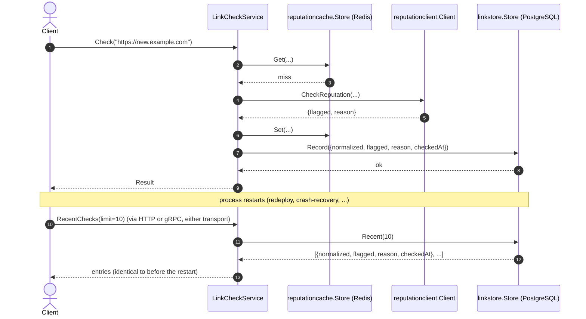

# Goal
Everything [[skills/go/architecture/plateau/plateau-cached-service/plateau-cached-service.skill/plateau-cached-service.skill.md|plateau-cached-service]] has, plus a PostgreSQL-backed durable record of every check — readable back out over both HTTP and gRPC, and confirmed to survive a full process restart.

# Core Principles
Union of the parent's principles, plus:
- The persistence port (`LinkHistory`) is narrow and business-named, exactly like `ReputationChecker`/`ReputationCache` (see [[skills/go/architecture/solutions/solution-persistent-db.skill/solution-persistent-db.skill.md|solution-persistent-db]]'s own ADR).
- A history-record failure **fails the request** — the opposite of a cache-store failure. The caller asked for a durable record; silently dropping it would be a correctness bug, not a degraded optimization.
- Recording history is a pure append to `Check`'s existing body — it reads the already-computed reputation result and writes afterward, never wrapping or relocating the cache-aside logic `plateau-cached-service` introduced. See [[registry/internal-domain-services-service-go.md|the registry entry]] for why this stays canonical `FMN`, unlike the borderline `{external-integration, cached-db}` pairing one plateau back.
- A solution that adds new domain data must expose it through every applied inbound adapter, not just compute it — the same principle `external-integration` established for `Flagged`/`Reason`, now applied to the entire read-history capability (`GET /v1/links/recent` over HTTP, `RecentChecks` over gRPC).

# Capabilities
Union of the parent's capabilities, plus:
- durable history
  - `linkstore.Store` (PostgreSQL via `pgx`/`pgxpool`, table `link_checks`, schema ensured with `CREATE TABLE IF NOT EXISTS` at startup). Every successful `Check` call is recorded; `RecentChecks` reads the most recent entries back out, most-recent-first.
  - `GET /v1/links/recent?limit=N` (HTTP) and `RecentChecks` (gRPC) both expose the same recorded history, sourced from the same domain-service instance and the same `Store`.

# Usecases

## Record a check and read it back after a restart

Verified for real: two checks recorded via `POST /v1/links/check`, read back identically via `GET /v1/links/recent` (HTTP), `RecentChecks` (gRPC via `grpcurl`), and a direct `psql` query against `link_checks` — all four views agreed exactly. The service process was then killed and restarted with no new checks made, and `GET /v1/links/recent` returned the identical two entries, proving genuine durability across a process lifetime rather than merely within one.

# Structure
See `structure/` — everything from the parent, union'd with:
- [[structure/plateau-persistent-service--package-domain-interfaces.skill.md|package-domain-interfaces]] (extended: `link_history.go`)
- [[structure/plateau-persistent-service--file-domain-interfaces-link-history.skill.md|file-domain-interfaces-link-history]] (new)
- [[structure/plateau-persistent-service--package-infrastructure-linkstore.skill.md|package-infrastructure-linkstore]] (new)
- [[structure/plateau-persistent-service--file-infrastructure-linkstore-store.skill.md|file-infrastructure-linkstore-store]] (new)
- [[structure/plateau-persistent-service--file-domain-services-linkcheck.skill.md|file-domain-services-linkcheck]] (extended: `history` field + `Record` call + `RecentChecks` method + 2 new godog scenarios)
- [[structure/plateau-persistent-service--file-cmd-service-main.skill.md|file-cmd-service-main]] (extended: dial the PostgreSQL pool)
- [[structure/plateau-persistent-service--file-config-config.skill.md|file-config-config]] (extended: `DatabaseDSN`)
- [[structure/plateau-persistent-service--file-api-http-server.skill.md|file-api-http-server]] (extended: `GET /v1/links/recent`) — this and the next bullet close a gap found while building this plateau: `solution-persistent-db` originally had no adapter-extension files at all, the same class of omission `solution-external-integration` was fixed for earlier (see `agent/DECISIONS.md`)
- [[structure/plateau-persistent-service--file-api-grpc-server.skill.md|file-api-grpc-server]] (extended: `RecentChecks` RPC)
- [[structure/plateau-persistent-service--repo-persistent-service.skill.md|repo-persistent-service]] (structure-table update only — `solution-persistent-db` adds no `Repository` content of its own, same as `solution-cached-db`)
- Unchanged: `package-domain-services`, `package-api-http`, `package-api-grpc`, `package-infrastructure-reputationclient`, `package-infrastructure-reputationcache`, `file-domain-interfaces-reputation`, `file-domain-interfaces-reputation-cache`, `file-infrastructure-reputationclient-client`, `file-infrastructure-reputationcache-store`, `file-version-version`, `file-logging-logger`.

# Registry
Six intersections — see `registry/`. Four canonical without further note; two carry a genuine architectural-signal finding:
- [[registry/cmd-service-main-go.md|cmd-service-main-go]] (N=7; `persistent-db` inserts before construction like `external-integration`/`cached-db` did, confirming the prediction from `plateau-cached-service` — every VP-realizing solution this catalog fully authored now extends this element)
- [[registry/internal-config-config-go.md|internal-config-config-go]] (N=7, stayed purely additive across five plateaus running)
- [[registry/repo-root.md|repo-root]] (N=4, unchanged from the previous two plateaus — `solution-persistent-db` contributes no `Repository` delta, same as `solution-cached-db`)
- [[registry/internal-domain-services-service-go.md|internal-domain-services-service-go]] (N=4; confirms — by actually reading `Check`'s body, not assuming — that `persistent-db`'s append-only delta stays plain `FMN`, unlike the borderline `{external-integration, cached-db}` pairing recorded one plateau back)
- [[registry/internal-api-http-server-go.md|internal-api-http-server-go]] (N=3, **new element for the registry, written retroactively**: a catalog-wide grep found this element had already reached N=2 at `plateau-integrated-service` with no registry entry, so that omission was fixed at its own shallowest plateau before this plateau's N=3 entry was written — see that plateau's own registry folder)
- [[registry/internal-api-grpc-server-go.md|internal-api-grpc-server-go]] (N=3, same retroactive-discovery story as above, conditional on `solution-grpc-api`)

# Ground truth
`example/` evolved from `plateau-cached-service`'s, verified:
- `go build ./...`, `go vet ./...` — clean.
- `make unit-test` — 13/13 godog scenarios green (11 unchanged + 2 new: a successful check is recorded in history, a history-recording failure fails the check), using in-memory stub `LinkHistory`/`ReputationCache`/`ReputationChecker` — no network call in the unit-test suite.
- `make mutation-test`/`test-report` — clean runs.
- **Full end-to-end runtime smoke test against a real PostgreSQL instance** (installed via `apt`, started manually — container init doesn't auto-start services), a real Redis instance, and a throwaway fake reputation gRPC server: two checks recorded via HTTP, read back identically via HTTP, gRPC, and a direct `psql` query — then **the service process was killed and restarted, and `GET /v1/links/recent` (no new checks made) returned the identical two entries**, the ground-truth proof this is genuine durable persistence, distinct in kind from `plateau-cached-service`'s Redis cache.

To run it yourself: `cd example && go mod tidy && make proto-gen && make build && make unit-test`. Running the full server needs a reachable PostgreSQL (`DATABASE_DSN`) in addition to Redis and the reputation service.
