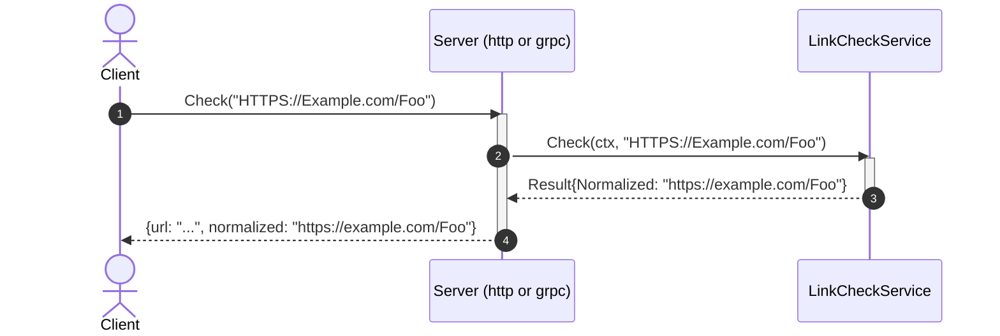
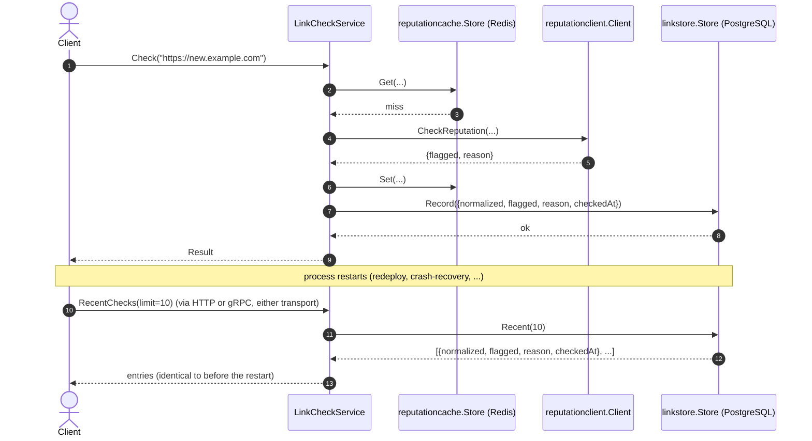

# Goal
A Go web-service with no database dependency for its core logic, a real domain layer, structured logging, the full godog/coverage/mutation conformance gate, two inbound entry points (HTTP and gRPC), an outbound call to an external reputation service, a Redis-backed cache in front of that lookup, and a PostgreSQL-backed durable record of every check — readable back out over both transports, and confirmed to survive a full process restart.

# Core Principles
- Ports-and-adapters: outbound dependencies are interfaces the domain declares; inbound adapters call the domain service's concrete type directly.
- `cmd/linkcheck/main.go` is the single composition root; reading it alone tells a reader everything the service does, including which inbound servers it runs and which outbound adapters (reputation client, cache, history store) it dials.
- Every business rule is a Cucumber (godog) scenario, co-located with the package it tests — never a plain `_test.go` masquerading as the spec.
- `internal/api/grpc` is exactly as thin as `internal/api/http` — no business logic, only decode/call/encode; two or more concurrent long-running servers in `run()` are run via `errgroup.Group`.
- `internal/domain/interfaces` holds every outbound port (`ReputationChecker`, `ReputationCache`, `LinkHistory`) — the domain never depends on an `internal/infrastructure/*` type or a third-party client type directly.
- Validation happens before any outbound call — an invalid URL never reaches the reputation service, the cache, or the history store.
- Every field or capability a port adds must reach every inbound adapter present on the plateau.
- A cache-store failure (Redis unreachable, a malformed cached value) degrades to computing the value normally — it never fails a request that would otherwise have succeeded.
- The cache and the history store are both shared by construction: one domain-service instance, one field each, every inbound adapter (HTTP, gRPC) benefits identically.
- The persistence port (`LinkHistory`) is narrow and business-named, exactly like `ReputationChecker`/`ReputationCache` (see [[skills/go/architecture/solutions/solution-persistent-db.skill/solution-persistent-db.skill.md|solution-persistent-db]]'s own ADR).
- A history-record failure **fails the request** — the opposite of a cache-store failure. The caller asked for a durable record; silently dropping it would be a correctness bug, not a degraded optimization.
- Recording history is a pure append to `Check`'s existing body — it reads the already-computed reputation result and writes afterward, never wrapping or relocating the cache-aside logic. See [[skills/go/architecture/registry/internal-domain-services-service-go.md|the registry entry]] for why this stays canonical `FMN`, unlike the borderline `{external-integration, cached-db}` pairing recorded one plateau back.
- A solution that adds new domain data must expose it through every applied inbound adapter, not just compute it — the same principle established for `Flagged`/`Reason`, now applied to the entire read-history capability (`GET /v1/links/recent` over HTTP, `RecentChecks` over gRPC).

# Capabilities
- api
  - `GET /health` (liveness/readiness). `POST /v1/links/check` (HTTP) and `linkcheck.LinkCheckService/Check` (gRPC) both return `flagged`/`reason` alongside `url`/`normalized`; an unreachable reputation service maps to `502` (HTTP) / `codes.Unavailable` (gRPC), distinct from `400`/`codes.InvalidArgument` for a malformed URL.
- domain
  - `LinkCheckService.Check`: parses a URL, accepts only `http`/`https` schemes, lowercases scheme+host, leaves the path unchanged, rejects everything else via `ErrInvalidURL` — then asks the cache (falling back to `ReputationChecker` on a miss) and records the outcome in history.
- integration
  - `ReputationChecker` port + `reputationclient.Client` gRPC adapter, translating `codes.Unavailable` into the domain's `ErrUnavailable` sentinel.
- caching
  - `reputationcache.Store` (Redis, JSON-encoded `Reputation` values, keyed `reputation:{normalized-url}`, no TTL). A hit skips `reputationclient.Client.CheckReputation` entirely; a miss computes normally and writes the cache afterward.
- durable history
  - `linkstore.Store` (PostgreSQL via `pgx`/`pgxpool`, table `link_checks`, schema ensured with `CREATE TABLE IF NOT EXISTS` at startup). Every successful `Check` call is recorded; `RecentChecks` reads the most recent entries back out, most-recent-first.
  - `GET /v1/links/recent?limit=N` (HTTP) and `RecentChecks` (gRPC) both expose the same recorded history, sourced from the same domain-service instance and the same `Store`.
- testing
  - `make unit-test`/`mutation-test`/`test-report`/`test-and-report` — godog scenarios in `internal/domain/services/features/check.feature`, `go test -cover`, `gremlins`, and a `public/` report site.

# Usecases

## Check a URL over HTTP or gRPC

## Invalid URL
`Check` returns `ErrInvalidURL` for anything that fails to parse, has no host, or uses a scheme other than `http`/`https`, before the cache, the reputation service, or the history store is ever touched; the HTTP adapter maps it to `400`, the gRPC adapter maps it to `codes.InvalidArgument`.

## A flagged URL, and a repeated check
`reputationclient.Client.CheckReputation` returns `{flagged, reason}` on a cache miss; a repeated check of the same URL hits the Redis cache instead (see [[skills/go/architecture/registry/internal-domain-services-service-go.md|internal-domain-services-service-go]] for the cache-aside flow). Both outcomes are recorded to `linkstore.Store` either way. An unreachable reputation service maps to `502` (HTTP) / `codes.Unavailable` (gRPC), distinct from the `400`/`codes.InvalidArgument` an actually-malformed URL produces.

## Record a check and read it back after a restart

Verified for real: two checks recorded via `POST /v1/links/check`, read back identically via `GET /v1/links/recent` (HTTP), `RecentChecks` (gRPC via `grpcurl`), and a direct `psql` query against `link_checks` — all four views agreed exactly. The service process was then killed and restarted with no new checks made, and `GET /v1/links/recent` returned the identical two entries, proving genuine durability across a process lifetime rather than merely within one.

# Structure
See `structure/` — this plateau's own copy of every file:
- [[skills/go/architecture/plateau/plateau-persistent-service/structure/plateau-persistent-service--package-domain-interfaces.skill.md|package-domain-interfaces]] (extended: `link_history.go`)
- [[skills/go/architecture/plateau/plateau-persistent-service/structure/plateau-persistent-service--file-domain-interfaces-link-history.skill.md|file-domain-interfaces-link-history]] (new)
- [[skills/go/architecture/plateau/plateau-persistent-service/structure/plateau-persistent-service--package-infrastructure-linkstore.skill.md|package-infrastructure-linkstore]] (new)
- [[skills/go/architecture/plateau/plateau-persistent-service/structure/plateau-persistent-service--file-infrastructure-linkstore-store.skill.md|file-infrastructure-linkstore-store]] (new)
- [[skills/go/architecture/plateau/plateau-persistent-service/structure/plateau-persistent-service--file-domain-services-linkcheck.skill.md|file-domain-services-linkcheck]] (extended: `history` field + `Record` call + `RecentChecks` method + 2 new godog scenarios)
- [[skills/go/architecture/plateau/plateau-persistent-service/structure/plateau-persistent-service--file-cmd-service-main.skill.md|file-cmd-service-main]] (extended: dial the PostgreSQL pool)
- [[skills/go/architecture/plateau/plateau-persistent-service/structure/plateau-persistent-service--file-config-config.skill.md|file-config-config]] (extended: `DatabaseDSN`)
- [[skills/go/architecture/plateau/plateau-persistent-service/structure/plateau-persistent-service--file-api-http-server.skill.md|file-api-http-server]] (extended: `GET /v1/links/recent`) — this and the next bullet close a gap found while building this plateau: `solution-persistent-db` originally had no adapter-extension files at all, the same class of omission `solution-external-integration` was fixed for earlier (see `agent/DECISIONS.md`)
- [[skills/go/architecture/plateau/plateau-persistent-service/structure/plateau-persistent-service--file-api-grpc-server.skill.md|file-api-grpc-server]] (extended: `RecentChecks` RPC)
- [[skills/go/architecture/plateau/plateau-persistent-service/structure/plateau-persistent-service--repo-persistent-service.skill.md|repo-persistent-service]] (structure-table update only — `solution-persistent-db` adds no `Repository` content of its own, same as `solution-cached-db`)
- Unchanged since `plateau-cached-service`: [[skills/go/architecture/plateau/plateau-persistent-service/structure/plateau-persistent-service--package-domain-services.skill.md|package-domain-services]], [[skills/go/architecture/plateau/plateau-persistent-service/structure/plateau-persistent-service--package-api-http.skill.md|package-api-http]], [[skills/go/architecture/plateau/plateau-persistent-service/structure/plateau-persistent-service--package-api-grpc.skill.md|package-api-grpc]], [[skills/go/architecture/plateau/plateau-persistent-service/structure/plateau-persistent-service--package-infrastructure-reputationclient.skill.md|package-infrastructure-reputationclient]], [[skills/go/architecture/plateau/plateau-persistent-service/structure/plateau-persistent-service--package-infrastructure-reputationcache.skill.md|package-infrastructure-reputationcache]], [[skills/go/architecture/plateau/plateau-persistent-service/structure/plateau-persistent-service--file-domain-interfaces-reputation.skill.md|file-domain-interfaces-reputation]], [[skills/go/architecture/plateau/plateau-persistent-service/structure/plateau-persistent-service--file-domain-interfaces-reputation-cache.skill.md|file-domain-interfaces-reputation-cache]], [[skills/go/architecture/plateau/plateau-persistent-service/structure/plateau-persistent-service--file-infrastructure-reputationclient-client.skill.md|file-infrastructure-reputationclient-client]], [[skills/go/architecture/plateau/plateau-persistent-service/structure/plateau-persistent-service--file-infrastructure-reputationcache-store.skill.md|file-infrastructure-reputationcache-store]], [[skills/go/architecture/plateau/plateau-persistent-service/structure/plateau-persistent-service--file-version-version.skill.md|file-version-version]], [[skills/go/architecture/plateau/plateau-persistent-service/structure/plateau-persistent-service--file-logging-logger.skill.md|file-logging-logger]].

# Registry
Six intersections — see `registry/`. Four canonical without further note; two carry a genuine architectural-signal finding:
- [[skills/go/architecture/registry/cmd-service-main-go.md|cmd-service-main-go]] (N=7; `persistent-db` inserts before construction like `external-integration`/`cached-db` did, confirming the prediction from `plateau-cached-service` — every VP-realizing solution this catalog fully authored now extends this element)
- [[skills/go/architecture/registry/internal-config-config-go.md|internal-config-config-go]] (N=7, stayed purely additive across five plateaus running)
- [[skills/go/architecture/registry/repo-root.md|repo-root]] (N=4, unchanged from the previous two plateaus — `solution-persistent-db` contributes no `Repository` delta, same as `solution-cached-db`)
- [[skills/go/architecture/registry/internal-domain-services-service-go.md|internal-domain-services-service-go]] (N=4; confirms — by actually reading `Check`'s body, not assuming — that `persistent-db`'s append-only delta stays plain `FMN`, unlike the borderline `{external-integration, cached-db}` pairing recorded one plateau back)
- [[skills/go/architecture/registry/internal-api-http-server-go.md|internal-api-http-server-go]] (N=3, **new element for the registry, written retroactively**: a catalog-wide grep found this element had already reached N=2 at `plateau-integrated-service` with no registry entry, so that omission was fixed at its own shallowest plateau before this plateau's N=3 entry was written — see that plateau's own registry folder)
- [[skills/go/architecture/registry/internal-api-grpc-server-go.md|internal-api-grpc-server-go]] (N=3, same retroactive-discovery story as above, conditional on `solution-grpc-api`)

# Ground truth
`example/` evolved from `plateau-cached-service`'s, verified:
- `go build ./...`, `go vet ./...` — clean.
- `make unit-test` — 13/13 godog scenarios green (11 unchanged + 2 new: a successful check is recorded in history, a history-recording failure fails the check), using in-memory stub `LinkHistory`/`ReputationCache`/`ReputationChecker` — no network call in the unit-test suite.
- `make mutation-test`/`test-report` — clean runs.
- **Full end-to-end runtime smoke test against a real PostgreSQL instance** (installed via `apt`, started manually — container init doesn't auto-start services), a real Redis instance, and a throwaway fake reputation gRPC server: two checks recorded via HTTP, read back identically via HTTP, gRPC, and a direct `psql` query — then **the service process was killed and restarted, and `GET /v1/links/recent` (no new checks made) returned the identical two entries**, the ground-truth proof this is genuine durable persistence, distinct in kind from `plateau-cached-service`'s Redis cache.

To run it yourself: `cd example && go mod tidy && make proto-gen && make build && make unit-test`. Running the full server needs a reachable PostgreSQL (`DATABASE_DSN`) in addition to Redis and the reputation service.
