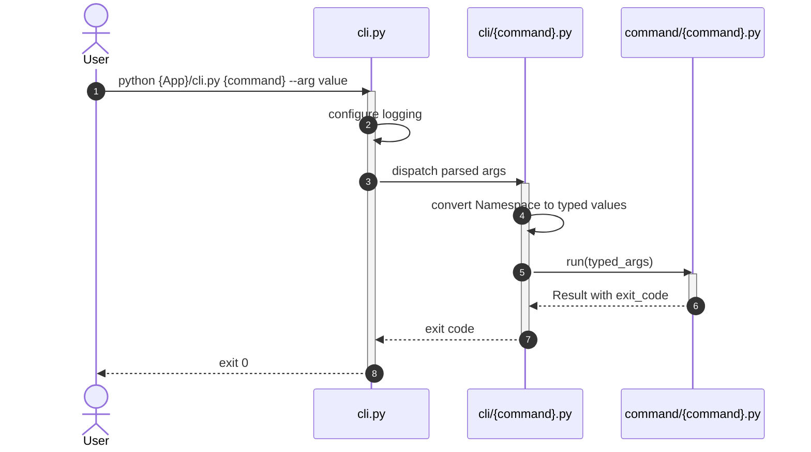
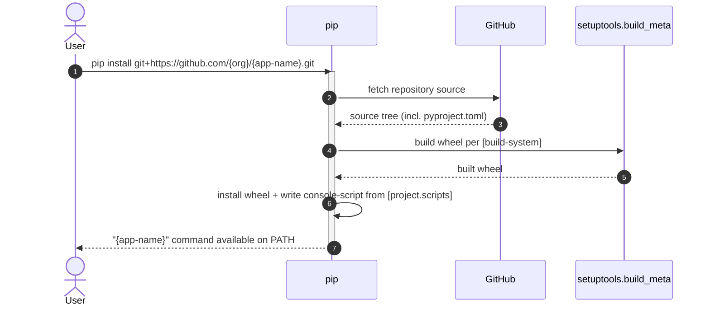

# Core Principles

- Every CLI entry point configures logging and exposes `--debug`.
- The CLI layer is thin: it parses arguments, configures logging, and dispatches to Commands.
- Commands contain business logic and receive typed parameters, not raw `argparse.Namespace`.
- Functions are stateless and reusable; Services encapsulate stateful or dependency-heavy behavior.
- Test structure mirrors source structure so every source module has a predictable test location.
- Tests are excluded from the installed package via explicit `pyproject.toml` rules.
- `pyproject.toml` is the single descriptor for build system and project metadata, and exposes the CLI as a `pip`-installed console command (see [[skills/python/architecture/solutions/solution-cli-packaging.skill/glossary/pyproject-toml.md|glossary: pyproject.toml]]).

__Applied solutions:__
- [[skills/python/architecture/solutions/solution-default-cli.skill/solution-default-cli.skill.md|solution-default-cli]]
- [[skills/python/architecture/solutions/solution-test.skill/solution-test.skill.md|solution-test]]
- [[skills/python/architecture/solutions/solution-cli-packaging.skill/solution-cli-packaging.skill.md|solution-cli-packaging]]

# Capabilities

- **CLI wiring**
  - Build an argument parser, register subcommands, and dispatch to typed handlers.
- **Command execution**
  - Implement business operations with typed parameters, validation, and result objects.
- **Reusable helpers**
  - Keep pure helper functions in `functions/` and stateful objects in `service/`.
- **Observability**
  - Configure standard `logging` and enable debug output with `--debug`.
- **Testing**
  - Mirror source structure in `test/` with one test module per source module.
  - Optionally co-locate tests next to source modules in large projects.
  - Exclude test directories and modules from the installed package.
- **Packaging**
  - Describe the application as an installable package with `pyproject.toml` (name, version, dependencies, supported Python versions).
  - Expose a console command via `[project.scripts]`, backed by `{App}.cli:main`.
  - Support `pip install` from a local checkout, a source archive, or directly from a Git/GitHub URL.

__Applied solutions:__
- [[skills/python/architecture/solutions/solution-default-cli.skill/solution-default-cli.skill.md|solution-default-cli]]
- [[skills/python/architecture/solutions/solution-test.skill/solution-test.skill.md|solution-test]]
- [[skills/python/architecture/solutions/solution-cli-packaging.skill/solution-cli-packaging.skill.md|solution-cli-packaging]]

# Usecases

## Run CLI command

User runs a subcommand from the terminal. The CLI layer parses arguments, configures logging, delegates to a typed Command, and returns the command exit code.

## Add a new CLI command

1. Create `cli/{command}.py` to declare arguments and dispatch typed values.
2. Create `command/{command}.py` to implement the business operation.
3. Register the new subcommand in `cli.py`.
4. Create matching test modules under `test/`.

## Add tests for a new module

1. Locate the source module under `src/{Package}/{Module}.py` or `{App}/{Module}.py`.
2. Create the matching test path under `test/{Package}/{Module}_test.py`.
3. Import the module under test and write focused unit tests.
4. Run the test module with `python -m unittest` or `pytest`.

## Enable debug logging

1. Append `--debug` to any CLI invocation.
2. `cli.py` sets the root logger level to `DEBUG` before invoking the Command.
3. Commands, Functions, and Services emit debug logs with specific context.

## Install the CLI application with pip

User installs the application directly from its GitHub repository. `pip` reads `pyproject.toml`, builds a wheel via the declared backend, and installs a console command from `[project.scripts]`.

See [glossary: pyproject.toml](skills/python/architecture/solutions/solution-cli-packaging.skill/glossary/pyproject-toml.md) for why a bare `https://github.com/...` URL does not work and `git+` is required.
