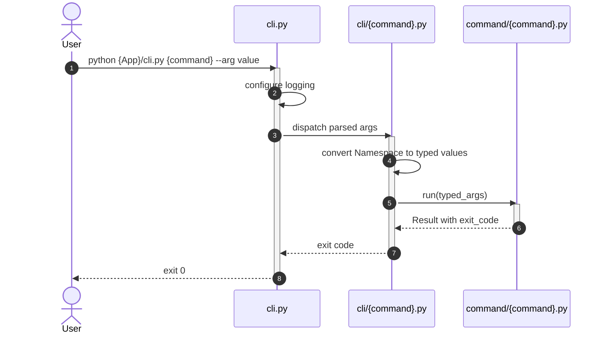
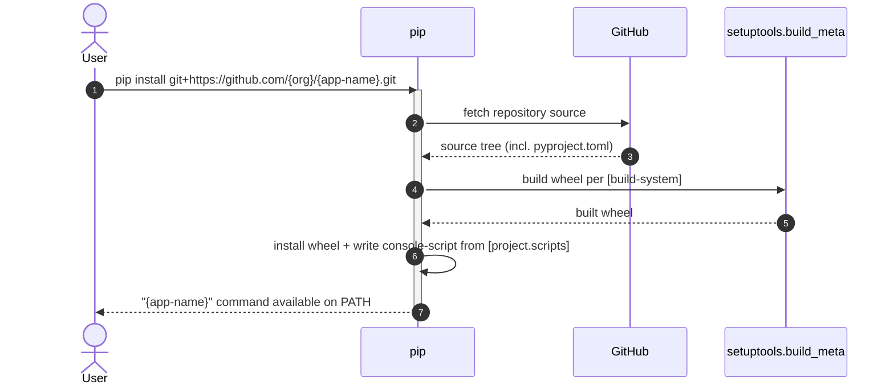

# Core Principles

- Every CLI entry point configures logging and exposes `--debug`.
- The CLI layer is thin: it parses arguments, configures logging, and dispatches to Commands.
- Commands contain business logic and receive typed parameters, not raw `argparse.Namespace`.
- Functions are stateless and reusable; Services encapsulate stateful or dependency-heavy behavior.
- `pyproject.toml` is the single descriptor for build system and project metadata, and exposes the CLI as a `pip`-installed console command (see [[skills/python/architecture/solutions/solution-cli-packaging.skill/glossary/pyproject-toml.md|glossary: pyproject.toml]]).

__Applied solutions:__
- [[skills/python/architecture/solutions/solution-default-cli.skill/solution-default-cli.skill.md|solution-default-cli]]
- [[skills/python/architecture/solutions/solution-cli-packaging.skill/solution-cli-packaging.skill.md|solution-cli-packaging]]

# Capabilities

- **CLI wiring**
  - Build an argument parser, register subcommands, and dispatch to typed handlers.
- **Command execution**
  - Implement business operations with typed parameters, validation, and result objects.
- **Reusable helpers**
  - Keep pure helper functions in `functions/` and stateful objects in `service/`.
- **Observability**
  - Configure standard `logging` and enable debug output with `--debug`.
- **Packaging**
  - Describe the application as an installable package with `pyproject.toml` (name, version, dependencies, supported Python versions).
  - Expose a console command via `[project.scripts]`, backed by `{App}.cli:main`.
  - Support `pip install` from a local checkout, a source archive, or directly from a Git/GitHub URL.

__Applied solutions:__
- [[skills/python/architecture/solutions/solution-default-cli.skill/solution-default-cli.skill.md|solution-default-cli]]
- [[skills/python/architecture/solutions/solution-cli-packaging.skill/solution-cli-packaging.skill.md|solution-cli-packaging]]

# Usecases

## Run CLI command

User runs a subcommand from the terminal. The CLI layer parses arguments, configures logging, delegates to a typed Command, and returns the command exit code.

```mermaid
sequenceDiagram
    autonumber
    actor User
    participant cli as cli.py
    participant cli_cmd as cli/{command}.py
    participant cmd as command/{command}.py

    User->>cli: python {App}/cli.py {command} --arg value
    activate cli
    cli->>cli: configure logging
    cli->>cli_cmd: dispatch parsed args
    activate cli_cmd
    cli_cmd->>cli_cmd: convert Namespace to typed values
    cli_cmd->>cmd: run(typed_args)
    activate cmd
    cmd-->>cli_cmd: Result with exit_code
    deactivate cmd
    cli_cmd-->>cli: exit code
    deactivate cli_cmd
    cli-->>User: exit 0
    deactivate cli
```

## Add a new CLI command

1. Create `cli/{command}.py` to declare arguments and dispatch typed values.
2. Create `command/{command}.py` to implement the business operation.
3. Register the new subcommand in `cli.py`.

## Enable debug logging

1. Append `--debug` to any CLI invocation.
2. `cli.py` sets the root logger level to `DEBUG` before invoking the Command.
3. Commands, Functions, and Services emit debug logs with specific context.

## Install the CLI application with pip

User installs the application directly from its GitHub repository. `pip` reads `pyproject.toml`, builds a wheel via the declared backend, and installs a console command from `[project.scripts]`.

```mermaid
sequenceDiagram
    autonumber
    actor User
    participant pip
    participant GitHub
    participant Backend as setuptools.build_meta

    User->>pip: pip install git+https://github.com/{org}/{app-name}.git
    activate pip
    pip->>GitHub: fetch repository source
    GitHub-->>pip: source tree (incl. pyproject.toml)
    pip->>Backend: build wheel per [build-system]
    Backend-->>pip: built wheel
    pip->>pip: install wheel + write console-script from [project.scripts]
    pip-->>User: "{app-name}" command available on PATH
    deactivate pip
```

See [glossary: pyproject.toml](skills/python/architecture/solutions/solution-cli-packaging.skill/glossary/pyproject-toml.md) for why a bare `https://github.com/...` URL does not work and `git+` is required.

# Testing
This plateau defines no test structure of its own. Tests follow the testing skills: [[skills/testing/python/cucumber-testing-in-python.skill/cucumber-testing-in-python.skill.md|cucumber-testing-in-python]] — features in `{App}/{layer}/features/`, their step modules in `{App}/{layer}/test/` — and [[skills/testing/python/solution-conformance-testing-in-python.skill/solution-conformance-testing-in-python.skill.md|solution-conformance-testing-in-python]] — the test kinds, the report, and the `pyproject.toml` settings that keep those tests out of the installed package. Decision recorded in [[skills/python/architecture/plateau/plateau-python-cli/adr/remove-solution-test-layout-in-python|Remove solution-test-layout-in-python]].
