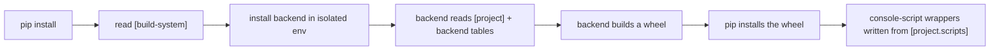

# pyproject.toml

`pyproject.toml` is a single TOML file at the root of a Python project that tells build tools (like `pip`) two things: **how to build** the project into an installable package, and **what the project is** — its name, version, dependencies, and any commands it exposes.

## Why it exists

Before `pyproject.toml`, a project's build instructions lived in an executable `setup.py` file. To install a package, `pip` had to actually *run* that arbitrary Python script — there was no safe way to ask "what build tool and dependencies does this project need?" without executing untrusted code first. Metadata (name, version, dependencies) was also scattered across `setup.py`/`setup.cfg` with each build tool inventing its own field names.

Three PEPs (Python Enhancement Proposals) fixed this in stages:
- **PEP 518** (2017) introduced `pyproject.toml` itself, with a `[build-system]` table declaring which build backend and build-time dependencies a project needs, *before* anything is executed.
- **PEP 517** (2017) defined a standard interface (a handful of Python functions like `build_wheel()`) that any build backend must implement, so frontends like `pip` can call it the same way regardless of which backend a project chose.
- **PEP 621** (2021) standardized the `[project]` table itself — `name`, `version`, `dependencies`, entry points — so project metadata is no longer proprietary to one build tool.

Together, they mean `pip` can inspect a project safely and declaratively, and the same `pyproject.toml` works whether the backend is `setuptools`, `hatchling`, `flit_core`, or `poetry-core`.

## How it works

`pyproject.toml` has (at minimum) two tables:

```toml
[build-system]
requires = ["setuptools>=61.0", "wheel"]
build-backend = "setuptools.build_meta"

[project]
name = "ai-skill-manager"
version = "1.6.2"
dependencies = ["pyyaml>=5.1"]

[project.scripts]
ai-skill-manager = "ai_skill_manager.cli:main"
```

When you run `pip install <source>` — a local directory, a `.tar.gz`, or a Git/GitHub URL — `pip` (the *build frontend*) does not run any project code directly. Instead:

1. It reads `[build-system]` to learn which backend to use (here, `setuptools.build_meta`) and installs that backend into a temporary, isolated environment.
2. It calls that backend's standard PEP 517 functions to build a **wheel** (a pre-built package archive) from the source tree — the backend is the only part that reads `[project]` and any backend-specific tables (like `[tool.setuptools.packages.find]`).
3. `pip` installs the resulting wheel into the target environment: it copies the package's code and writes a small executable wrapper for every entry under `[project.scripts]`.

This is why `pip install git+https://github.com/{org}/{repo}.git` works the same as installing from PyPI: `pip` fetches the source (via `git`), finds `pyproject.toml` at the root, and runs the exact same build steps it would for a local checkout. (Note the `git+` prefix: `pip` needs to know explicitly that the URL is a version-control repository, not just any web address.)



## How it is structured

- **`[build-system]`** — which backend builds the package (`build-backend`) and what that backend itself needs installed first (`requires`). Every `pyproject.toml` needs this table.
- **`[project]`** — the PEP 621 metadata table: `name`, `version`, `description`, `dependencies`, `requires-python`, `readme`, `authors`, `classifiers`, and more. This is what PyPI, `pip`, and other tools read to know what the package *is*.
- **`[project.scripts]`** — maps a console command name to a Python callable (`module.submodule:function`). `pip` turns each entry into a runnable executable placed on `PATH` when the package is installed.
- **`[project.optional-dependencies]`** — named groups of extra dependencies (e.g. `dev`) installed only when requested, e.g. `pip install ".[dev]"`.
- **`[project.urls]`** — a free-form table of labeled links (Homepage, Repository, Issues, ...) shown on package listings.
- **`[tool.*]`** — backend- or tool-specific configuration that PEP 621 does not standardize (e.g. `[tool.setuptools.packages.find]` for package discovery). Only the tool named in `[tool.X]` reads that table.

## Example

From this repository's own CLI tool, `ai-skill-manager` (referenced by [[../solution-cli-packaging.skill.md|solution-cli-packaging]]):

```toml
[build-system]
requires = ["setuptools>=77.0", "wheel"]
build-backend = "setuptools.build_meta"

[project]
name = "ai-skill-manager"
version = "1.6.2"
description = "Sync AI agent skills into .agents/skills/ from local directories or GitHub repositories"
requires-python = ">=3.9"
dependencies = ["pyyaml>=5.1", "rich>=10.0.0"]

[project.scripts]
ai-skill-manager = "ai_skill_manager.cli:main"
aism = "ai_skill_manager.cli:main"

[tool.setuptools.packages.find]
where = ["src"]
exclude = ["*.test", "*.test.*", "test", "test.*"]
```

Two console commands (`ai-skill-manager` and `aism`, both aliases for the same `main()`) become available on `PATH` after `pip install git+https://github.com/InsonusK/ai-skill-manager.git`.

## Related concepts

- [[../../solution-default-cli.skill/solution-default-cli.skill.md|solution-default-cli]] — defines the `cli.py`/`main()` function that `[project.scripts]` points at.
- [[../../solution-test.skill/solution-test.skill.md|solution-test]] — extends `[tool.setuptools.packages.find]` to keep tests out of the built wheel.

## Sources

- [PEP 517 – A build-system independent format for source trees](https://peps.python.org/pep-0517/)
- [PEP 518 – Specifying Minimum Build System Requirements for Python Projects](https://peps.python.org/pep-0518/)
- [PEP 621 – Storing project metadata in pyproject.toml](https://peps.python.org/pep-0621/)
- [Python Packaging User Guide – Writing your pyproject.toml](https://packaging.python.org/en/latest/guides/writing-pyproject-toml/)
- [pip documentation – VCS Support](https://pip.pypa.io/en/stable/topics/vcs-support/)
- This repository's `tmp/pyproject.toml` (the `ai-skill-manager` project referenced above)
