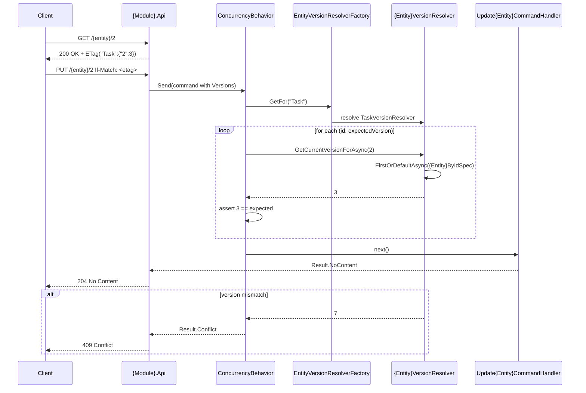

# Core Principals
```hint
Summarise core principles from applied solutions.

MUST:
- If Core Principals conflicted to each other as user to solve the problem
- Don't just copy principles, make brief summary

RECOMENDATION:
- Prefer bullet list
```
```example
- Validation entity version on change
```
# Capabilities
```hint
What capabilities does this plateau has

MUST:
- If Capabilities conflicted to each other as user to solve the problem
- Summaraize all capabilities from all used solutions and logicaly group them

RECOMENDATION:
- Prefer bullet list
```
```example
- workflow
	- All command and queries validate by FluentValidator in `ValidatorBahaviour`
- validation
	- all modules valudate dto and soft{ValueObject} from other module using there validator
```

# Usecases
```hint
fill usecases for plateau
- example of interactions
- example of cron jobs
```
## {Case name}
```hint
write short description and mermaid workflow
```
````example
Update entity with concurency check

````